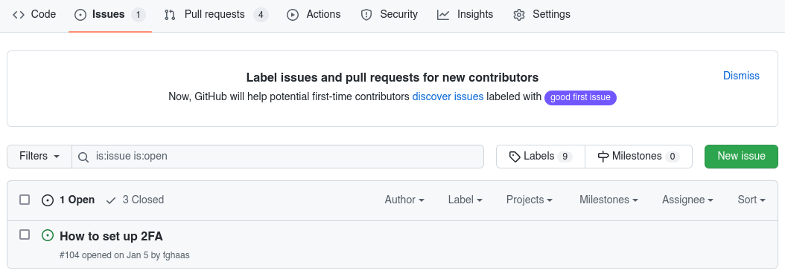

# Reporting issues

If you notice an issue (a typo, a grammar glitch, missing or factually incorrect information), here's how you can let us know:

Go to [our issue tracker]({{config.repo_url}}/issues) and click *New issue*.

Select the issue type that most closely matches the type of issue you are reporting.

Be sure to fill *all* required fields (the ones marked with a red asterisk), and fill in the optional ones as necessary.

Don't forget to click *Submit new issue* when you're done.

And if you want to help us **fix** the issue you've just reported, please take a look at our guidelines for [modifying content](modifications.md) on this site!
