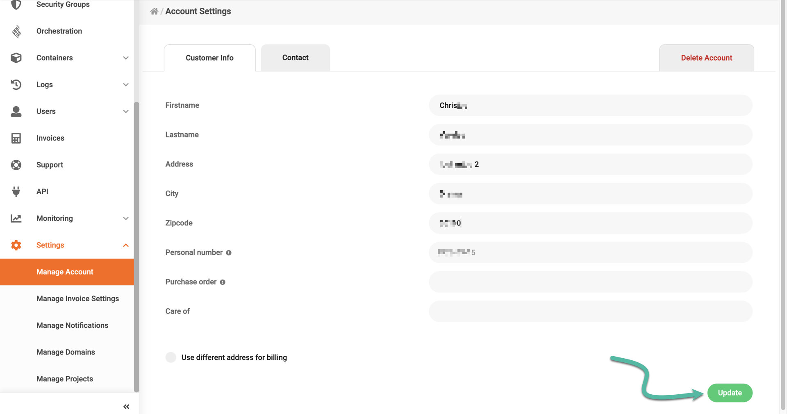
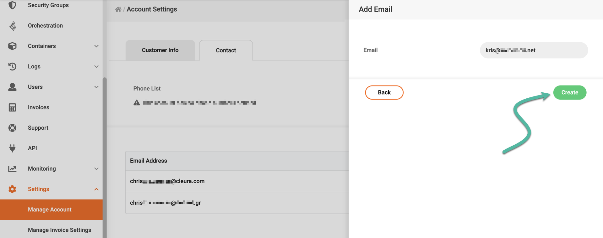
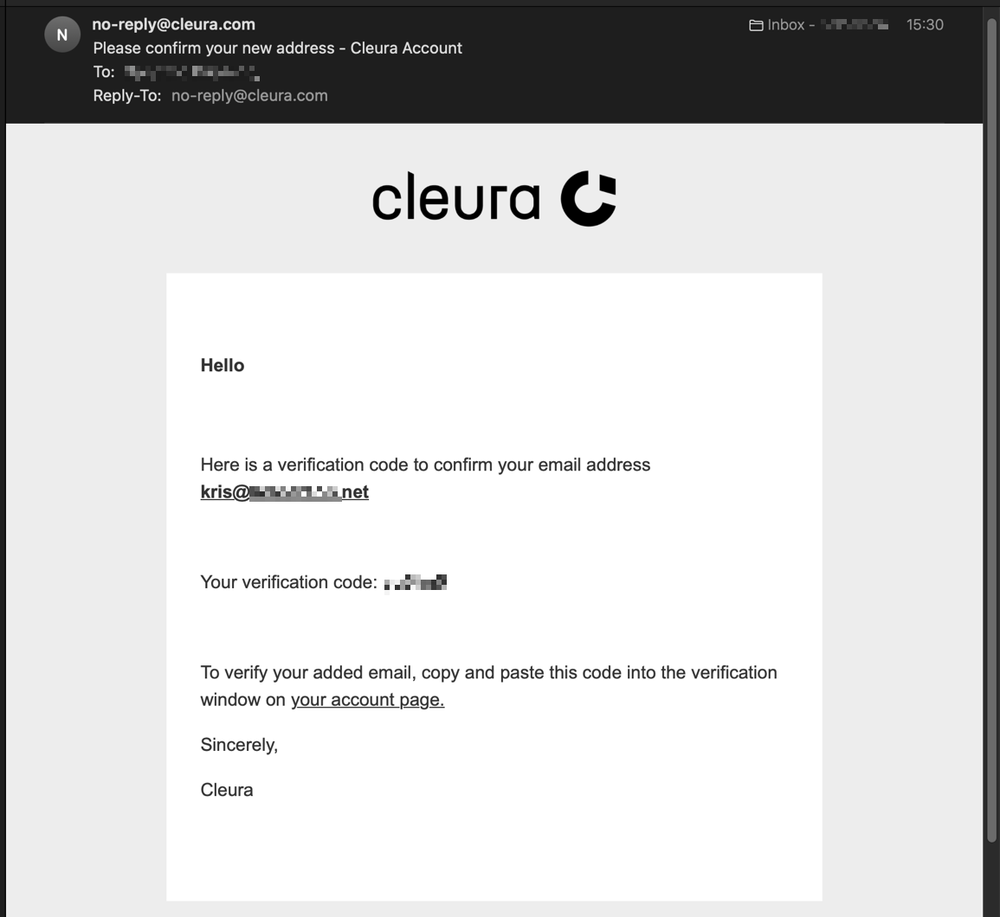
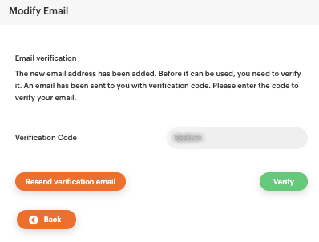
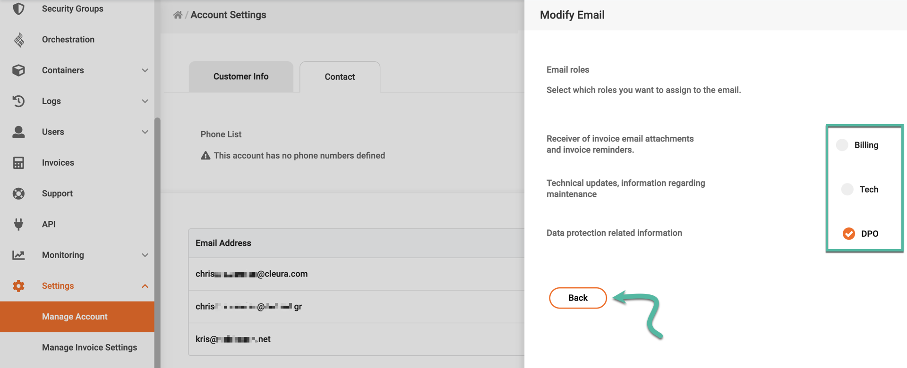
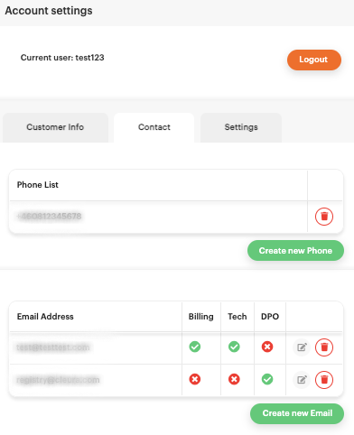
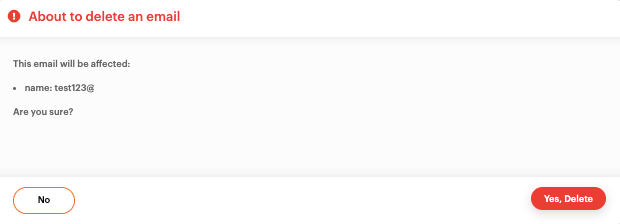
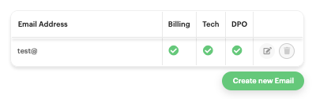
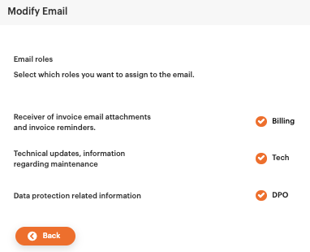

# Changing your account data

You may at any time change the contact person, address, company name, and purchase order number associated with your {{brand}} account.

To get started, navigate to the [{{gui}}](https://{{gui_domain}}) and log into your account.
Expand the vertical pane on the left, click on _Settings_, and then on _Manage Account_.

In the central pane, named _Account Settings_, click on the _Customer Info_ tab.
There, you can change and manage your customer information.

Finalize your changes by clicking the green _Update_ button at the bottom.

## Adding or removing email addresses

In the _Account Settings_ pane, click the tab labeled _Contact_.
This will show your currently configured email addresses.
If there is only one email address, it will have all available roles enabled.

### Adding a new email address

Click on the green button labeled _Create new Email_ (see above).

A new vertical pane will slide over from the right-hand side of the {{gui}}.
Enter your new email address and click the green _Create_ button.

The system will then send an automated email containing a verification code.
The verification email looks like the example below, with the subject line _Please confirm your new address - Cleura Account_.

Please enter this code to verify your email address. Then click the green button labeled _Verify_.

Choose a role association for the new email address, and click the _Back_ button.

You have now added one more email address and selected a role.

### Removing an email address

Click on the red _Trash_ icon :fontawesome-solid-trash: next to the email address you want to remove.

A pop-up window appears. Click on the red button labeled _Yes, Delete_.

You have now removed one email address.

### Assigning an email address to a new role

Click on the _Modify_ button :material-square-edit-outline: next to the email address you want to assign to a different role.

Change the role by clicking one or all of _Billing_, _Tech_, or _DPO_.

At this point, the roles associated with the email address have been changed:

## Changing an account's organization number

Please note that you cannot readily change your organization number (for business accounts) or your personal number (for individual accounts) in the {{gui}}.

In case you do wish to change any of those, you will have to submit a [{{legal_docs.transfer_form.name}}]({{legal_docs.transfer_form.url}}) via our [{{support}}](https://{{support_domain}}/servicedesk).

