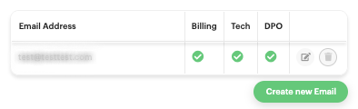
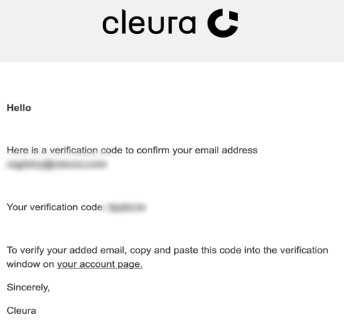
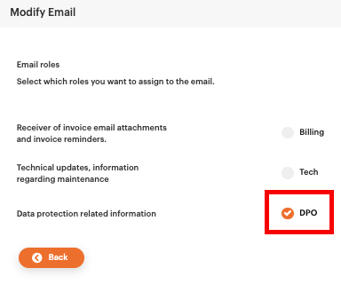
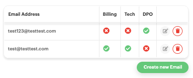
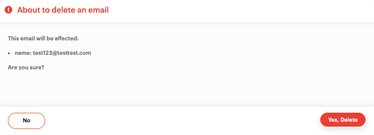
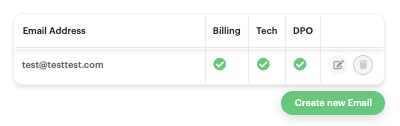
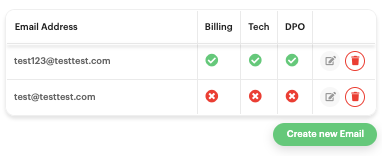

# Changing your account data

You may at any time change the contact person, address, company name, and purchase order number associated with your {{brand}} account.

To get started, navigate to the [{{gui}}](https://{{gui_domain}}).
Log in and click the _Profile_ button at the top right.

There, you will see the _Account settings_ page.
Choose the _Customer Info_ tab, in which you can change and manage your customer information.

Finalize your changes by clicking the green _Update_ button at the bottom.

## Changing an account's organization number

Please note that you cannot readily change your organization number (for business accounts) or your personal number (for individual accounts) in the {{gui}}.

In case you do wish to change any of those, you will have to submit a [{{legal_docs.transfer_form.name}}]({{legal_docs.transfer_form.url}}) via our [{{support}}](https://{{support_domain}}/servicedesk).

## E-invoicing

This is available to select accounts.
More specifically, you have the option of e-invoicing if all three conditions are met:

* the country in the customer contract is set to _Sweden_ (that is the country in the account owner data, not the country in the billing data),
* you have provided a company name,
* you have provided a Swedish [_organisationsnummer_](https://www.bolagsverket.se/foretag/organisationsnummer.1207.html) (link in Swedish).

If you are eligible for e-invoicing and wish to activate it, in the _Account settings_ vertical pane go to the _Invoice settings_ section and click the _Request form_ link.

A pop-up window titled _Request e-invoice_ will appear.
Click on the _Choose Provider_ drop-down menu to expand it.

Choose one of the available providers for your invoicing application.

If none of the available providers is suitable for your invoicing application, select _Other_.
Finally, click the green _Send request_ button.

## Add or remove email address

At the right-hand side of the dashboard, click the user icon at the top of the page. A pane titled _Account settings_ will slide over.

Click the middle one, _Contact_ and you will see which _Email Address_ you have right now. If there is only one email address, it will have all available roles activated.

### Add a new email address

Click on the green button _Create new Email_.

Enter your new email address and click the green _Create_ button.

An email has been sent to you with verification code. Please enter the code to verify your email. Then click green button _Verify_.

The verification email will look like below and have a subject line _Please confirm your new address - Cleura Account_.

Choose which role your email address shall have and click _Back_.

Now you have add one more email address and selected a role.

### Remove an email address

Click on the red _trash_ can next to the email address you wanna remove.

A pop up windows appears. Click on red button _Yes, Delete_.

Now you have removed one email address.

## Change email role

Click on the _Modify_ button  next to the email address you wanna change role.

Change role by clicking one or all of _Billing, Tech or DPO_.

Now you have change role on your email adress

