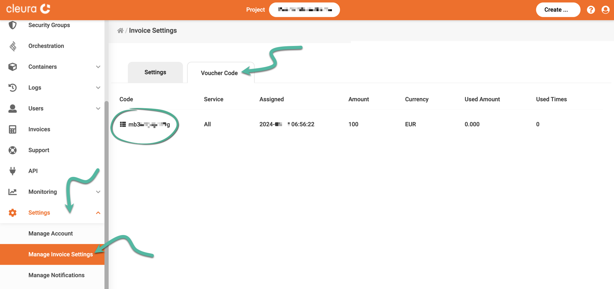

# Changing your credit card data

You can only change your credit card when you _pay a new invoice_ via
the [{{gui}}](https://{{gui_domain}}).

## Prerequisites

You must be logged in to your [Cleura Cloud](https://{{gui_domain}})
account to switch credit cards.

## Change credit card

In the {{gui}}, make sure the vertical pane on the left is visible.
Click on _Settings_, and from the drop-down menu that appears select _Manage Invoice Settings_.

Your invoice specifications are in the _Settings_ tab.
To pay an invoice, click on the orange :material-dots-horizontal-circle: icon beside it.

You may want to check if you have a voucher code before paying; just click on the _Voucher Code_ tab on the right.

Back in the _Settings_ tab, choose _$ Pay this Invoice_ at the bottom.

You will now see two payment methods. Click on _Card Payment
(Debit/Credit)_.

You are now redirected to the bank's website. Add your information
that applies to your _new credit card_ and click _Pay_.

Your _new credit card_ is now valid on your
[Cleura Cloud](https://{{gui_domain}}) account.
