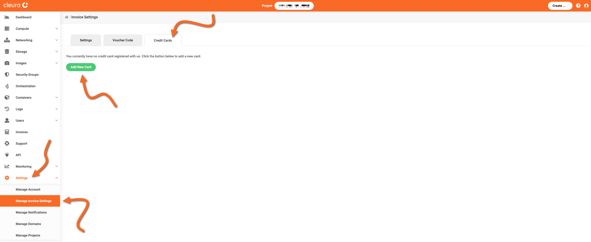
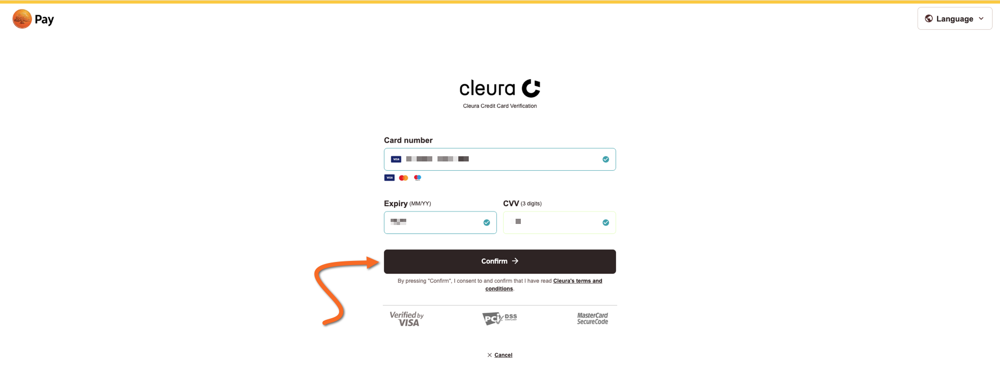
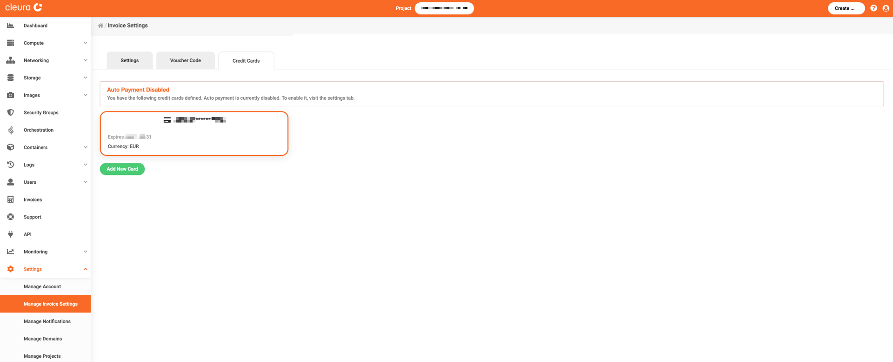
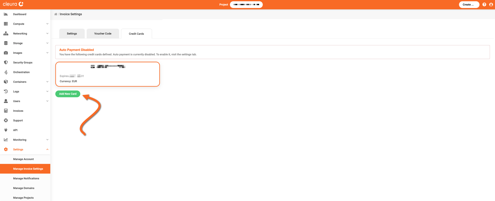

# Managing your credit card information

You may add or change credit card information via the [{{gui}}](https://{{gui_domain}}).

## Prerequisites

You must be logged in to your [Cleura Cloud](https://{{gui_domain}}) account to manage credit card information.

## Adding a credit card

In the {{gui}}, make sure the vertical pane on the left is visible.
Click on _Settings_, and then on _Manage Invoice Settings._
In the central pane, named _Invoice Settings,_ notice the three tabs at the top.
Click on the one labeled _Credit Cards,_ and then on the green _Add New Card_ button below.

You are redirected to a PayEx Sverige AB page, where you enter your credit card information.
When you are done, click the black _Confirm_ button.

To confirm the new card, {{brand}} charges you exactly zero (0) amount of money, in the currency of your credit card.
Depending on your credit card bank, you might have to use whatever mechanism is provided to authorize that zero charge.

Once the new credit card is added, it will be visible in the _Credit Cards_ tab.

## Changing a credit card

If you want to use another credit card, click the green _Add New Card_ button below the existing card.

You will add the new card following the exact same procedure you followed while adding the existing card.
When you are done adding the new one, you will realize that the old one is no longer listed under _Credit Cards_.

## Removing a credit card

pqrxyz
