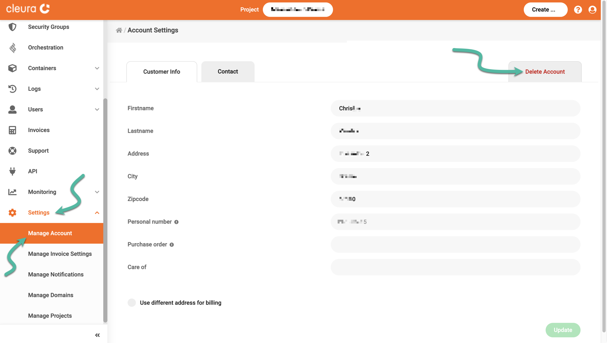

# Deleting your account

In case you decide to close your {{brand}} account, you may do so via the [{{gui}}](https://{{gui_domain}}).
From the vertical pane on the left, select _Settings_ and then _Manage Account_.

In the central _Account Settings_ pane, click the red _Delete Account_ tab on the right.

At the bottom of the tab, click the red button named _Delete Account_.

Choose a reason for leaving and type in your current password.
Click the red button named _Delete Account_ one more time.
That will trigger a request for account deletion.

## Using the {{legal_docs.termination_form.name}}

You may be unable to follow the standard account deletion process using the {{gui}}, because you have lost your administrative credentials or you cannot access your account owner's email address.

In this case, you can instead terminate your account by filling out the [{{legal_docs.termination_form.name}}]({{legal_docs.termination_form.url}}).
Be sure to add your own signature (for personal accounts), or that of an authorized signatory (for company accounts).

Submit the form via our [{{support}}](https://{{support_domain}}/servicedesk).
If you have lost your {{support}} credentials, you may also send it by email to [{{support_email}}](mailto:{{support_email}}).

## What happens after you delete your account

Three (3) days after receiving the request for deletion, any running virtual machines will be shut off. Then, after ten (10) days, all virtual machines and any other resources connected to your account will be deleted, **including** backups.

After the last invoice has been paid, we will delete your account. This entire process may take up to thirty (30) days after the last invoice is paid.

If you change your mind during the first three (3) days, please get in touch with our [{{support}}](https://{{support_domain}}/servicedesk), and we will **not delete** your assets or your account.
