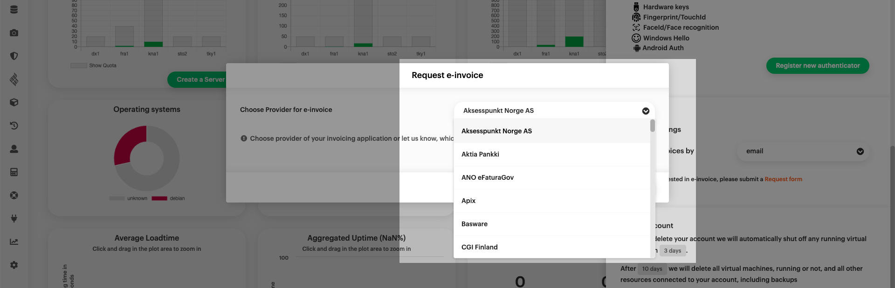
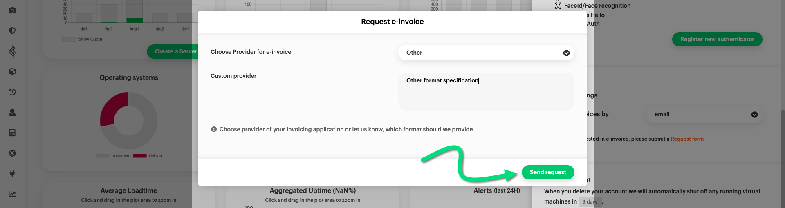

# E-invoicing

Electronic invoicing (*e-invoicing*) is available to select accounts.
More specifically, you have the option of e-invoicing if all three of the following conditions are met:

* The country in the customer contract is set to _Sweden_ (that is the country in the account owner data, not the country in the billing data),
* you have provided a company name, and
* you have provided a Swedish [_organisationsnummer_](https://www.bolagsverket.se/foretag/organisationsnummer.1207.html) (link in Swedish).

If you are eligible for e-invoicing and wish to activate it, navigate to the [{{gui}}](https://{{gui_domain}}) start page and log into your {{brand}} account.

Make sure the vertical pane at the left-hand side of the {{gui}} is expanded.
Click on _Settings_, then on _Manage Invoice Settings_.
In the central pane of the {{gui}}, titled *Invoice Settings*, be sure to have the *Settings* tab open, and then click on the green _Request form_ button.

A pop-up window titled _Request e-invoice_ will appear.
Click on the _Choose Provider_ drop-down menu to expand it.

Choose one of the available providers for your invoicing application.

Finally, click the green _Send request_ button.

Please note that if your provider is not on the list, we cannot provide e-invoicing.
