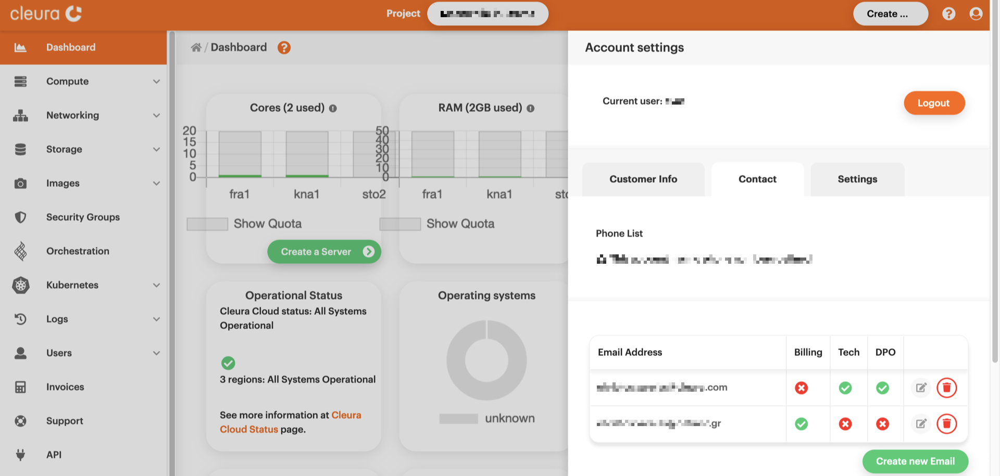

# Managing invoices

You may quickly review your invoices regarding the monthly usage of
{{brand}} resources, selectively pay outstanding invoices, save any
number in PDF format, and change the email address for receiving such
invoices.

First, fire up your favorite web browser, navigate to the
[{{gui}}](https://{{gui_domain}}) start page, and log into your
{{brand}} account.

## Listing invoices

Make sure the vertical pane on the left-hand side of the dashboard is
expanded. Please look at the options and click on _Invoices_ (right
below _Users_). Then, in the main pane of the dashboard, you will see a
list of paid and outstanding invoices.

Any paid invoice has a green circle-with-tick icon at the left of its
row. Also, look at the _Outstanding Amount_ column, where there is a
value of `0.00` for each paid invoice.

## Displaying invoice details

Notice the three-dot orange icon at the right of any invoice row. By
clicking on it, you get a pop-up with specific options regarding the
corresponding invoice. For example, you can view the invoice's PDF or
download it onto your computer.

## Paying outstanding invoices

There is also the _Pay this invoice_ option. Choose it for an
outstanding invoice and you will get a pop-up with a detailed rundown
of the dues, together with supported payment methods.

## Changing your invoice email address

Finally, you may change the email address for receiving invoices. At
the right-hand side of the dashboard, click the user icon at the top
of the page. A pane titled _Account settings_ will slide over.

There are three tabs in that pane:

* _Customer Info_,
* _Contact_,
* _Settings_.

Click the middle one, _Contact_. If there is only one email address, it
will have all available roles activated --- including the _Billing_
role.

Add a new email address to receive future invoices in a different email.
Then, make sure the _Billing_ role is deactivated for the old email
address and activated for the new one.

