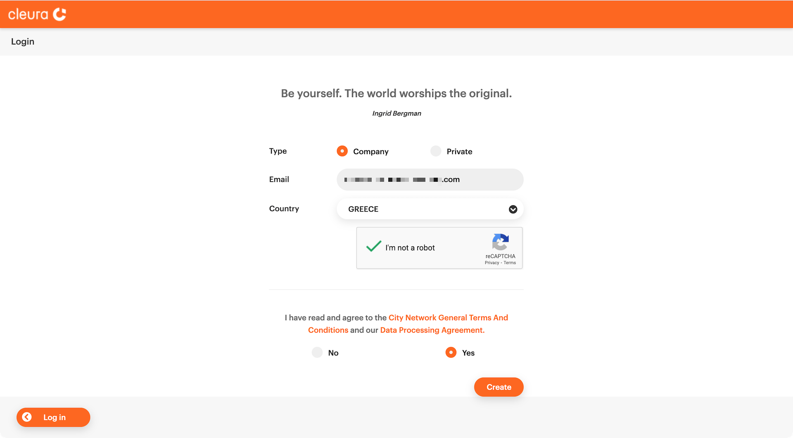
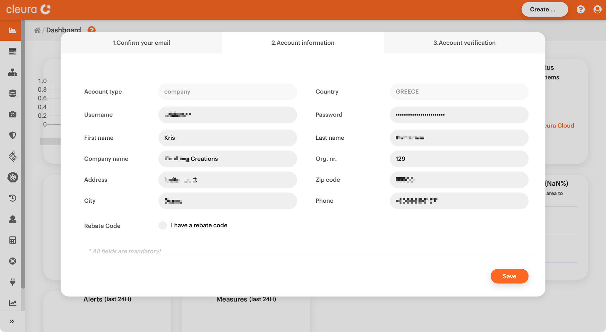

# Creating a new account

To gain access to {{brand}}, you first
have to create a new account. For that, navigate to
<https://{{gui_domain}}/register>.

Select the new account type (that would be _Company_ or _Private_),
carefully type in a valid email address, and choose your country.
At your leisure, please read the [{{ legal_docs.tos.name}}]({{ legal_docs.tos.url}})
and our
[{{ legal_docs.cdpa.name}}]({{ legal_docs.cdpa.url}}).

Agree to these documents (select _Yes_), check the _I'm not a robot_
box, and then click on the _Create_ button.

This will redirect you to the {{gui}}, and
since you are logging in from a new account for the first time, you
now have to take three simple steps.

* **Step 1 - Confirm your email**. Check your inbox or your SPAM/junk
  folder for an email from `no-reply@cleura.com` with the subject
  _Thank you for your registration - Cleura Cloud_. Open that email
  and click on the link in the message body.

* **Step 2 - Account information**. After clicking on the confirmation
  link you move on to step two, where you enter all relevant
  information that uniquely identifies the brand-new account. Type in,
  for example, a username for the account user, and make sure you
  define a strong password for them. (A password manager may come in
  handy.) Please note that all fields are mandatory, so take a little
  time and fill them in accordingly. Should you have a voucher code, do
  not forget to click on _I have a voucher code_ and type it in
  below. When you are done, click on the _Save_ button.

* **Step 3 - Account verification**. While the new account is being
  created, and before it becomes fully operational, you have to take
  one last step toward verification. You do that either by entering
  valid credit card information or by placing a simple phone
  call. Should you choose to verify by credit card, rest assured that
  no charge will take place --- no money will be drawn from the card,
  in other words. On the other hand, if you prefer to verify by phone,
  you may certainly do so during business hours (08:00 – 17:00
  CET/CEST UTC+1/UTC+2). If you choose to call, please remember that
  you will be asked for the username of the new account, so have that
  piece of info handy.

After the account verification is complete, you are greeted by the
{{gui}}. Feel free to follow through the
introductory guide to the environment --- that will not take long ---
or skip it and start taking advantage of the Cleura Cloud without
delay.
