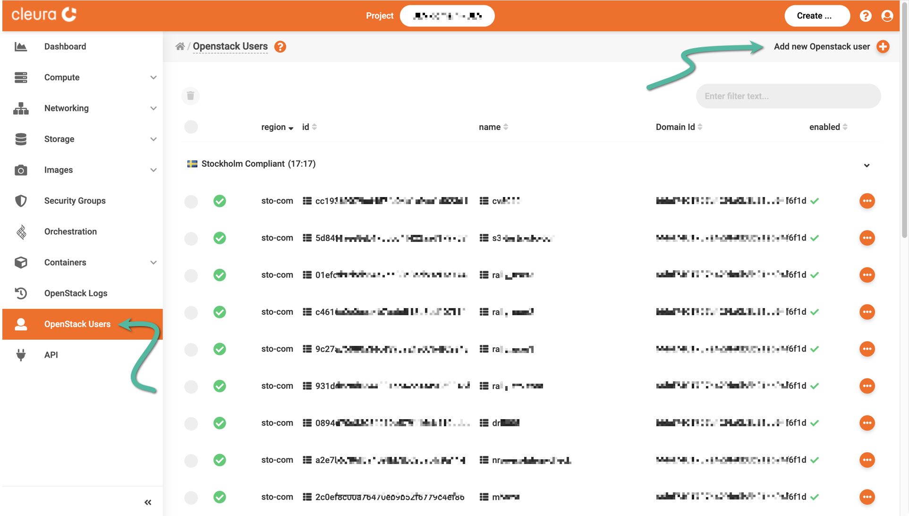
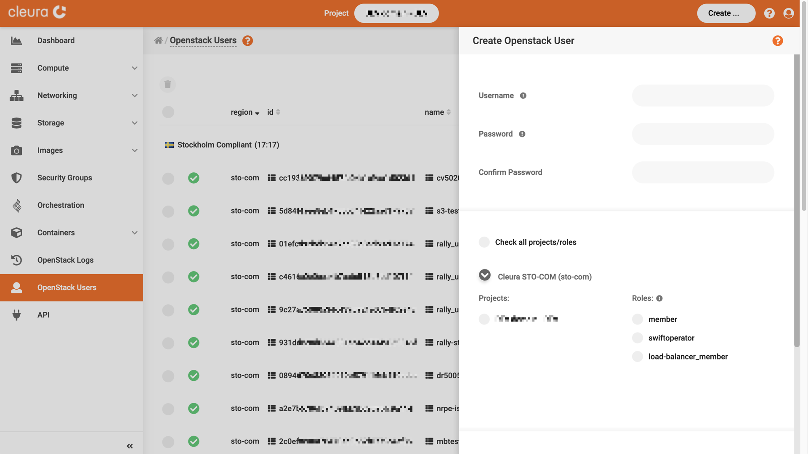
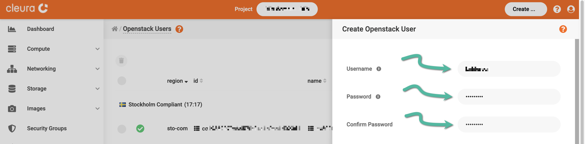
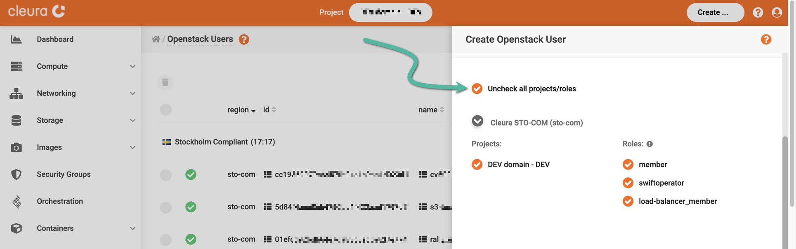
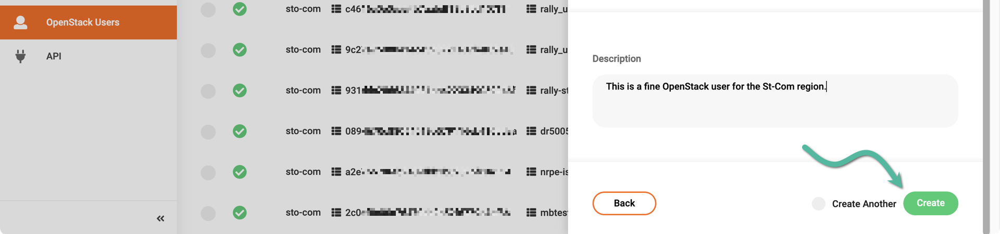
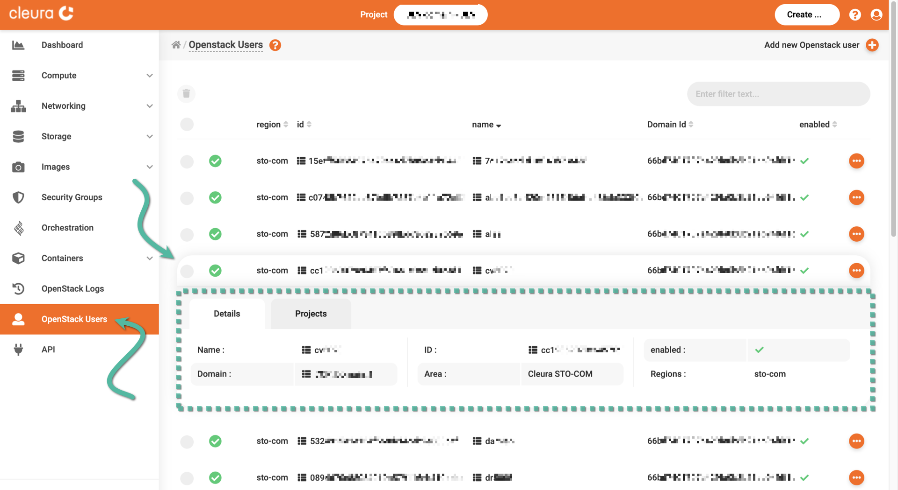
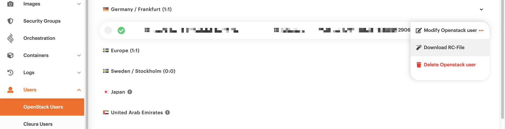
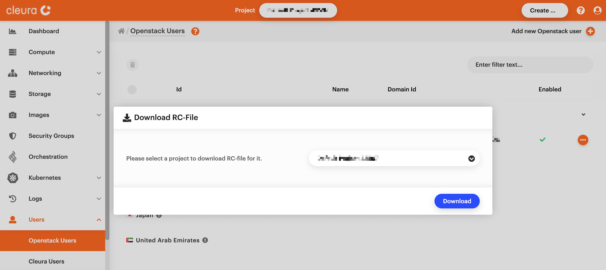

# Enabling the OpenStack CLI

The OpenStack Command Line Interface (CLI) tool, also known as OpenStack
Client (OSC) or simply `openstack`, conveniently provides access to
various OpenStack APIs. Using the OpenStack CLI tool, you can remotely
create and manage the lifecycle of objects related, for example, to
Compute, Networking, or Storage.

Before installing `openstack` to your local laptop or workstation, you
first need to have an OpenStack user in your {{brand}} account.
Next, you create and download a special RC file onto your computer,
modify it to reflect your OpenStack user's credentials, and source it.
Only then will you be able to use any installed `openstack` client.

## Creating an OpenStack user

From your favorite web browser, navigate to the
[{{gui}}](https://{{gui_domain}}) start page, and login into your
{{brand}} account.

Please make sure the left-hand side pane on the {{gui}} is fully
visible, click the _Users_ category to expand it, and click on
_Openstack Users_.



Then, at the top right-hand side of the {{gui}}, click once more
the _Add new Openstack user_ option. A new pane will slide into view,
titled _Create Openstack User_.



Type in a username and a password for the new OpenStack user. To ensure
you typed the password correctly, you must re-type it below. This
password should be adequately strong, and thus a password manager may
come in handy.



Scroll down a bit, so the _Regions_ section is in full view. Expand one
or more of the available regions you want your new user to have access
to. For each one of the expanded regions, select one or more
_Projects_. For each project, activate one or more _Roles_. (Hint: For
an overview of the rights that roles provide, hover the mouse pointer
over the exclamation mark icon by the _Roles_.)



Optionally, type in a description for the new OpenStack user. Then,
create the user by clicking the green _Create_ button below the
_Description_ box.



The new OpenStack user will be ready in just a few seconds. At any
time, you can view all available OpenStack users by going to the
left-hand side pane on the {{gui}} and selecting _Users_ >
_Openstack Users_.



## Downloading an RC file

On the {{gui}}, expand the left-hand side vertical pane, click _Users_,
and then _Openstack Users_. You will see, listed in the main pane, all
available users. Click the three-dot round icon on the right of the user
their RC file you want. From the drop-down menu that appears, select
_Download RC-File._



Before downloading the RC file onto your local computer, you must select
one of the available projects to relate it to. Do so and then click the
blue _Download_ button.



A _Save as_ dialog window appears. Select a convenient location and save
your RC file.

## Modifying and sourcing the RC file

The general naming for RC files goes like this:

```plain
your_username--region_name--project_name--rc
```

So, assuming your username is `olafsdottir`, and the RC file has been
created for the `fra1` region and the `katla` project, your RC file
name should be this:

```plain
olafsdottir--fra1--katla--rc
```

Take a look at the contents of this file --- they should be like this:

```bash
export OS_USERNAME=olafsdottir
export OS_PASSWORD=<your password goes here>
export OS_AUTH_URL=https://fra1.citycloud.com:5000
export OS_USER_DOMAIN_NAME=...
export OS_PROJECT_DOMAIN_NAME=...
export OS_REGION_NAME=Fra1
export OS_PROJECT_NAME="katla"
export OS_TENANT_NAME="katla"
export OS_AUTH_VERSION=3
export OS_IDENTITY_API_VERSION=3
```

Before you source the RC file, and thus initialize all relevant environment
variables, make sure to edit the file and put your OpenStack user
password in place of `<your password goes here>`. Also, change the
permissions of the file, so it is readable and writable by your local
user only:

```bash
chmod 600 olafsdottir--fra1--katla--rc
```

Then, go ahead and source it:

```bash
source olafsdottir--fra1--katla--rc
```

## Installing the OpenStack CLI

If you do not have the OpenStack CLI tool readily available, use your
operating system's package manager or `pip` to install it. Some
examples follow.

=== "Debian/Ubuntu"
    ```bash
    apt update && apt install python3-openstackclient
    ```
=== "Mac OS X with Homebrew"
    ```bash
    brew install openstackclient
    ```
=== "Python package"
    ```bash
    pip install python-openstackclient
    ```

## Testing access

Provided you have already sourced your RC file, you can now use the
`openstack` command line tool to access various OpenStack APIs on the
{{brand}}.

To make sure your local installation of `openstack` works as expected,
type:

```bash
openstack token issue
```

If `openstack` can indeed connect to the {{brand}}
OpenStack APIs, then you will get information, in tabular format,
regarding the issuance of a new token.

To get general help regarding `openstack`, type:

```bash
openstack --help
```

When you need help on a specific command, type something like
`openstack help command`.


## Auto-adjusting the CLI output to your terminal size

Many of the subcommands available in the `openstack` CLI produce
tabular about by default. To ensure that this output always fits
neatly into your terminal window, you may add the following line
either to OpenStack RC file(s), or to your shell initialization file
(like `.profile` or `.bashrc`):

```bash
export CLIFF_FIT_WIDTH=1
```

Then, be sure to either re-source the file you modified, and/or
restart your shell.
