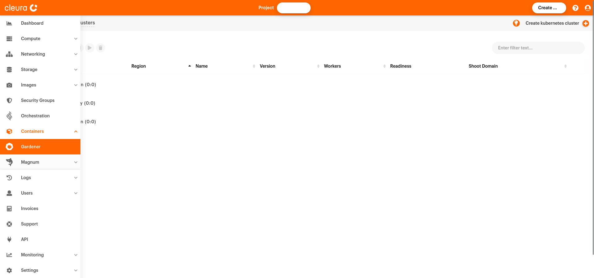
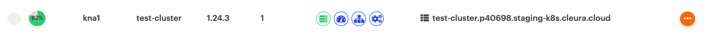
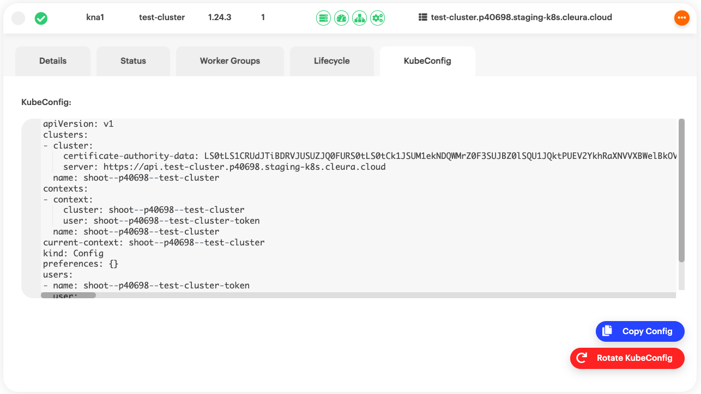

# Creating Kubernetes clusters with Gardener

If you want to create a Kubernetes cluster, you can do it via
{{gui}} using Gardener. This how-to shows you how to do
that, and how to deploy a sample application on such a cluster.

## Prerequisites

To access the cluster from your computer, you will need
[kubectl](https://kubernetes.io/docs/tasks/tools/#kubectl) installed
on your machine.

## Creating a Kubernetes cluster in {{gui}}

To get started, navigate to <https://{{gui_domain}}>, and
in the side panel choose Kubernetes → [Managed
Kubernetes](https://{{gui_domain}}/containers/gardener).
You will see a Gardener page, in which you can create and manage your
clusters. Click `Create Kubernetes cluster`.



> In Gardener's terminology, a Kubernetes cluster is referred as a
> **Shoot cluster**. You can see the name "Shoot" in various places
> throughout the panel's UI, so it is good to know what it means. To
> learn more, check out [Gardener
> architecture](https://gardener.cloud/docs/gardener/concepts/architecture/).

In the opened form, fill in the name of the cluster and a region to
see the rest of the options. Hover over question mark icons at each
form field to learn more about it. For the purposes of this how-to,
you can leave everything at default values and click `Create` at the
bottom.

> In the form you can see a section about worker groups. This name
> refers to Kubernetes worker nodes.

In the list of clusters, you will see your new Gardener shoot
bootstrapping. The icon on the left marks the progress. Creating the
cluster can take up to several minutes.



## Extract kubeconfig file from Shoot cluster

When the Shoot cluster is up and running, you need to get a kubeconfig
file to be able to access it. To do that, click on the cluster to
expand its properties, and open `Kubeconfig`.



You should now see the file's contents. You have the option to `Copy
Config` or `Rotate Kubeconfig` if your credentials got compromised.
Copy the content of the kubeconfig and insert it into
`~/.kube/config`. Create the directory and the file if needed.

> By default, Kubectl searches for its configuration in
> `~/.kube/config`, but you can modify this behaviour if needed. More
> info
> [here](https://kubernetes.io/docs/concepts/configuration/organize-cluster-access-kubeconfig/).

Check if your kubectl uses the proper configuration by running:

```shell
kubectl config view
```

You should see something like this:

```yaml
apiVersion: v1
clusters:
  - cluster:
      certificate-authority-data: DATA+OMITTED
      server: https://api.test-cluster.p40698.staging-k8s.{{gui_domain}}
    name: shoot--p40698--test-cluster
contexts:
  - context:
      cluster: shoot--p40698--test-cluster
      user: shoot--p40698--test-cluster-token
    name: shoot--p40698--test-cluster
current-context: shoot--p40698--test-cluster
kind: Config
preferences: { }
users:
  - name: shoot--p40698--test-cluster-token
    user:
      token: REDACTED
```

## Access your cluster with kubectl and deploy an application

Check your available nodes by running:

```shell
kubectl get nodes
```

You should see Gardener's worker node that is available:

```console
NAME                                                STATUS   ROLES    AGE    VERSION
shoot--p40698--test-cluster-czg4zf-z1-5d7b5-bfl7p   Ready    <none>   156m   v1.24.3
```

Create a sample deployment with a Hello World application:

```shell
kubectl create deployment hello-node --image=registry.k8s.io/echoserver:1.4
kubectl expose deployment hello-node --type=LoadBalancer --port=8080
```

To access the created app, list the available services:

```shell
kubectl get services
```

You should get the load balancer service with its external IP and port
number:

```console
NAME         TYPE           CLUSTER-IP      EXTERNAL-IP     PORT(S)          AGE
hello-node   LoadBalancer   100.69.16.106   <External IP>   8080:32039/TCP   34m
kubernetes   ClusterIP      100.64.0.1      <none>          443/TCP          3h46m
```

Open a browser and open ```<External IP>:8080```. You should see the
page of the Hello World app.
