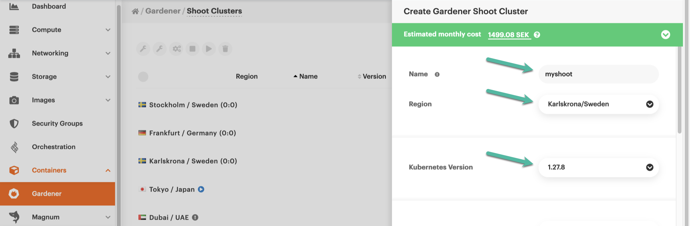
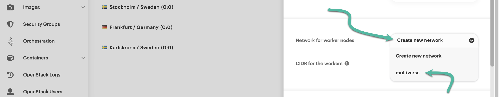
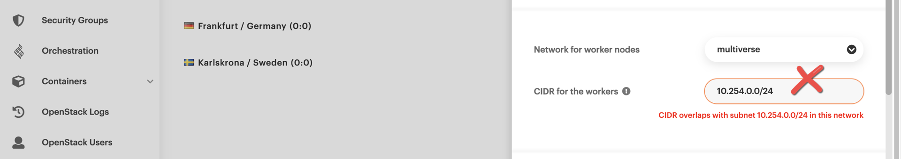
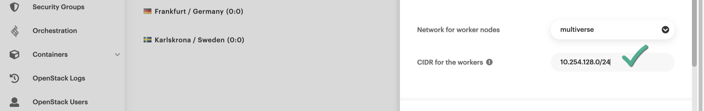
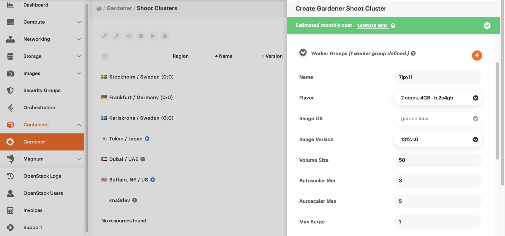
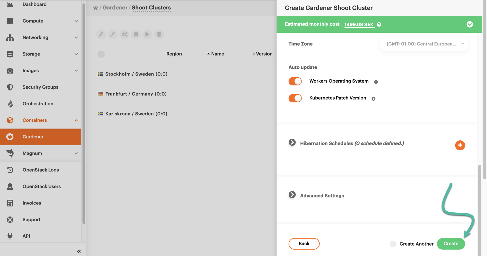

# Creating a Kubernetes cluster

If you want to create a Kubernetes cluster, you can do so via the {{gui}} using {{k8s_management_service}}.
This guide shows you how to do that.

## Prerequisites

* If this is your first time using {{brand_container_orchestration}}, you need to [activate the service](index.md) from the {{gui}}.
* To access the Kubernetes cluster from your computer, you must [install `kubectl`](https://kubernetes.io/docs/tasks/tools/#kubectl) on your machine.

## Creating a Kubernetes cluster in {{gui}}

To get started, navigate to <https://{{gui_domain}}> and, in the side panel, choose *Containers → [{{k8s_management_service}}](https://{{gui_domain}}/containers/gardener)*.
You will land on a page named *{{k8s_management_service}} / Shoot Clusters*.
There, you can create and manage your {{k8s_management_service}}-based clusters.
In {{k8s_management_service}} terminology, a Kubernetes cluster is referred as a **Shoot** (as in, [new plant growth](https://en.wikipedia.org/wiki/Shoot)).

At the top right-hand side of the central pane, click on *Create Kubernetes cluster*.

A new pane named *Create {{k8s_management_service}} Shoot Cluster* slides over from the right-hand side of the browser.
Type in a name for the new shoot cluster, and select a region.
Also, select the version of Kubernetes the new cluster will be running.
In the example below, we have chosen version 1.28.7, which, at the time of writing, was the latest supported in {{brand}}.

Next, you may accept the proposed network address (in [CIDR notation](https://en.wikipedia.org/wiki/Classless_Inter-Domain_Routing#CIDR_notation)) for the worker nodes, or type in the one you prefer.

Alternatively, click on the drop-down menu at the right-hand side of "Network for worker nodes".
From the available menu items, choose a pre-existing network.
Be sure to select one that has an assigned subnet, and is connected to a router.

Then, define a new subnet for the worker nodes by typing in a CIDR network address.
If the new subnet overlaps with one of the subnets of the network you just selected, you will see an error message in red.

Instead, you should define a subnet that does not overlap with any of the subnets of your selected network.

Now, scroll down a bit until you bring the *Worker Groups* section into full view.
Make sure there is at least one worker group defined.
(By default, you start with one.)
Pay attention to the values you set for the following parameters:

* *Flavor:* The [flavor](../../../reference/flavors/index.md) your worker nodes will use;
this determines the number of CPU cores and the amount of RAM allocated to them.
* *Volume Size:* The amount of local storage allocated to each worker node.
* *Autoscaler Min:* The minimum number of worker nodes to run in the cluster at any time.
* *Autoscaler Max:* The maximum number of worker nodes the cluster automatically scales to, in the event that the current number of nodes cannot handle the deployed workload.
* *Max Surge:* The maximum number of additional nodes to deploy in an autoscaling event.

For a test cluster, you can leave each parameter at its default value.
Scroll to the bottom of the pane and click the green *Create* button.

In the list of clusters, you will see your new {{k8s_management_service}} shoot bootstrapping.
The animated icon on the left-hand side of the cluster row marks the progress.
Creating the cluster may take several minutes.

### A note on quotas

Your {{k8s_management_service}} worker nodes are subject to [quotas](../../../reference/quotas/openstack.md) applicable to your {{brand}} project.
It would be best if you kept that in mind when selecting the worker node [*flavor*](../../../reference/flavors/index.md), setting the _volume size_ value, and also the _Autoscaler Max_ value, so you will not be at risk of violating any quota.

For example, if your project is configured with the [default quotas](../../../reference/quotas/openstack.md), and you select the `b.4c16gb` flavor for your worker nodes, your cluster would be able to run with a maximum of 3 worker nodes (since their total memory footprint would be 3×16=48 GiB, just short of the default 50 GiB limit).
A 4th node would push your total memory allocation to 64 GiB, violating your quota.

If necessary, be sure to request a quota increase via our [{{support}}](https://{{support_domain}}/servicedesk).

## Interacting with your cluster

Once your new shoot cluster is operational, you can [start interacting with it](kubectl.md).
