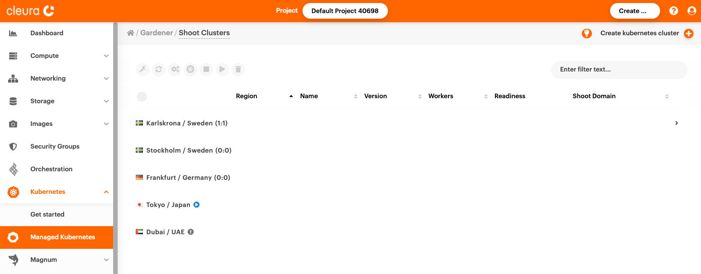

# Creating a Kubernetes cluster

If you want to create a Kubernetes cluster, you can do so via the {{gui}} using {{k8s_management_service}}.
This guide shows you how to do that, and how to deploy a sample application on such a cluster.

## Prerequisites

* If this is your first time using {{k8s_management_service}} in {{brand}}, you need to [activate the service](index.md) from the {{gui}}.
* To access the Kubernetes cluster from your computer, you will need to [install `kubectl`](https://kubernetes.io/docs/tasks/tools/install-kubectl-linux/) on your machine.

## Creating a Kubernetes cluster in {{gui}}

To get started, navigate to <https://{{gui_domain}}>, and in the side panel choose *Containers → [{{k8s_management_service}}](https://{{gui_domain}}/containers/gardener)*.
You will see a {{k8s_management_service}} page, in which you can create and manage your clusters. Click *Create Kubernetes cluster*.

In {{k8s_management_service}} terminology, a Kubernetes cluster is referred as a **Shoot** (as in, [new plant growth](https://en.wikipedia.org/wiki/Shoot)).

In the opened form, fill in the name of the new shoot cluster and select a region to see the rest of the options.

In the *Worker Groups* section, create at least one worker group.
Pay attention to the values you set for the following values:

* *Machine Type:* The [flavor](../../../reference/flavors/index.md) your worker nodes will use; this determines the number of CPU cores and RAM allocated to them.
* *Volume Size:* The amount of local storage allocated to each worker node.
* *Autoscaler Min:* The minimum number of worker nodes to run in the cluster at any time.
* *Autoscaler Max:* The maximum number of worker nodes the cluster automatically scales to, in the event that the current number of nodes cannot handle the deployed workload.
* *Max Surge:* The maximum number of additional nodes to deploy in an autoscaling event.

For a test cluster, you can leave all values at their defaults, and click *Create* at the bottom.

In the list of clusters, you will see your new {{k8s_management_service}} shoot bootstrapping.
The icon on the left marks the progress.
Creating the cluster can take several minutes.

### A note on quotas

Your {{k8s_management_service}} worker nodes are subject to [quotas](../../../reference/quotas/openstack.md) applicable to your {{brand}} project.
You should make sure that considering your selection of worker node [*flavor*](../../../reference/flavors/index.md) (which determines the number of virtual cores and virtual RAM allocated to each node), the _volume size_, and the _Autoscaler Max_ value, you are not at risk of violating any quota.

For example, if your project is configured with the [default quotas](../../../reference/quotas/openstack.md), and you select the `b.4c16gb` flavor for your worker nodes, your cluster would be able to run with a maximum of 3 worker nodes (since their total memory footprint would be 3×16=48 GiB, just short of the default 50 GiB limit).
A 4th node would push your total memory allocation to 64 GiB, violating your quota.

If necessary, be sure to request a quota increase via our [{{support}}](https://{{support_domain}}).

## Interacting with your cluster

Once your new shoot cluster is operational, you can [start interacting with it](kubectl.md).
