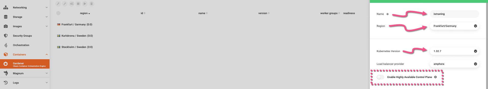
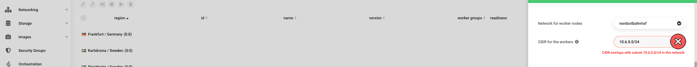
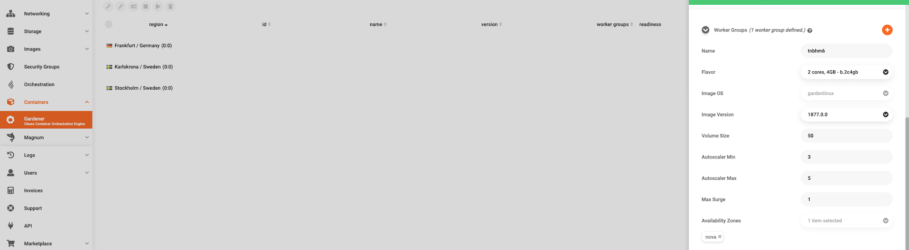
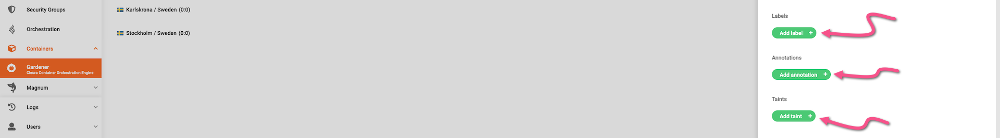
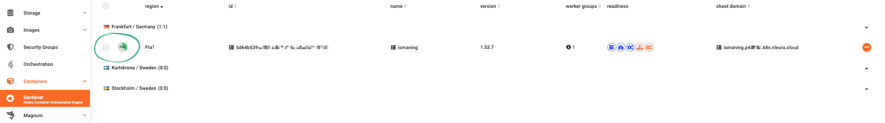
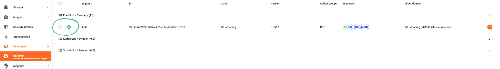

# Creating a Kubernetes cluster

To create a Kubernetes cluster, you may use the {{gui}} and the {{k8s_management_service}} service in particular.
This guide shows you how to do that.

## Prerequisites

* If this is your first time using {{brand_container_orchestration}}, you need to [activate the service](index.md) from the {{gui}}.
* To access the Kubernetes cluster from your computer, you must [install `kubectl`](https://kubernetes.io/docs/tasks/tools/#kubectl) on your local host.

## Creating a Kubernetes cluster in {{gui}}

To get started, navigate to <https://{{gui_domain}}> and, in the left-hand side panel, choose *Containers → [{{k8s_management_service}}](https://{{gui_domain}}/containers/gardener)*.
A central pane named *{{k8s_management_service}} / Shoot Clusters* appears.
There, you can create and manage your {{k8s_management_service}}-based clusters.
In {{k8s_management_service}} terminology, a Kubernetes cluster is referred to as a **shoot** (as in, [new plant growth](https://en.wikipedia.org/wiki/Shoot)).

At the top right-hand side of the central pane, click on *Create Kubernetes cluster*.

A new pane named *Create {{k8s_management_service}} Shoot Cluster* slides over from the right-hand side of the browser.
Type in a name for the new shoot cluster, and select a region.
Also, select the version of Kubernetes the new cluster will be running.
In the example below, we have chosen version 1.30.5, which, at the time of writing, was the latest supported in {{brand}}.
Please note the *Load balancer provider* and *Availability Zone* parameters.
Both are already set and for the time being, you cannot modify any of them.

Next, you may accept the proposed network address (in [CIDR notation](https://en.wikipedia.org/wiki/Classless_Inter-Domain_Routing#CIDR_notation)) for the worker nodes, or type in the one you prefer.

Alternatively, click on the drop-down menu at the right-hand side of *Network for worker nodes*.
From the available menu items, choose a pre-existing network.
Be sure to select one that has an assigned subnet and is connected to a router.

Then, define a new subnet for the worker nodes by typing in a CIDR network address.
If the new subnet overlaps with one of the subnets of the network you just selected, you will see an error message in red.

Instead, you should define a subnet that does not overlap with any of the subnets of your selected network.

Now, scroll down a bit until you bring the *Worker Groups* section into full view.
Make sure there is at least one defined.
(By default, you start with one Worker Group.)
Pay attention to the values you may set for the following parameters, and keep in mind that they apply to the particular Worker Group only.
In case you'll create another Worker Group, you'll have another set of parameters for it.

* *Flavor:* The [flavor](../../../reference/flavors/index.md) your worker nodes will use;
this determines the number of CPU cores and the amount of RAM allocated to them.
* *Volume Size:* The amount of local storage allocated to each worker node.
* *Autoscaler Min:* The minimum number of worker nodes to run at any time.
* *Autoscaler Max:* The maximum number of worker nodes the cluster automatically scales to, in the event that the current number of nodes cannot handle the deployed workload.
* *Max Surge:* The maximum number of additional nodes to deploy in an autoscaling event.

For a test cluster, feel free to leave each parameter at its default value.
When you scroll a bit further down, you see that for each Worker Group you may add [*Labels*](https://kubernetes.io/docs/concepts/overview/working-with-objects/labels), [*Annotations*](https://kubernetes.io/docs/concepts/overview/working-with-objects/annotations), or [*Taints*](https://kubernetes.io/docs/concepts/scheduling-eviction/taint-and-toleration).

Each shoot cluster in {{brand}} has a maintenance window.
Additionally, the operating system of the worker nodes can be automatically updated, and so can Kubernetes itself.
Do not change anything regarding the maintenance window or the [updates](rolling-upgrades.md), for everything is already set for you.
Instead, at the bottom of the pane, click the green *Create* button.

In the list of clusters, you will see your new {{k8s_management_service}} shoot bootstrapping.
The animated icon on the left-hand side of the cluster row marks the progress.
Creating the cluster may take several minutes.

Once your Gardener cluster has successfully launched, a green check mark will appear at the left of the cluster row.

### A note on quotas

Your {{k8s_management_service}} worker nodes are subject to [quotas](../../../reference/quotas/openstack.md) applicable to your {{brand}} project.
It would be best if you kept that in mind when selecting the worker node [*flavor*](../../../reference/flavors/index.md), setting the _volume size_ and the _Autoscaler Max_ values, or when creating more than one Worker Groups, so you will not be at risk of violating any quota.

For example, if your project is configured with the [default quotas](../../../reference/quotas/openstack.md), and you select the `b.4c16gb` flavor for your worker nodes, your cluster would be able to run with a maximum of 3 worker nodes (since their total memory footprint would be 3×16=48 GiB, just short of the default 50 GiB limit).
A 4th node would push your total memory allocation to 64 GiB, violating your quota.

If necessary, be sure to request a quota increase via our [{{support}}](https://{{support_domain}}/servicedesk).

## Viewing details and monitoring

After the new shoot cluster finishes bootstrapping, you may click on its row to bring all relevant details into view.
For instance, click the *Details* tab to get networking information about the worker nodes.

Next, go to the *Monitoring* tab.
There, you will notice two orange buttons: one for launching [Prometheus](https://prometheus.io), and one for launching [Plutono](https://github.com/credativ/plutono).

As an example, we have clicked the button for Plutono.
Prior to launching the dashboard, a pop-up window appears.
This shows the default username (`admin`), and the masked generated password.
You get this pop-up every time you click on either of the orange buttons.
In any case, to copy the password into the clipboard, click the related button shown below.
Then, click the orange button labeled *Open Dashboard*.

After typing in the default username and pasting the password, you get access to the Prometheus or Plutono dashboard for your shoot cluster.
In the example below, we have the Plutono dashboard displaying graphical information regarding the cluster nodes.

## Interacting with your cluster

Once your new shoot cluster is operational, you can [start interacting with it](kubectl.md).
