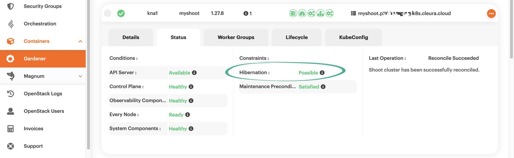
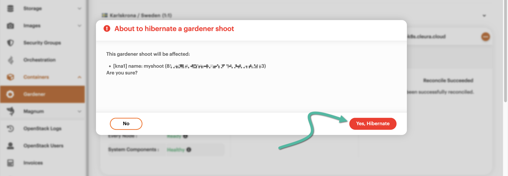

# Hibernating a Kubernetes cluster

There will be times when you won't be using your Gardener-based cluster
much, if at all. To save on costs, you can put the whole cluster in
hibernation. If you do, then from that time on (and until you wake the
cluster again), you will be paying *less* for the cluster.
The reason for not paying anything at all is directly related to [how
Gardener hibernation
works](../../../background/kubernetes/gardener/hibernation.md).

## Prerequisites

We assume you have already used Gardener in {{brand}} to spin up a
Kubernetes cluster, which is now humming away. If you've never done
this before, please feel free to [follow this
guide](../create-shoot-cluster).

## Hibernating a cluster

Fire up your favorite web browser and navigate to
<https://{{gui_domain}}>. Make sure the vertical pane at the left-hand
side of the page is in full view, then choose
*Containers → [{{k8s_management_service}}](https://{{gui_domain}}/containers/gardener)*.
In the main pane, you will see your Gardener cluster.  Click anywhere
on the corresponding row for a detailed view of the various cluster
characteristics. Go to the *Status* tab and check if hibernation is
possible.

If hibernation is indeed possible, this will be reflected in the
*Constraints* section. To go ahead and actually hibernate the cluster,
click the orange three-dot icon at the right-hand side of the cluster
row, and from the pop-up menu that appears, select *Hibernate Cluster*.

A big pop-up window will appear, asking you to confirm the action.
Click the red button labeled *Yes, Hibernate*.

After a minute or two, the cluster will be in a hibernated state. This
fact will be indicated by the white-square-in-red-circle icon, at the
left-hand side of the cluster row.

At this point, and as long as the cluster is in hibernation, any
attempt to list the cluster nodes, e.g., via `kubectl`, will fail.

## Waking up a cluster in hibernation

To wake up a cluster in hibernation, click the orange three-dot icon
at the right-hand side of its row. From the pop-up menu that appears,
select *Wake up Cluster*.

A big pop-up window will appear, asking you to confirm that you want
to wake the cluster. Go ahead and click the red *Yes, Wakeup* button.

After a couple of minutes, the cluster will be fully awake. The fact
will be indicated by the white-tick-in-green-circle icon, at the
left-hand side of the cluster row.

From that time on, the cluster will be accessible and fully operational again.
