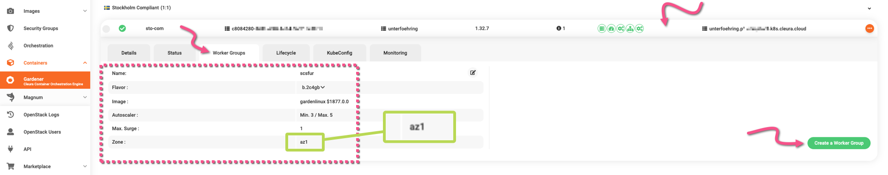
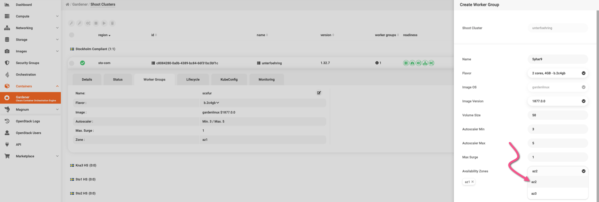
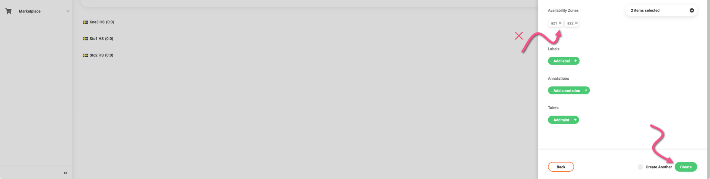
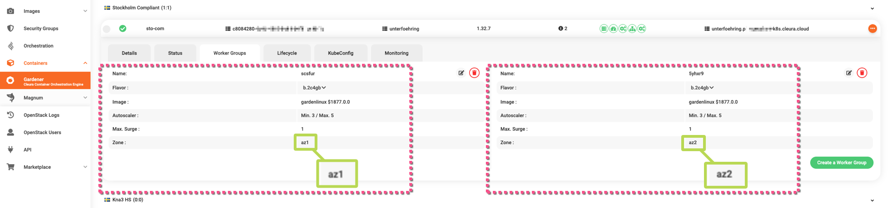

# Enabling high availability

When you [create a new {{k8s_management_service}} cluster](create-shoot-cluster.md), you have the option to enable high availability (HA) features for its control plane.
In case you have an existing {{k8s_management_service}} cluster with a non-HA control plane, you may at any time enable the HA features for that control plane.

> Keep in mind that once you enable HA for the control plane of a {{k8s_management_service}} cluster, you cannot disable it for that particular cluster.

Additionally, you may add HA characteristics to one or more Worker Groups of an existing cluster.

## Enabling HA for the control plane

Using your favorite web browser, navigate to <https://{{gui_domain}}> and log in.
In the left-hand side panel, choose *Containers → [{{k8s_management_service}}](https://{{gui_domain}}/containers/gardener)*.
Then, in the central pane of the {{gui}}, you see all of your {{k8s_management_service}} clusters, organized by {{brand}} region.

Locate the cluster you are interested in, and click the orange :material-dots-horizontal-circle: icon on the right of the corresponding row.
From the drop-down menu that appears, select _Modify Cluster_.

A vertical pane titled _Modify Gardener Shoot Cluster_ slides over from the right.
In it, you see the disabled option _Enable Highly Available Control Plane_.
Click on it to enable HA for the control plane of the shoot cluster.

Before the change is applied, a warning appears:
enabling HA is an irreversible action.
Once you take it, there is no way to disable HA at a later time.

If you are sure you want to enable HA, scroll down a bit until you see the green _Update_ button and click on it.

Enabling HA for the control plane of any {{k8s_management_service}} cluster takes a few minutes.
You can see how the process is progressing by the animated icon on the left of the cluster row.

As soon as HA is enabled, the animated icon changes into a check mark (:material-check-circle:).

## Enabling HA for Worker Groups

You may add HA characteristics to one or more Worker Groups by modifying the _Autoscaler&nbsp;Min_ and _Autoscaler&nbsp;Max_ parameters.

First off, select the {{k8s_management_service}} cluster you are interested in.
Click on the cluster row to expand its characteristics, then select the _Worker Groups_ tab.

Click once more on the :fontawesome-solid-pen-to-square: icon of the Worker Group you wish to modify.
A vertical pane named _Modify Worker Group_ slides over from the right.

Modify the _Autoscaler&nbsp;Min_ and _Autoscaler&nbsp;Max_ parameters.
You may, for instance, set _Autoscaler&nbsp;Min_ to 3 and _Autoscaler&nbsp;Max_ to 5.
When you are ready to apply the changes, click the green _Update_ button.

After a few seconds, the new values for the autoscaler parameters will be visible in the _Worker Groups_ tab.

## Having Worker Groups in different Availability Zones

Another way to make Worker Groups highly available is to have _at least_ two such groups, each in its own Availability Zone (AZ).

To create a new Worker Group in its own AZ, begin by locating the cluster you are interested in, then click its row to have all relevant details in full view.
Click once more on the _Worker Groups_ tab to see all available groups.
In the example below, there is only one Worker Group that resides in the AZ named `az1`.
To create a new Worker Group, click on the green _Create a Worker Group_ button.

A vertical pane named _Create Worker Group_ slides over from the right.
There, you see the parameters of a new group.
Before you create it, click on the drop-down menu for _Availability Zones_, and indicate an AZ for the new group.
Make sure you pick one which is **different** from the AZ where the first Worker Group resides.

Optionally, you can have the new Worker Group reside **only** in the new AZ you just selected:
for that, click the old AZ label to remove it.
Finally, click on the green _Create_ button to instantiate the new WG.

When the new Worker Group is ready, you can see all groups in the _Worker Groups_ tab, each in its own AZ.

