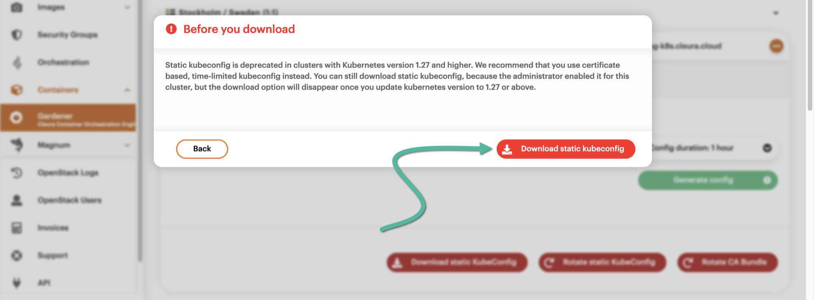

# Managing a Kubernetes cluster

Once you [have launched a new cluster](create-shoot-cluster.md), you can interact with it using `kubectl` with a [kubeconfig](https://kubernetes.io/docs/concepts/configuration/organize-cluster-access-kubeconfig/) file.

## Prerequisites

You should install `kubectl`, the Kubernetes command line tool, on your local computer.
Then, you will be able to issue commands against your clusters.
To install `kubectl`, follow [the official documentation](https://kubernetes.io/docs/tasks/tools/#kubectl).

## Extracting the kubeconfig file

With the advent of Kubernetes 1.27, you can access your shoot cluster using a *certificate-based* kubeconfig file.
You may also be familiar with *static* kubeconfig files.

* A **static** kubeconfig contains a [static token](https://kubernetes.io/docs/reference/access-authn-authz/authentication/#static-token-file), provides `cluster-admin` privileges to the corresponding shoot cluster, and never expires.
In {{brand}}, up until and including Kubernetes 1.26, you could access your shoot cluster by generating a static kubeconfig.

* A **certificate-based** kubeconfig is valid for a predefined amount of time, during which it can be used for accessing the corresponding shoot cluster with `cluster-admin` privileges.
The credentials associated with this type of kubeconfig are client certificates with time-limited validity.
Beginning with Kubernetes version 1.27, for new clusters you are able to issue certificate-based kubeconfig files only.

To get a kubeconfig file for a shoot cluster, in the {{gui}} click on the cluster row to expand its properties and go to the *KubeConfig* tab.

=== "Static kubeconfig"
    
=== "Certificate-based kubeconfig"
    Notice that you may set the duration of the kubeconfig file validity.

    

    The default validity period is one hour, but you may use the drop-down menu to select a different duration.

    

    When satisfied with the duration, click the green button labeled *Generate config*.

    

    Right below, you will see the contents of your dynamically generated kubeconfig.

    

To download your kubeconfig, click the blue button labeled *Download KubeConfig*.
In the default download folder of your local user account, you will get a configuration file named like so:

```plain
kubeconfig--<cluster_name>--<region_name>--<project_id>.yaml
```

Create a directory named `.kube` in your local user's home, then move the YAML file you downloaded into it.
Rename the YAML to `config`, ending up with `~/.kube/config`.
By default, `kubectl` searches for its configuration in `~/.kube/config`.
If necessary, you can [modify this behavior](https://kubernetes.io/docs/concepts/configuration/organize-cluster-access-kubeconfig/) by setting the `KUBECONFIG` environment variable.
For example, if you want to retain the original filename exactly as downloaded, you will type something like the following:

```shell
export KUBECONFIG=~/.kube/kubeconfig--<cluster_name>--<region_name>--<project_id>.yaml
```

If you manage multiple Kubernetes clusters, you will probably prefer this approach.

## Verifying your kubeconfig

Check if your `kubectl` uses the proper configuration by running:

```shell
kubectl config view
```

You should see something like this:

=== "Static kubeconfig"
    ```yaml
    apiVersion: v1
    clusters:
      - cluster:
          certificate-authority-data: DATA+OMITTED
          server: https://api.test-cluster.pabxyz.staging-k8s.{{gui_domain}}
        name: shoot--pabxyz--test-cluster
    contexts:
      - context:
          cluster: shoot--pabxyz--test-cluster
          user: shoot--pabxyz--test-cluster-token
        name: shoot--pabxyz--test-cluster
    current-context: shoot--pabxyz--test-cluster
    kind: Config
    preferences: { }
    users:
      - name: shoot--pabxyz--test-cluster-token
        user:
          token: REDACTED
    ```
=== "Certificate-based kubeconfig"
    ```yaml
    apiVersion: v1
    clusters:
    - cluster:
        certificate-authority-data: DATA+OMITTED
        server: https://api.ghar.pabxyz.k8s.{{gui_domain}}
      name: garden-pabxyz--ghar-external
    - cluster:
        certificate-authority-data: DATA+OMITTED
        server: https://api.ghar.pabxyz.internal.k8s.{{gui_domain}}
      name: garden-pabxyz--ghar-internal
    contexts:
    - context:
        cluster: garden-pabxyz--ghar-external
        user: garden-pabxyz--ghar-external
      name: garden-pabxyz--ghar-external
    - context:
        cluster: garden-pabxyz--ghar-internal
        user: garden-pabxyz--ghar-external
      name: garden-pabxyz--ghar-internal
    current-context: garden-pabxyz--ghar-external
    kind: Config
    preferences: {}
    users:
    - name: garden-pabxyz--ghar-external
      user:
        client-certificate-data: DATA+OMITTED
        client-key-data: DATA+OMITTED
    ```

You will notice that the cluster API endpoints (the `server` entries in your kubeconfig) are dynamically managed DNS addresses.
{{brand_container_orchestration}} automatically created the DNS records upon shoot cluster creation.

The DNS records will subsequently disappear when you delete the cluster.
They *also* disappear when you [hibernate the shoot cluster](hibernate-shoot-cluster.md), and reappear when you wake it from hibernation.

## Accessing your cluster with `kubectl`

Check your available nodes by running:

```shell
kubectl get nodes
```

Assuming you used the default options when creating the cluster, you should now see the one {{k8s_management_service}} worker node that is initially available:

```console
NAME                                        STATUS   ROLES    AGE   VERSION
shoot--pabxyz--ghar-knnv4s-z1-6bb46-fg84s   Ready    <none>   27h   v1.26.12
shoot--pabxyz--ghar-knnv4s-z1-6bb46-gbv6x   Ready    <none>   27h   v1.26.12
shoot--pabxyz--ghar-knnv4s-z1-6bb46-p5vsk   Ready    <none>   27h   v1.26.12
```

> Please note that in contrast to an [OpenStack Magnum-managed Kubernetes cluster](../../openstack/magnum/new-k8s-cluster.md) (where the output of `kubectl get nodes` includes control plane and worker nodes), in a {{k8s_management_service}} cluster the same command *only* lists the worker nodes.

## Deploying an application

Create a sample deployment with a Hello World application:

```shell
kubectl create deployment hello-node --image=registry.k8s.io/echoserver:1.4
kubectl expose deployment hello-node --type=LoadBalancer --port=8080
```

To access the created app, list the available services:

```shell
kubectl get services
```

You should get the load balancer service with its external IP and port
number:

```console
NAME         TYPE           CLUSTER-IP       EXTERNAL-IP    PORT(S)          AGE
hello-node   LoadBalancer   100.66.245.131   198.51.100.42  8080:32481/TCP   73s
kubernetes   ClusterIP      100.64.0.1       <none>         443/TCP          27h
```

Open a browser to `http://198.51.100.42:8080` (substituting the correct `EXTERNAL-IP` listed for your service).
You should see the page of the Hello World app.

## Rotating kubeconfig

Whether using a certificate-based kubeconfig file or not, you can rotate it for a fresh one.
Since certificate-based kubeconfig files have time-bound validity anyway, issuing fresh kubeconfig files of this type is standard practice.
In addition to issuing new certificate-based kubeconfig files, it is highly recommended to rotate the [CA bundle](https://www.ssldragon.com/blog/what-is-a-ca-bundle) used for creating the kubeconfig files in the first place.

It is also recommended to periodically rotate static kubeconfig files;
even though they never expire, this very fact makes them less secure than certificate-based ones.

In any case, you can rotate an existing kubeconfig using the {{gui}}.

=== "Static kubeconfig"
    Go to the shoot cluster you want.
    Click the orange circular :fontawesome-solid-ellipsis: icon at the right-hand side of the cluster row.

    

    Select the *Rotate Kubeconfig* option from the menu that immediately appears.

    

    A window pops up notifying you that the new kubeconfig will have a fresh authentication token, and during the creation of the new kubeconfig, the existing one you might still be using will stop working.
    When ready, click the red *Yes, Rotate kubeconfig* button.

    

    The creation of the new kubeconfig begins, and the whole process might take a minute or two to complete.
    During that time, you will notice an animated red circular progress indicator at the left-hand side of the cluster row.

    

    When the new kubeconfig is ready, click the blue *Download KubeConfig* button.

    
=== "Certificate-based kubeconfig"
    Go to the shoot cluster you want, and then to the *KubeConfig* tab.
    Click the red *Rotate CA Bundle* button.

    

    A new window pops up, informing you in detail about the 3-step process that is about to take place.
    Please notice that it may take up to twenty minutes to complete.
    When ready, click the red *Start CA rotation* button.

    

    During the first step, a new CA bundle is generated.
    This may take up to ten minutes to complete.
    During that time, the existing kubeconfig file still works.

    

    When the new CA bundle is ready, you should remove the existing one by clicking the red *Remove old CA bundle* button.
    When you click that button, the existing kubeconfig will stop working.

    

    It is now time to create a new certificate-based kubeconfig, which will be based on the new CA bundle.
    This time click the *Back* button, or the CA bundle creation process will start over.

    

    Choose a duration for the new kubeconfig, then click the green *Generate config* button.

    

    To get your new certificate-based kubeconfig file, click the blue *Download KubeConfig* button.

    
