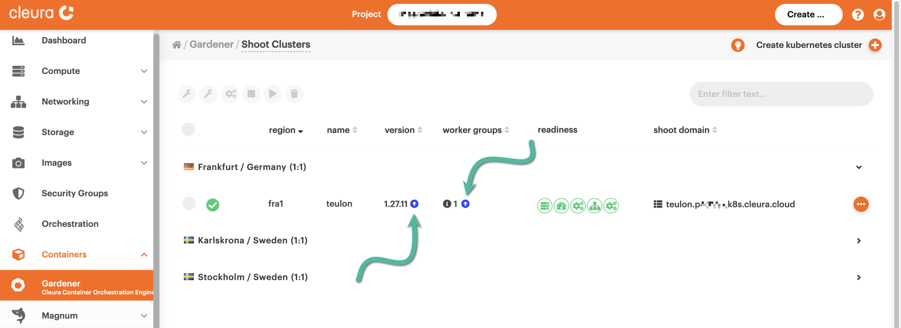
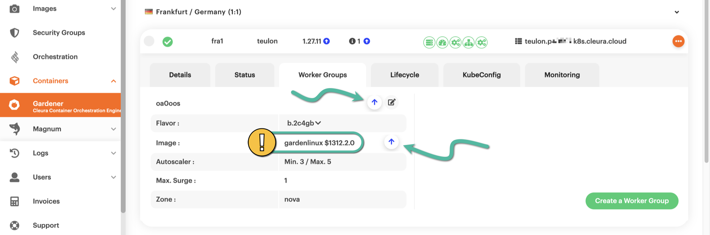
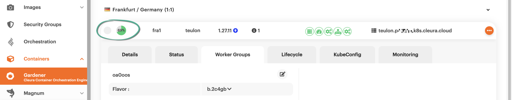
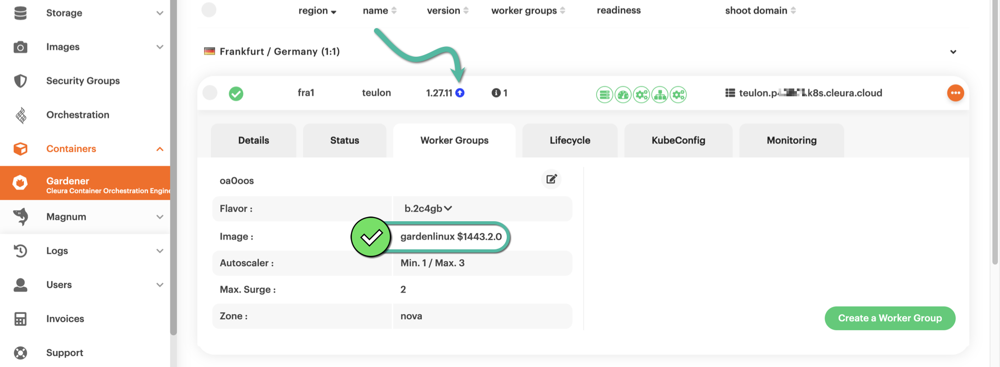
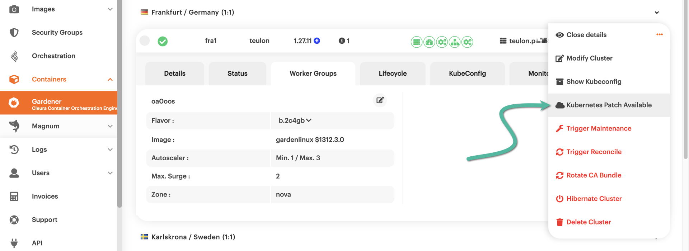
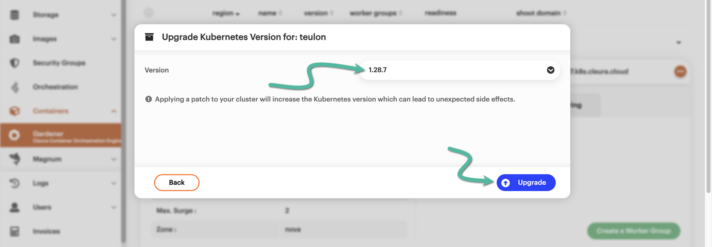

# Conducting rolling upgrades

By default, Kubernetes clusters created with {{k8s_management_service}} in {{brand}} are upgraded automatically.
Those upgrades take place during a specified maintenance window, and you may learn more about [what they involve and how they work](../../../background/kubernetes/gardener/autoupgrades.md).
Besides the automatic upgrades, you may manually apply any upgrades available for your cluster.

In the following two examples, we first show how to manually upgrade the machine image for cluster nodes.
Then, we show how to upgrade the Kubernetes version the cluster is running.

## Upgrading machine images

In the left-hand vertical pane of the {{gui}}, select Containers → [{{k8s_management_service}}](https://{{gui_domain}}/containers/gardener).
In the central pane are your {{k8s_management_service}} clusters, each on its row.

If a Kubernetes upgrade is available for a shoot cluster, you will notice a blue :fontawesome-solid-circle-arrow-up: icon on the right of the current Kubernetes version.
In our example, the current Kubernetes version is 1.29.9.
Additionally, if there is a new machine image for the cluster nodes, you will also notice a blue :fontawesome-solid-circle-arrow-up: icon on the right of the number of Worker Groups.
In our example, the cluster has 1 Worker Group.

To get more information about the current machine image, click on the cluster row to bring its details into full view, then select the *Worker Groups* tab.
There, you will see the version of the current machine image.
To see the newer version of the image available, hover the mouse over any of the two :fontawesome-solid-arrow-up: icons.
The upgrade process starts by clicking on any one of those.

The upgrade process starts immediately and takes some time to complete.
The animated icon at the left-hand side of the cluster row marks the progress.

As soon as the upgrade is complete, the new image version is displayed in the *Image* row of the *Worker Groups* tab.
Since we have not upgraded Kubernetes yet, there is still a blue :fontawesome-solid-circle-arrow-up: icon on the right of the current Kubernetes version.

## Upgrading Kubernetes

To get the Kubernetes upgrade process going, click the orange :material-dots-horizontal-circle: icon on the right-hand side of the cluster row.
In the pop-up menu that appears, there is an option named *Kubernetes Patch Available*.
That one is not always there, and when it is, it acts as yet another indicator of an available Kubernetes upgrade.
Please select the option by clicking on it.

A new pop-up window named *Upgrade Kubernetes Version for: &lt;cluster_name&gt;* appears.
From the *Version* drop-down menu, you may select the new Kubernetes version for your shoot cluster.
When ready, click the blue *Upgrade* button.

The upgrade doesn't start right away.
Instead, you are informed that the cluster is indeed ready for it, but there are some notes you might want to read up on before the actual process begins.

Click the *Upgrade* button --- which is now green --- to start the upgrade process.
The animated icon at the left-hand side of the cluster row indicates the progress of the whole upgrade process.

After some minutes, the upgrade will be over.
The new Kubernetes version will be visible on the right of the shoot cluster name.

