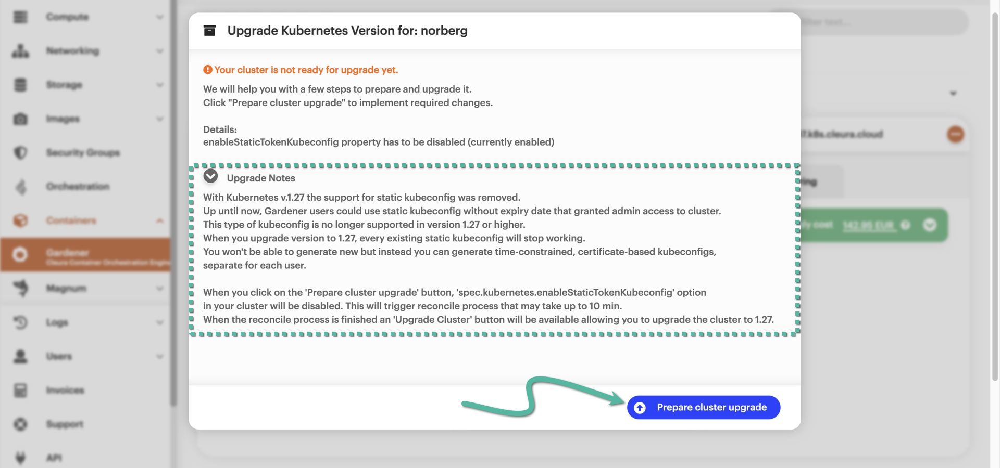
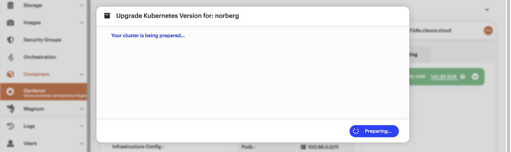
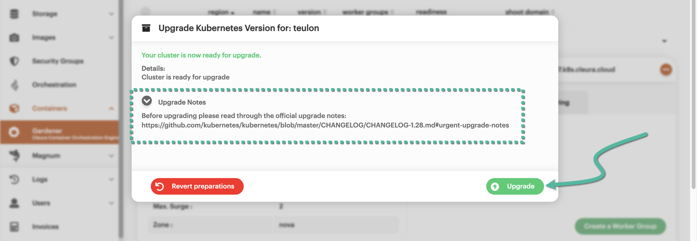

# Conducting rolling upgrades

By default, Kubernetes clusters created with {{k8s_management_service}} in {{brand}} are upgraded automatically.
Those upgrades take place during a specified maintenance window, and you may find out more about [what they involve and how they work](../../../background/kubernetes/gardener/autoupgrades.md).
Besides the automatic upgrades, you may manually apply any upgrades available for your cluster.

In the following two examples, we first show how to manually upgrade the machine image the cluster nodes are based on.
Then, we show how to upgrade the Kubernetes version the cluster uses.

## Upgrading machine images

In the left-hand vertical pane of the {{gui}}, select Containers → [{{k8s_management_service}}](https://{{gui_domain}}/containers/gardener).
In the central pane, you will see all your {{k8s_management_service}} clusters, each on its own row.

If a Kubernetes upgrade is available for a shoot cluster, in the *Version* column, you will notice a blue :fontawesome-solid-circle-arrow-up: icon together with the current Kubernetes version.
Additionally, if there is a new machine image version for the cluster nodes, then in the *Worker Groups* column, you will also notice a blue :fontawesome-solid-circle-arrow-up: icon --- but no version number.

To get more information about the current machine image, click on the cluster row to bring its details into full view, then select the *Worker Groups* tab.
There, you will see the version of the current machine image.
To start the upgrade process, click any of the two :fontawesome-solid-arrow-up: icons.

The upgrade process starts immediately and takes some time to complete.
The animated icon at the left-hand side of the cluster row marks the progress.

A little before and after it is done, there is no icon in the *Worker Groups* column, and the new image version is displayed in the
*Image* row of the *Worker Groups* tab.
Since we have not upgraded Kubernetes yet, an icon is still in the *Version* column.

## Upgrading Kubernetes

To get the Kubernetes upgrade process going, click the orange :material-dots-horizontal-circle: icon on the right-hand side of the cluster row.
In the pop-up menu that appears, there is an option named *Kubernetes Patch Available*.
That one is not always there, and when it is, it acts as yet another indicator of an available Kubernetes upgrade.
Please select the option by clicking on it.

A new pop-up window named *Upgrade Kubernetes Version for: &lt;cluster_name&gt;* appears.
From the *Version* drop-down menu, you may select the new Kubernetes version you want your cluster to upgrade to.
When ready, click the blue *Upgrade* button.

You will realize that the upgrade doesn't start right away.
Instead, you are informed that the cluster is indeed ready for it, but there are some notes you might want to read up on *before* the actual process begins.
The gist of the notes differs depending on whether you're upgrading a shoot with Kubernetes 1.26, or a shoot with Kubernetes 1.27 or higher.
=== "Shoot with Kubernetes 1.26"
    In summary, the notes inform you that any existing static kubeconfig will stop working after the upgrade to Kubernetes 1.27, and you will not be able to create a new static kubeconfig.
    You will, however, be able to create [a new certificate-based kubeconfig](kubectl.md).

    

    To disable support for static kubeconfigs for the existing cluster and thus prepare the shoot for the upgrade, click the blue button labeled *Prepare cluster upgrade*.
    Another pop-up window appears, indicating that the preparation is underway.
    Keep in mind that this might take up to ten minutes to complete.

    

    When the shoot is ready for the upgrade, yet another window appears.
    It lets you know that the shoot is now ready for the upgrade, reminds you that any existing static kubeconfig will not work after the upgrade is complete, and points out that you will not be able to create a new static kubeconfig.

    
=== "Shoot with Kubernetes 1.27 or higher"
    The notes link to the official Kubernetes changelog of the version you are about to upgrade to.
    You may want to copy that link, paste it into a new browser window or tab, and take the time to read the changelog.

    

Click the *Upgrade* button --- which is now green --- to start the upgrade process.
After some minutes, the upgrade will be over.
The new Kubernetes version will be visible in the *Version* column of the cluster row.

