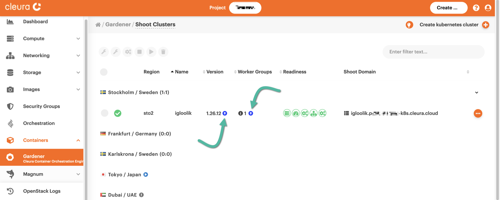
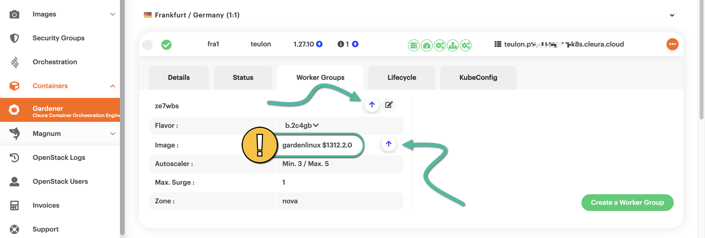
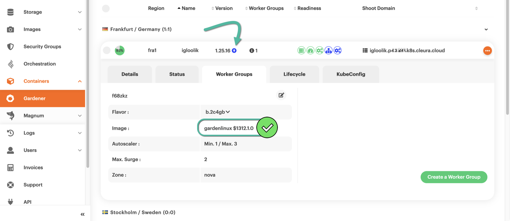
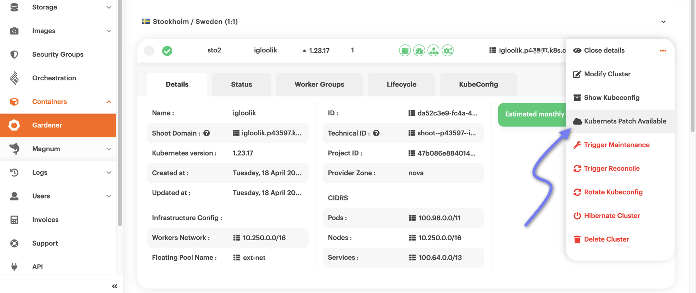
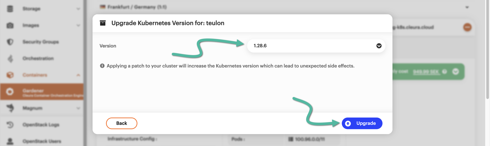
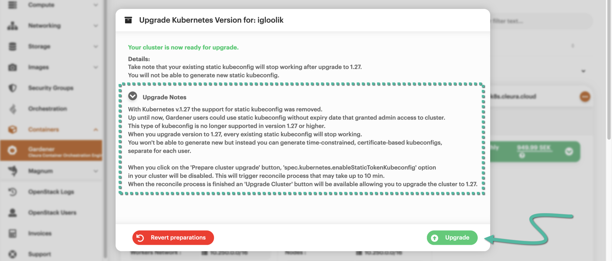
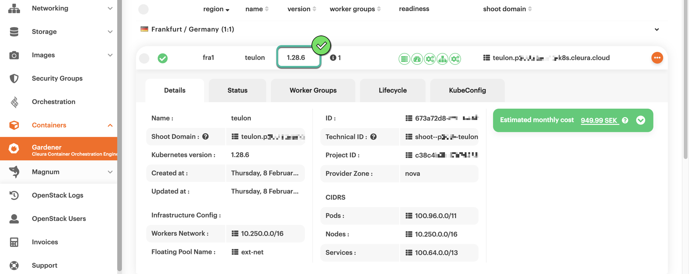

# Conducting rolling upgrades

By default, Kubernetes clusters created with {{k8s_management_service}}
in {{brand}} are upgraded automatically. Those upgrades take place
during a specified maintenance window, and you may find out more about
[what they involve and how they
work](../../../background/kubernetes/gardener/autoupgrades.md). Besides
the automatic upgrades, you can manually apply any upgrades available
for your cluster.

In the following two examples, we first show how to manually upgrade the
machine image the cluster nodes are based on and then how to upgrade the
Kubernetes version the cluster uses.

## Upgrading machine images

In the left-hand vertical pane of the {{gui}}, select Containers →
[{{k8s_management_service}}](https://{{gui_domain}}/containers/gardener).
In the central pane, you will see all your {{k8s_management_service}}
clusters, each on its own row. If a Kubernetes upgrade is available, in
the *Version* column you will notice a blue :fontawesome-solid-circle-arrow-up: icon, together with
the new Kubernetes version. Additionally, if there is a new machine
image version for the cluster nodes, then in the *Worker Groups* column you
will also notice a blue :fontawesome-solid-circle-arrow-up: icon but no version number.

To get more information about the new machine image available, click on
the cluster row to bring its details up into view, then select the *Worker
Groups* tab. There, you will see the version of the new machine image.
To start the upgrade process, click any of the two
:fontawesome-solid-arrow-up: icons.

The upgrade process will start immediately and will take some time to
complete. A little before and after it is done, there will be no icon in the
*Worker Groups* column, and the new image version will be displayed in the
*Image* row of the *Worker Groups* tab. Our example still has an icon in the
*Version* column. That is because we have not upgraded Kubernetes yet.

## Upgrading Kubernetes

To get the Kubernetes upgrade process going, click the orange
:material-dots-horizontal-circle: icon on the right of the cluster row.
In the pop-up menu that appears, you will notice an option named
*Kubernetes Patch Available*. That one is not always there, but now it
is and acts as another indicator of an available Kubernetes upgrade.
Please select the option by clicking on it.

A new pop-up window named *Upgrade Kubernetes Version for:
&lt;cluster_name&gt;* appears. From the *Version* drop-down menu, you
may select the new Kubernetes version you want your cluster to upgrade
to.  When ready, click the blue *Upgrade* button to start the process.

You will realize that the upgrade doesn't start right away. Instead, you
are informed that the cluster is indeed ready for it, but there are some
notes you might want to read up on before the whole process begins. If
you do, copy and paste the provided URL into a separate browser tab or
window. In any case, to actually get the upgrade going, click the
*Upgrade* button which is now green.

After some minutes, the upgrade will be over. The new Kubernetes version
will be visible in the *Version* column of the cluster row.

