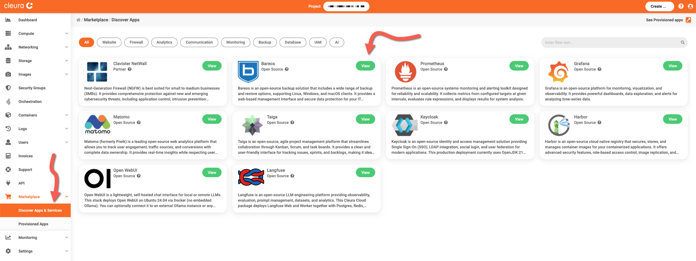
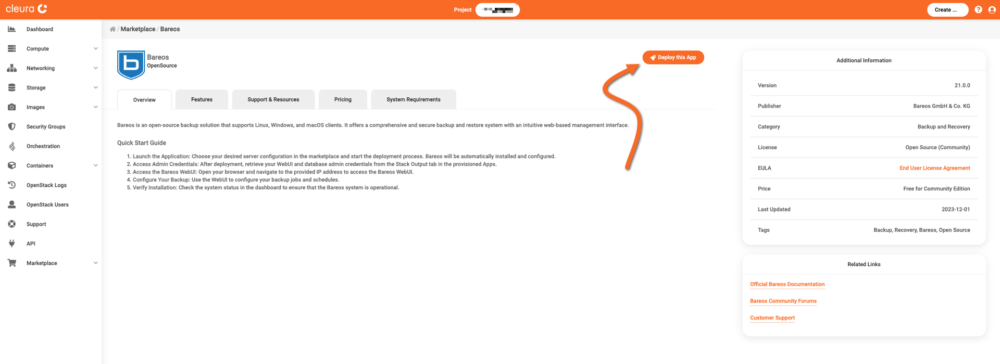
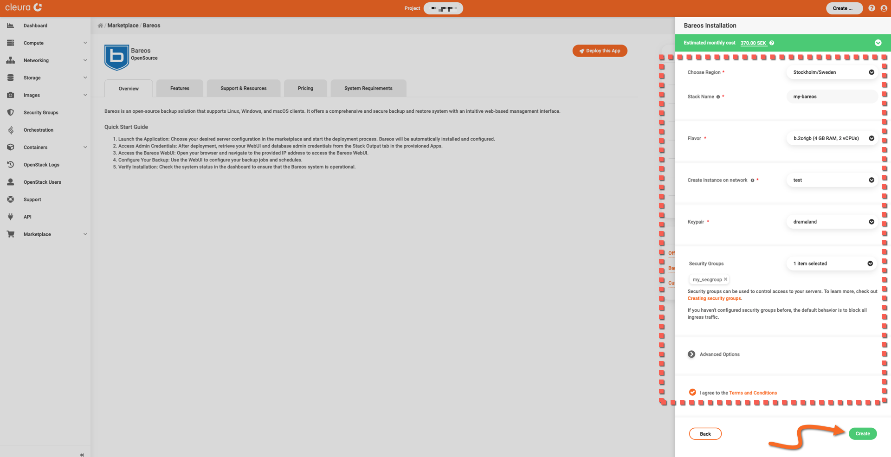
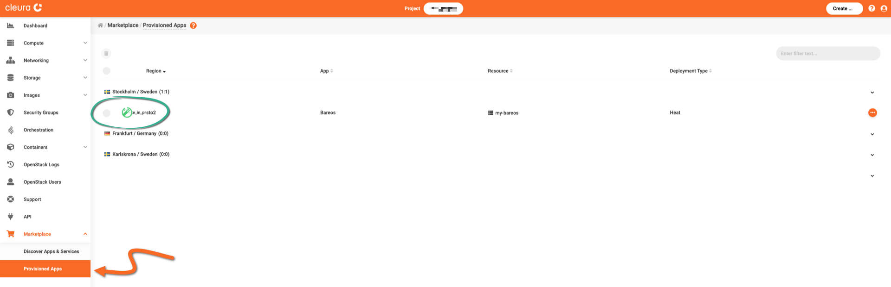
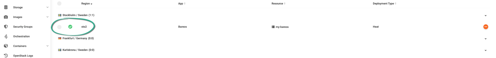
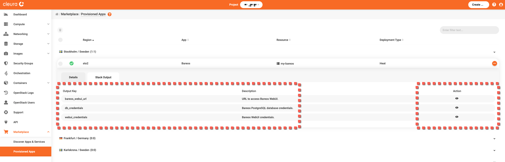
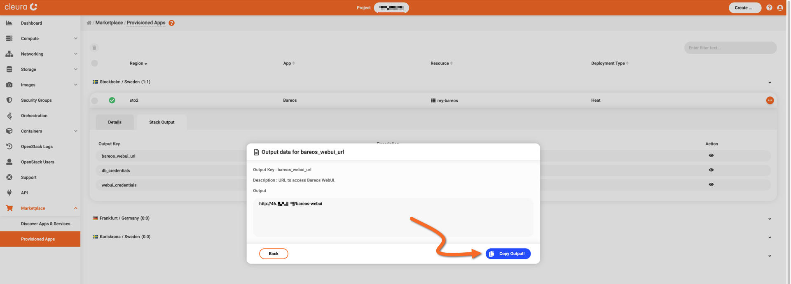
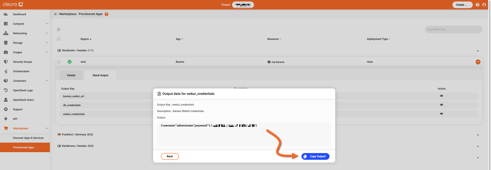
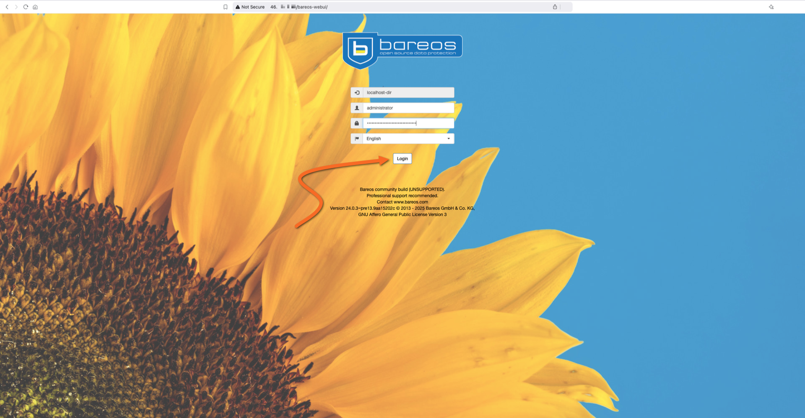
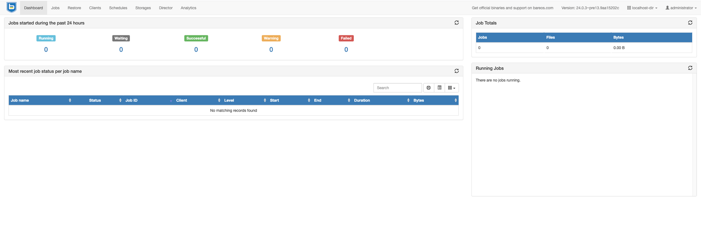

# Creating a Bareos instance

This guide covers the deployment of a self-hosted [Bareos](https://www.bareos.com/) service.

To proceed, make sure you have an [account in {{brand}}](../../getting-started/create-account.md), and you are logged in to the [{{gui}}](https://{{gui_domain}}).

## Step-by-step deployment

In the left vertical pane of the {{gui}}, expand the *Marketplace* category and click on *Discover Apps and Services*.
In the central pane, you will see all available applications and services.
Locate the *Bareos* box and click the green *View* button.

You will see the *Bareos* information page, where you can learn more about its features, and obtain pricing information.
Click the orange *Deploy this App* button to start the deployment process.

The Bareos application is hosted on a [Nova VM](../../openstack/nova/new-server.md), so now you may select a region, a name, a flavor, a public network, a keypair, and a security group for it.
Regarding the security group, [make sure it includes a rule](../../openstack/neutron/create-security-groups.md) allowing incoming TCP connections to port 80.

Read and agree to the *Terms and Conditions.*
When you are ready, click the green *Create* button.

The deployment takes some minutes to complete.
To check how it is going, expand the Marketplace category in the vertical pane on the left and click *Provisioned Apps*.
In the central pane, watch the Bareos Heat stack row.
The animated icon at the left marks the deployment progress.

When the deployment is complete, you will see a white check mark in a green circle.

## Logging into the Bareos dashboard

You must know the URL of Bareos and the password automatically generated for the `administrator` user.
For that, make sure you are in the *Provisioned Apps* pane.
Click on the Bareos row to expand it, and select the *Stack Output* tab.

Get a pop-up window revealing the URL of the particular Bareos deployment.
Click the icon in the *Action* column of the *harbor_webui_url* row, then click the blue *Copy Output!* button.
Paste that into a new text editor window, but don't save it in a new file.
Instead, we recommend you create a new entry in your password manager of choice and use the URL there.
Close the pop-up window by clicking on the *Back* button.

In the *webui_credentials* row, click the icon in the *Action* column.
A pop-up window appears.
Click the blue *Copy Output!* button to copy the content of the *Output* box to the clipboard.
Paste that into a new text editor window.
Move the user name (`administrator`) and the password into the password manager entry you just created.
Again, the pop-up window by clicking on the *Back* button.

Using your favorite web browser, navigate to your Bareos deployment's URL.
The Bareos login page appears.
Type in the user name (`administrator`), paste the password from your password manager, and click the *Login* button below.

You are directed to the Bareos main page.

On a separate browser window or tab, navigate to the [Bareos documentation page](https://www.bareos.com/learn/documentation/) to learn how to use your new self-hosted backup and data recovery service.
