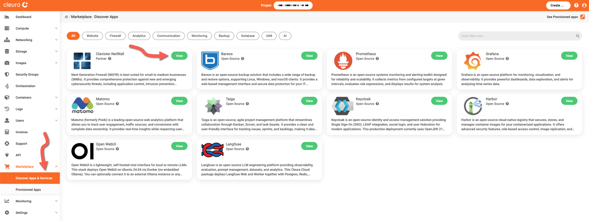

# Creating a firewall instance

Assuming you already have an [account in {{brand}}](../../getting-started/create-account.md), you may log in to [{{gui_domain}}](https://cleura.cloud), visit the Marketplace, and deploy any of the available applications or services.

This guide covers the deployment of a Clavister NetWall application firewall.

## Step-by-step deployment

In the left-hand side vertical pane of the {{gui}}, expand the *Marketplace* category and click on *Discover Apps and Services*.
In the central pane, you will see all available applications and services.
Locate the *Clavister NetWall* box and click the green *View* button.

You will see the *Clavister NetWall* information page, where you can learn more about its features and obtain pricing information.
Click the orange *Deploy this App* button to start the deployment process.

The firewall is hosted on a [Nova VM](../../openstack/nova/new-server.md), so now you may select a region, a name, a flavor, a public network, and a keypair for it.
When you are ready, click the green *Create* button.

The deployment takes a few minutes to complete.
To check how it is going, expand the Marketplace category in the vertical pane on the left and click *Provisioned Apps*.
In the central pane, watch the firewall VM row.
The animated icon at the left marks the deployment progress.

When the deployment is complete, you will see a white check mark in a green circle at the left of the firewall VM row.

## Logging into the NetWall dashboard

You need to know the firewall VM's public IP address and the automatically generated password for the `admin` user.
For that, make sure you are in the *Provisioned Apps* pane.
Click on the firewall row to expand it, and select the *Stack Output* tab.

In the *gateway_password* row, click the icon in the *Action* column.
A pop-up window appears, and you may click the blue *Copy Output!* button to copy the password to the clipboard.
Close the pop-up window by clicking on the *Back* button.

Then get a pop-up window with the public IP, by clicking the icon in the *Action* column of the *gateway_public_ip* row.
Again, you may click the blue *Copy Output!* button or, better yet, jot the IP down so you won't overwrite the password in the clipboard.

In your favorite web browser, navigate to `https://<public-ip>`.
You will see a warning regarding the self-signed certificate, so make an exception and allow the browser to load the page.
In the login window, type `admin` in the *Username* text field, and paste the password in the *Password* field below.
Click on the blue *Login* button to proceed.

The Clavister NetWall dashboard appears.
At your convenience, take the time to familiarize yourself with it and explore the features the application firewall offers.

By now, you might want to [put a new server behind the firewall](../../openstack/nova/new-server-cnw.md).
