# Creating a Grafana instance

This guide covers the deployment of a self-hosted [Grafana](https://grafana.com/) service.

To proceed, make sure you have an [account in {{brand}}](../../getting-started/create-account.md), and you are logged in to the [{{gui}}](https://{{gui_domain}}).

## Step-by-step deployment

In the left vertical pane of the {{gui}}, expand the *Marketplace* category and click on *Discover Apps and Services*.
In the central pane, you will see all available applications and services.
Locate the *Grafana* box and click the green *View* button.

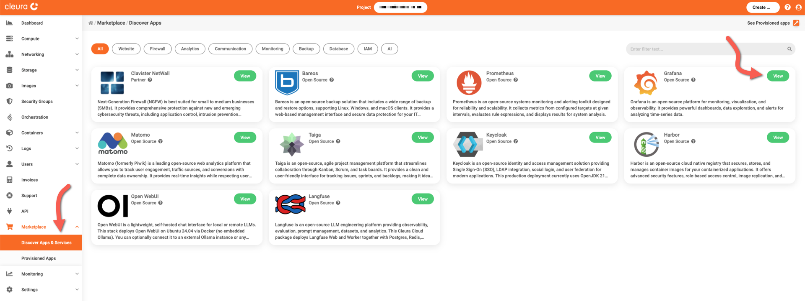

You will see the *Grafana* information page, where you can learn more about its features, and obtain pricing information.
Click the orange *Deploy this App* button to start the deployment process.

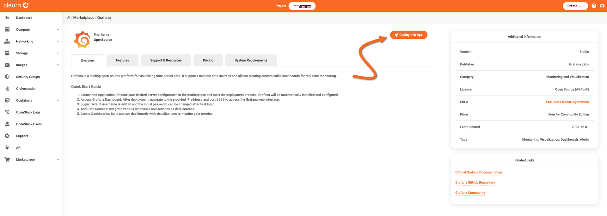

The Grafana application is hosted on a [Nova VM](../../openstack/nova/new-server.md), so now you may select a region, a name, a flavor, a public network, a keypair, and a security group for it.
Regarding the security group, [make sure it includes a rule](../../openstack/neutron/create-security-groups.md) allowing incoming TCP connections to port 3000.

Read and agree to the *Terms and Conditions.*
When you are ready, click the green *Create* button.

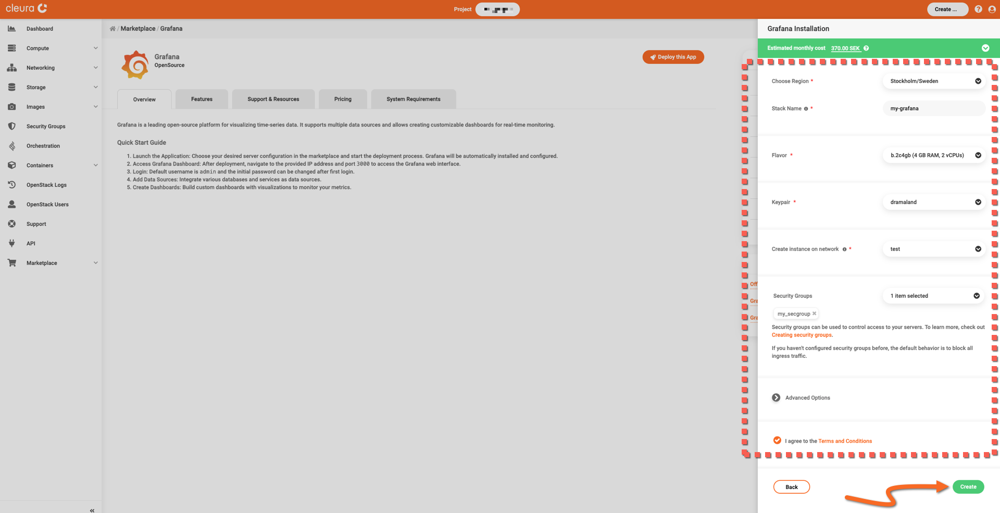

The deployment takes some minutes to complete.
To check how it is going, expand the Marketplace category in the vertical pane on the left and click *Provisioned Apps*.
In the central pane, watch the Grafana Heat stack row.
The animated icon at the left marks the deployment progress.

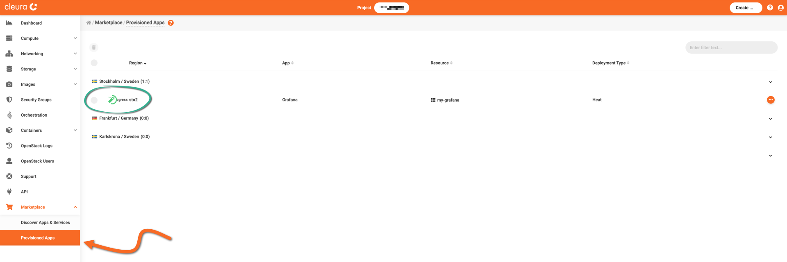

When the deployment is complete, you will see a white check mark in a green circle.

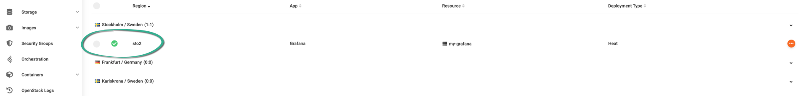

## Logging into the Grafana dashboard

You need the administrator's predefined username and password, as well as the URL of your Grafana instance.
For that, make sure you are in the *Provisioned Apps* pane.
Click on the Grafana row to expand it, and select the *Stack Output* tab.

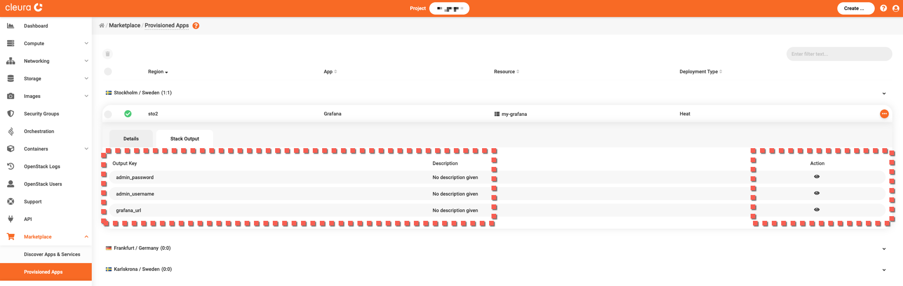

We recommend you create a new entry in your password manager, and populate all necessary fields with values from the corresponding output keys.

For the preset password, click the icon in the *Action* column of the *admin_password* row.
A pop-up window appears.
Click the blue *Copy Output!* button to copy the password into the clipboard.
When ready, click the *Back* button to close the window.

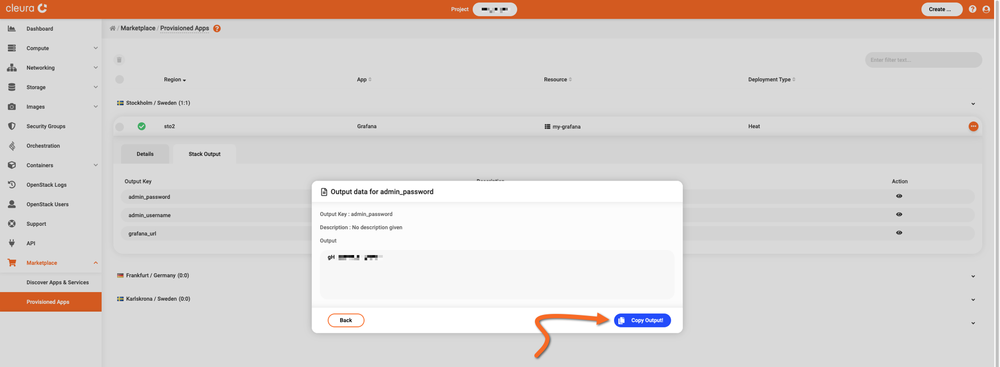

Similarly, get the administrator's username from the *admin_username* row.

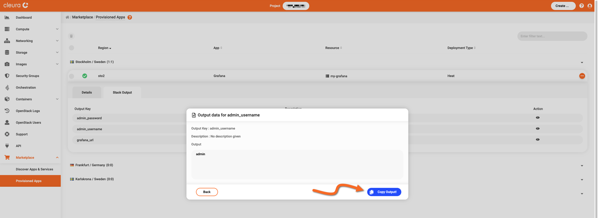

And finally, get your Grafana deployment's URL from the *grafana_url* row.

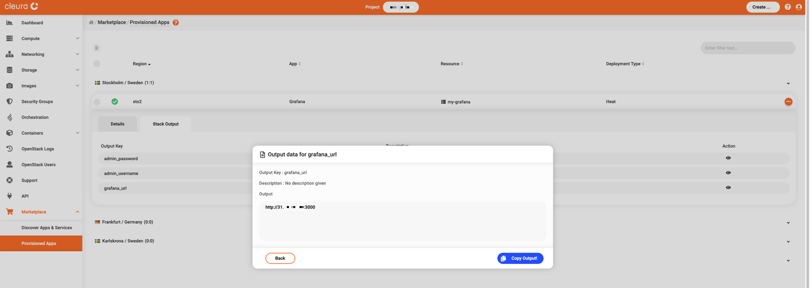

Using your favorite web browser, navigate to your Grafana deployment's URL.
The Grafana login page appears.
Use the default username and password, and click the *Log in* button.

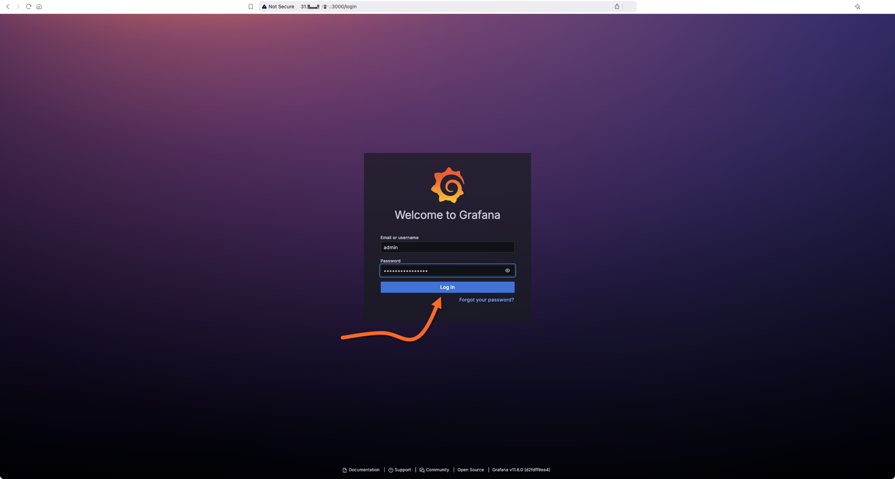

The Grafana landing page appears.

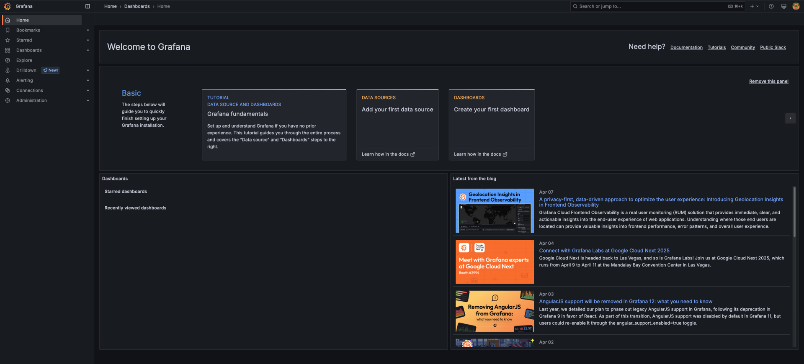

Start from the official [Grafana documentation](https://grafana.com/docs/grafana/latest/) page to learn how to use your new data visualization service.
