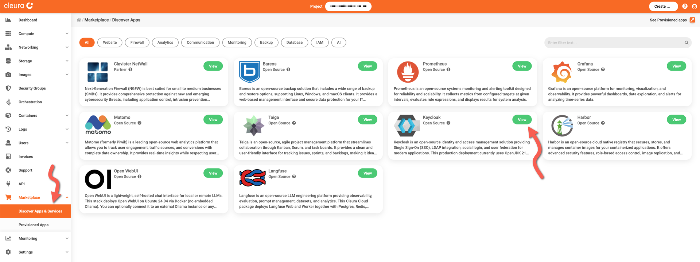
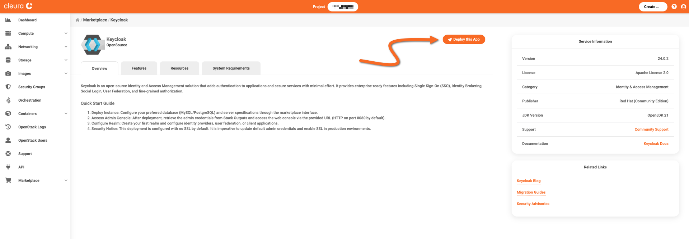
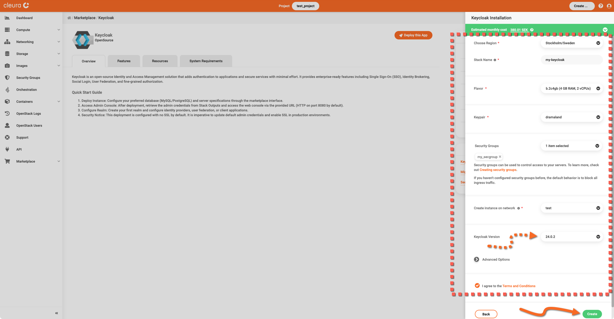
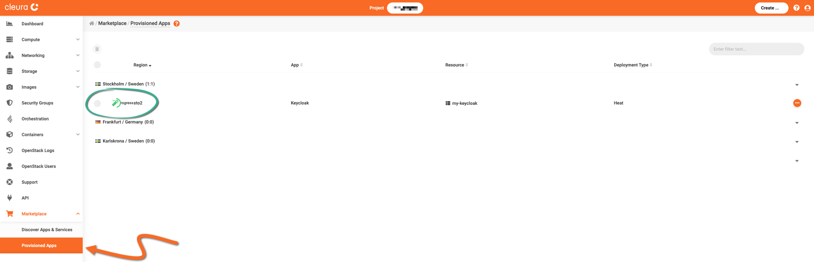
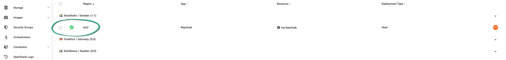
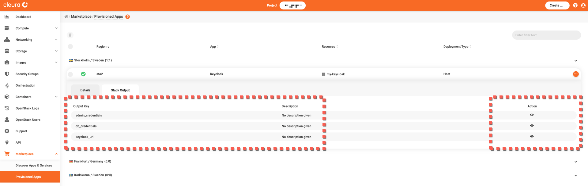
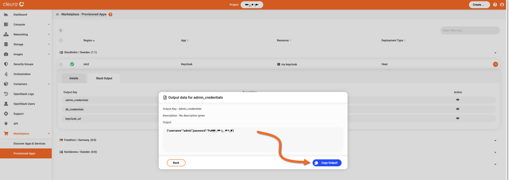
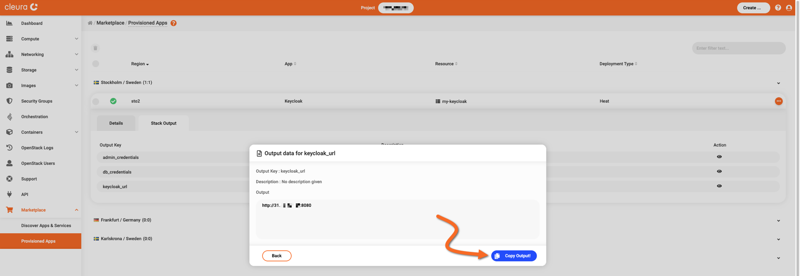
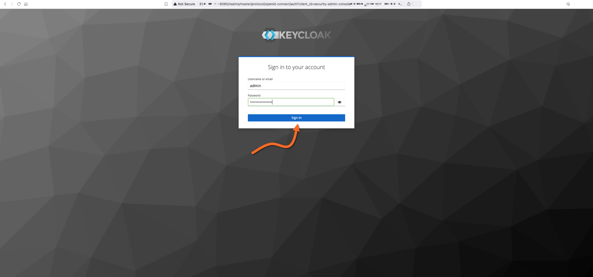
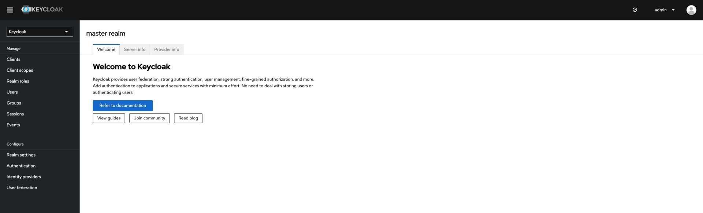

# Creating a Keycloak instance

This guide covers the deployment of a self-hosted [Keycloak](https://www.keycloak.org/) service.

To proceed, make sure you have an [account in {{brand}}](../../getting-started/create-account.md), and you are logged in to the [{{gui}}](https://{{gui_domain}}).

## Step-by-step deployment

In the left vertical pane of the {{gui}}, expand the *Marketplace* category and click on *Discover Apps and Services*.
In the central pane, you will see all available applications and services.
Locate the *Keycloak* box and click the green *View* button.

You will see the *Keycloak* information page, where you can learn more about its features, and obtain pricing information.
Click the orange *Deploy this App* button to start the deployment process.

The Keycloak application is hosted on a [Nova VM](../../openstack/nova/new-server.md), so now you may select a region, a name, a flavor, a public network, a keypair, and a security group for it.
Regarding the security group, [make sure it includes a rule](../../openstack/neutron/create-security-groups.md) allowing incoming TCP connections to port 8080.

Optionally, select one of the available Keycloak versions.
Then, read and agree to the *Terms and Conditions.*
When you are ready, click the green *Create* button.

The deployment takes some minutes to complete.
To check how it is going, expand the *Marketplace* category in the vertical pane on the left and click *Provisioned Apps*.
In the central pane, watch the Keycloak Heat stack row.
The animated icon at the left marks the deployment progress.

When the deployment is complete, you will see a white check mark in a green circle.

## Logging into the Keycloak dashboard

You need the administrator's (`admin`) predefined password and the URL of your Keycloak instance.
For that, make sure you are in the *Provisioned Apps* pane.
Click on the Keycloak row to expand it, and select the *Stack Output* tab.

We recommend you create a new entry in your password manager and populate all necessary fields with values from the corresponding output keys.

For the preset password, click the icon in the *Action* column of the *admin_credentials* row.
A pop-up window appears.
Click the blue *Copy Output!* button to copy all data below *Output* into the clipboard.
Temporarily paste that data into a text editor, and use the password for your password manager entry.
When ready, click the *Back* button to close the window.

Similarly, get the URL to your Keycloak instance from the *keycloak_url* row.

Using your favorite web browser, navigate to your Keycloak deployment's URL.
The Keycloak Sign-in page appears.
Use the default username (`admin`) and password from your password manager, and click the *Sign in* button.

The Keycloak welcome page appears.

We recommend you start with the official [Keycloak guides](https://www.keycloak.org/guides) page to learn how to use your new identity and access management service.
