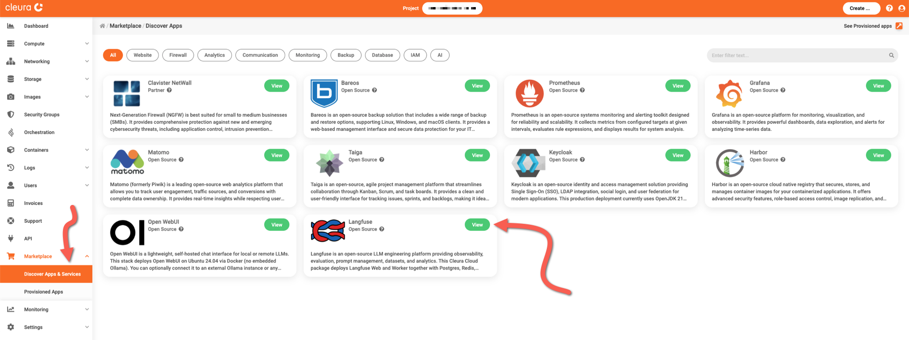
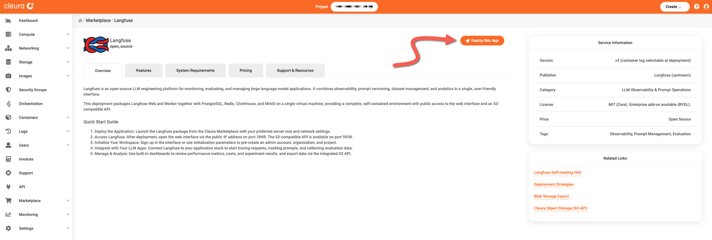
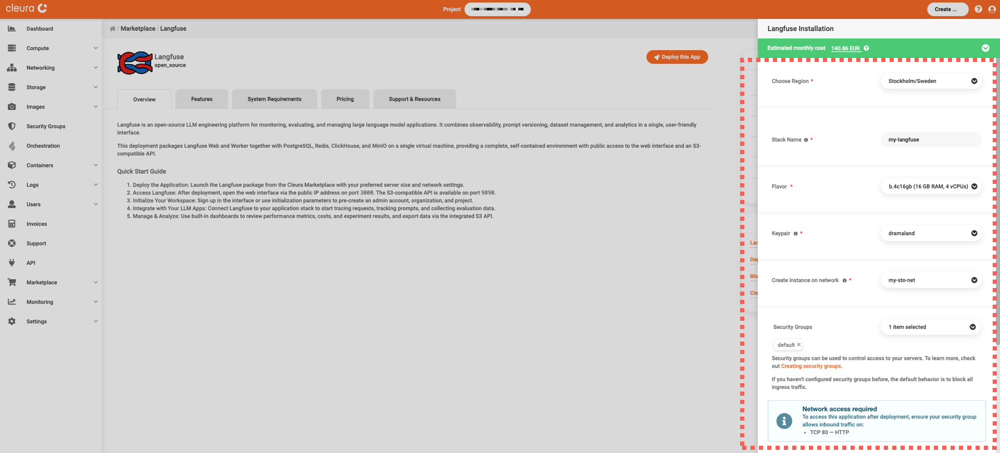
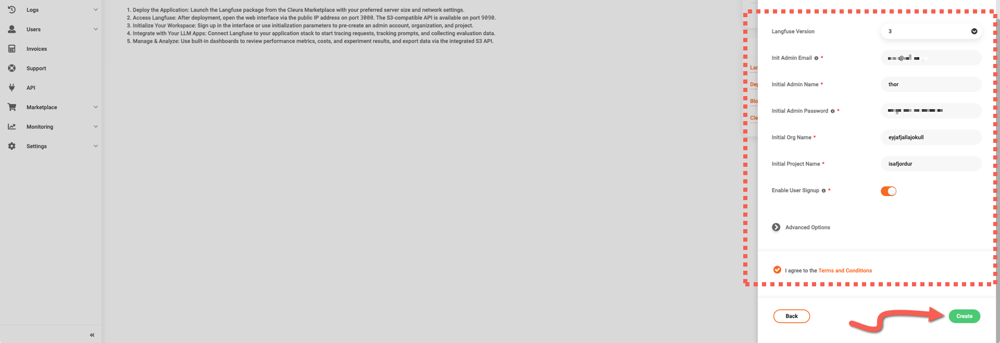
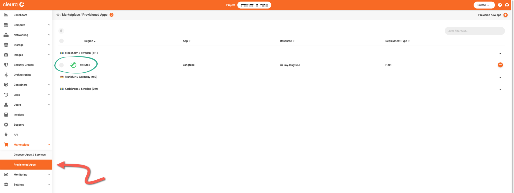
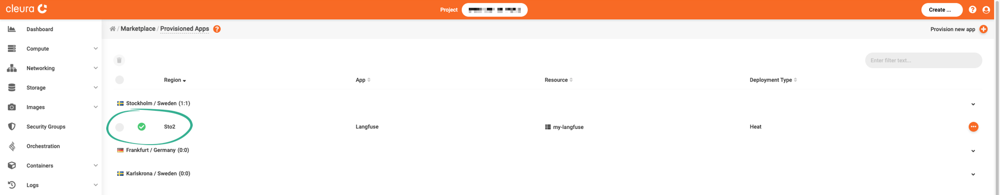
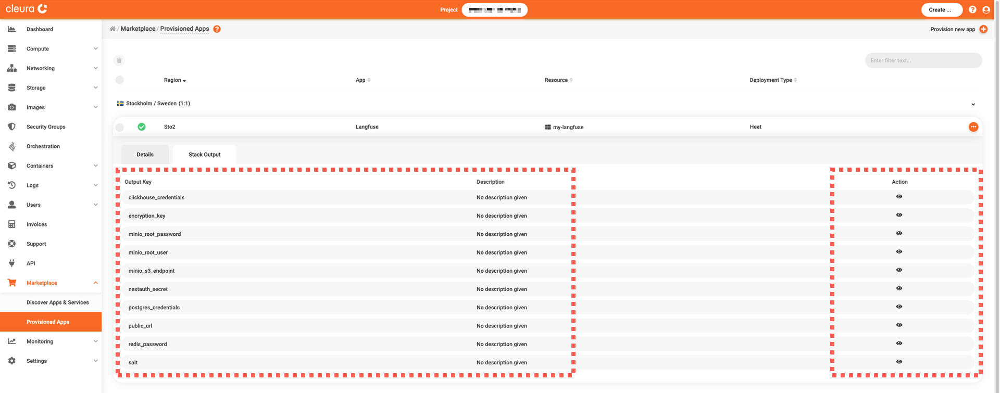
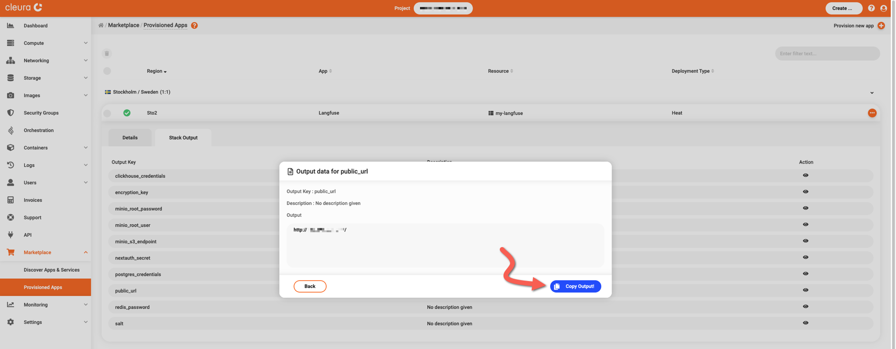
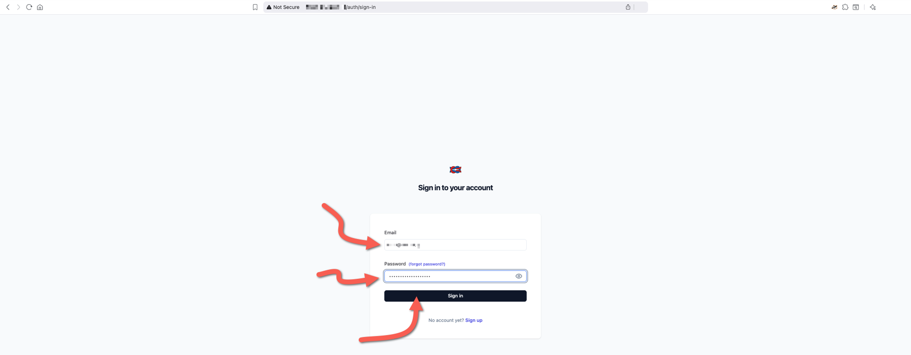
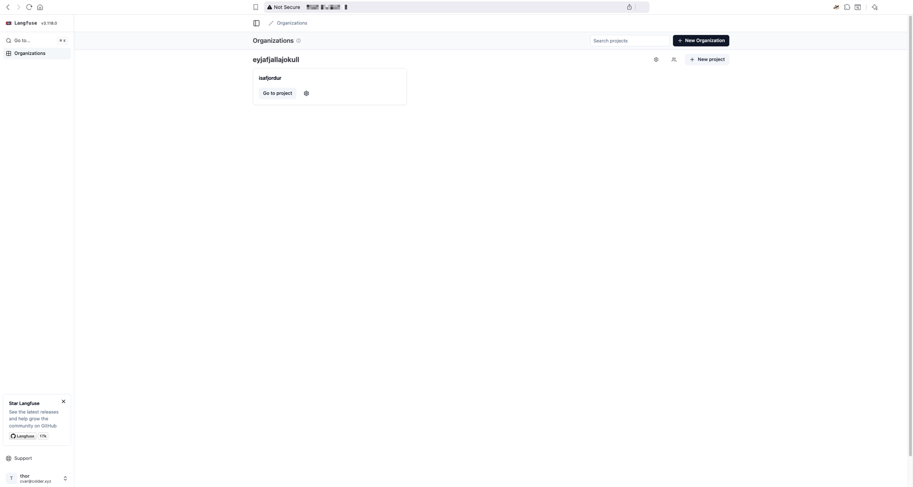

# Creating a Langfuse instance

This guide covers the deployment of a self-hosted [Langfuse](https://langfuse.com/) service.

To proceed, make sure you have an [account in {{brand}}](../../getting-started/create-account.md), and you are logged in to the [{{gui}}](https://{{gui_domain}}).

## Step-by-step deployment

In the left vertical pane of the {{gui}}, expand the *Marketplace* category and click on *Discover Apps and Services*.
In the central pane, you will see all available applications and services.
Locate the *Langfuse* box and click the green *View* button.

You will see the *Langfuse* information page, where you can learn more about its features and system requirements.
Click the orange *Deploy this App* button to start the deployment process.

The Langfuse application is hosted on a [Nova VM](../../openstack/nova/new-server.md), so now you may select a region, a name, a flavor, a public network, a keypair, and a security group for it.
Regarding the security group, [make sure it includes a rule](../../openstack/neutron/create-security-groups.md) allowing incoming TCP connections to port 9000.

Additionally, fill in some necessary parameters for Langfuse, like the initial administrator's email and user name, and the corresponding account's password.
Then, read and agree to the *Terms and Conditions.*
When you are ready, click the green *Create* button.

The deployment takes some minutes to complete.
To check how it is going, expand the Marketplace category in the vertical pane on the left and click *Provisioned Apps*.
In the central pane, watch the Langfuse Heat stack row.
The animated icon on the left marks the deployment progress.

When the deployment is complete, you will see a white check mark in a green circle.

## Logging into the Langfuse dashboard

First off, you have to know Langfuse's URL.
For that, make sure you are in the *Provisioned Apps* pane.
Click on the Langfuse row to expand it, and select the *Stack Output* tab.

In the *public_url* row, click the icon in the *Action* column.
A pop-up window appears.
Click the blue *Copy Output!* button to copy the URL displayed in the *Output* box to the clipboard.
Then, paste that password into a new text editor window, but don't save it in a new file.
Instead, we recommend you create a new entry in your password manager of choice and move the URL there.
Close the pop-up window by clicking on the *Back* button.

Using your favorite web browser, navigate to the URL you just retrieved.
The Langfuse dashboard loads.
Enter the admin email and password, then click on the *Login* button below.

You now see the main Langfuse page.

On a separate browser window or tab, navigate to the [Langfuse documentation page](https://langfuse.com/docs) to learn how you can start using your new self-hosted LLM engineering platform.
