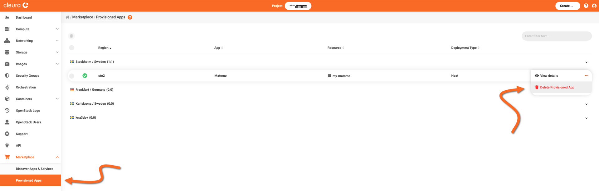
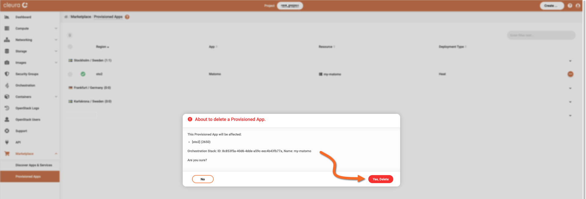
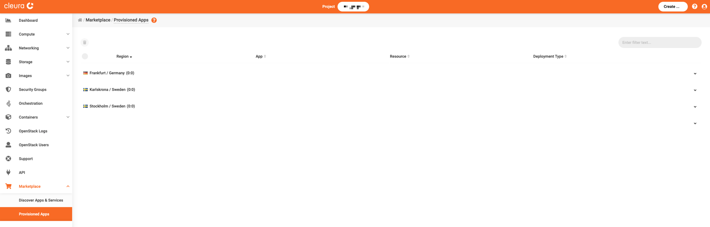

# Deleting a Matomo instance

This short guide covers the deletion of a self-hosted Matomo deployment.

In the left vertical pane of the {{gui}}, expand the *Marketplace* category and click on *Provisioned Apps*.
All your deployed applications, including the one you are about to delete, are listed in the central pane.
Notice the orange :material-dots-horizontal-circle: icon at the right of the application row.
Click on it, and from the drop-down menu that appears, select *Delete Provisioned App*.

A new window named *About to delete a Provisioned App* appears.
Make sure it refers to the Matomo deployment you wish to delete.
When you are ready, click on the red *Yes, Delete* button.

After a few seconds, your Matomo deployment will be deleted, and that fact will be reflected in the list of provisioned applications.

