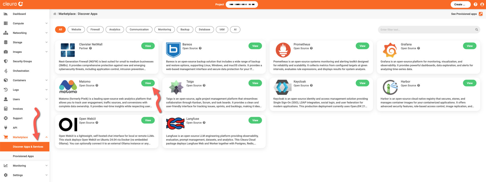
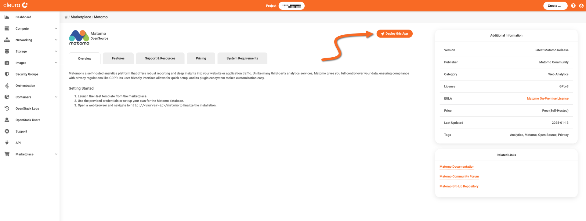
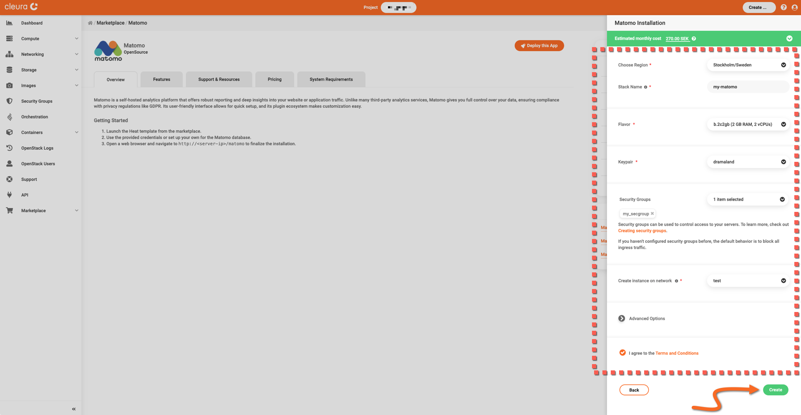
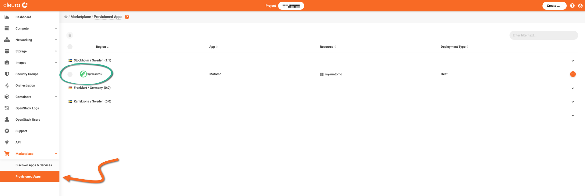
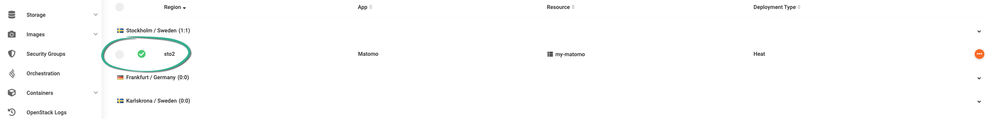
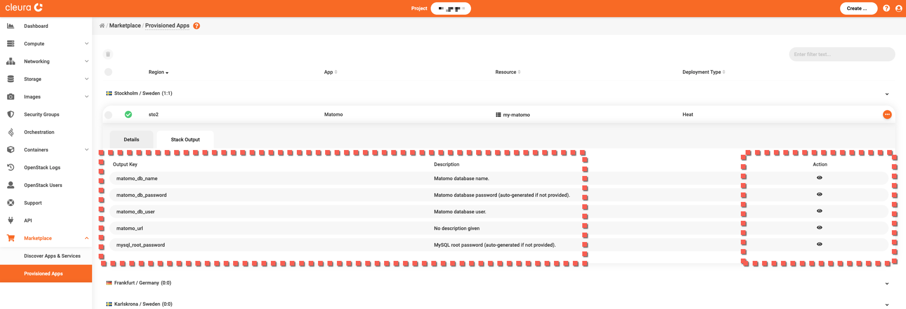
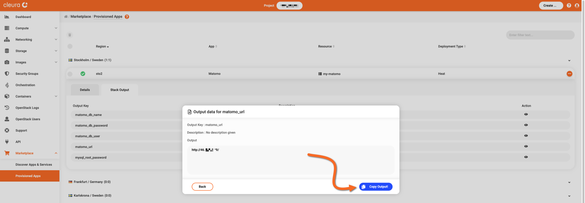
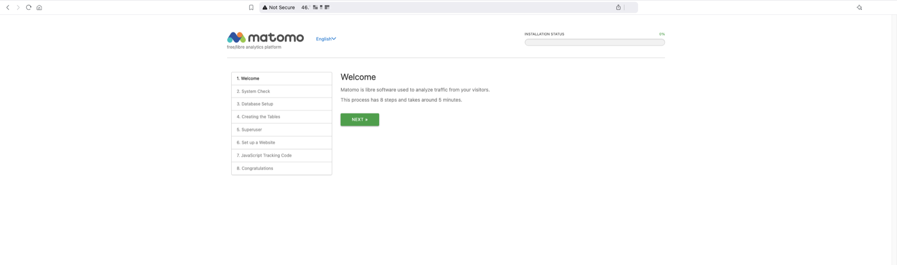

# Creating a Matomo instance

This guide covers the deployment of a self-hosted [Matomo](https://matomo.org/) service.

To proceed, make sure you have an [account in {{brand}}](../../getting-started/create-account.md), and you are logged in to the [{{gui}}](https://{{gui_domain}}).

## Step-by-step deployment

In the left vertical pane of the {{gui}}, expand the *Marketplace* category and click on *Discover Apps and Services*.
In the central pane, you will see all available applications and services.
Locate the *Matomo* box and click the green *View* button.

You will see the *Matomo* information page, where you can learn more about its features, and obtain pricing information.
Click the orange *Deploy this App* button to start the deployment process.

The Matomo application is hosted on a [Nova VM](../../openstack/nova/new-server.md), so now you may select a region, a name, a flavor, a public network, a keypair, and a security group for it.
Regarding the security group, [make sure it includes a rule](../../openstack/neutron/create-security-groups.md) allowing incoming TCP connections to port 80.

Read and agree to the *Terms and Conditions.*
When you are ready, click the green *Create* button.

The deployment takes some minutes to complete.
To check how it is going, expand the Marketplace category in the vertical pane on the left and click *Provisioned Apps*.
In the central pane, watch the Matomo Heat stack row.
The animated icon at the left marks the deployment progress.

When the deployment is complete, you will see a white check mark in a green circle.

## Logging into the Matomo dashboard

Next, you need the URL of your Matomo instance.
For that, make sure you are in the *Provisioned Apps* pane.
Click on the Matomo row to expand it, and select the *Stack Output* tab.

Get a pop-up window revealing the URL of the particular Matomo deployment.
Click the icon in the *Action* column of the *matomo_url* row, then click the blue *Copy Output!* button.
Close the pop-up window by clicking on the *Back* button.

Using your favorite web browser, navigate to your Matomo deployment's URL.
The Matomo welcome page appears.

To configure your new traffic analytics service, and to learn how to use it, start with the [Matomo Help Centre](https://matomo.org/help/).

Keep in mind that while configuring Matomo, you will need pieces of information provided in the application's *Stack Output* tab.
