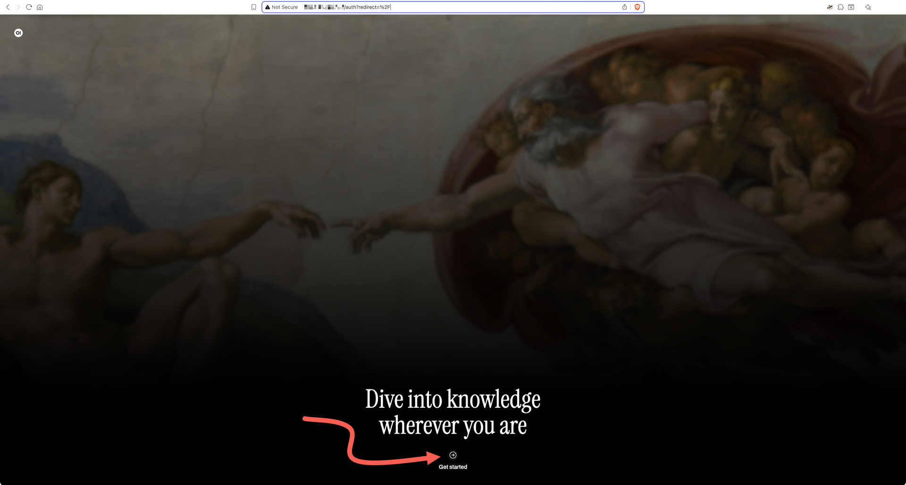

# Creating an Open WebUI instance

This guide covers the deployment of a self-hosted [Open WebUI](https://openwebui.com/) service.

To proceed, make sure you have an [account in {{brand}}](../../getting-started/create-account.md), and you are logged in to the [{{gui}}](https://{{gui_domain}}).

## Step-by-step deployment

In the left vertical pane of the {{gui}}, expand the *Marketplace* category and click on *Discover Apps & Services*.
In the central pane, you will see all available applications and services.
Locate the *Open WebUI* box and click the green *View* button.

You will see the *Open WebUI* information page, where you can learn more about its features and system requirements.
Click the orange *Deploy this App* button to start the deployment process.

The Open WebUI application is hosted on a [Nova VM](../../openstack/nova/new-server.md), so now you may select a region, a name, a flavor, and a keypair for it.

Select a security group [that allows incoming connections to port 80/TCP](../../openstack/neutron/create-security-groups.md), and choose a network to connect the service to.

Then, read and agree to the *Terms and Conditions.*
When you are ready, click the green *Create* button.

The deployment takes some minutes to complete.
To check how it is going, expand the Marketplace category in the vertical pane on the left and click *Provisioned Apps*.
In the central pane, watch the Open WebUI Heat stack row.
The animated icon on the left marks the deployment progress.

When the deployment is complete, you will see a white check mark in a green circle.

## Logging into the Open WebUI dashboard

First off, you have to know Open WebUI's public URL.
Go to the *Provisioned Apps* pane, click on the Open WebUI row to expand it, and select the *Stack Output* tab.

In the *public_url* row, click the icon in the *Action* column.
A pop-up window appears.
Click the blue *Copy Output!* button to copy the URL displayed in the *Output* box to the clipboard.
Jot it down somewhere, or create a new bookmark off of it.
Close the pop-up window by clicking on the *Back* button.

On a new browser tab or window, visit the Open WebUI's welcome page and click on the *Get started* link at the bottom.

On the next page, create a new admin user;
type in a *Name*, an *Email*, and a *Password*, then click on the *Create Admin Account* button.

The Open WebUI dashboard appears.
Visit the [official tutorials page](https://docs.openwebui.com/category/-tutorials) to start learning how you can use your new self-hosted AI interface.

