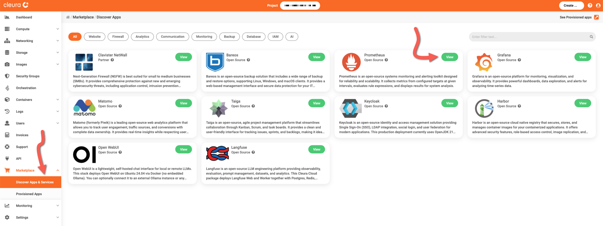
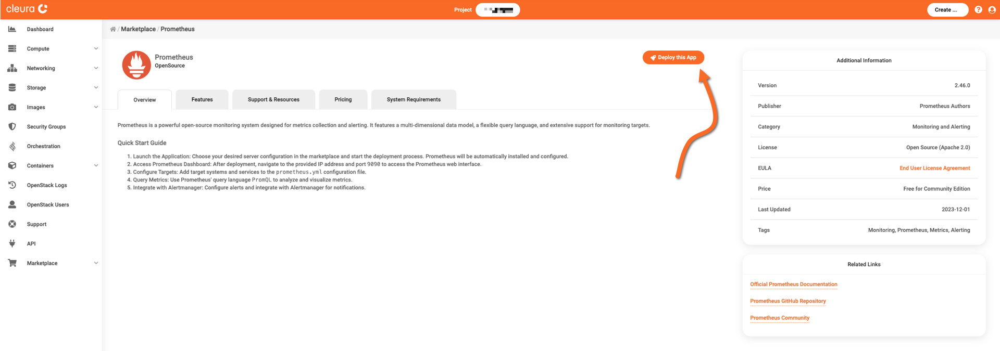
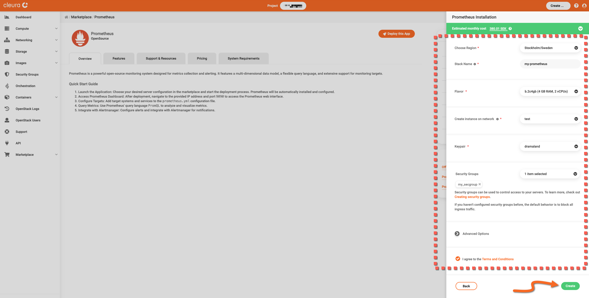
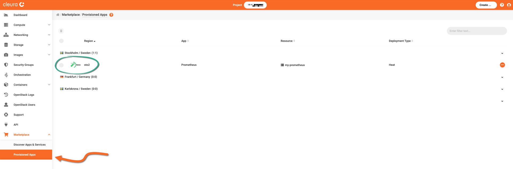
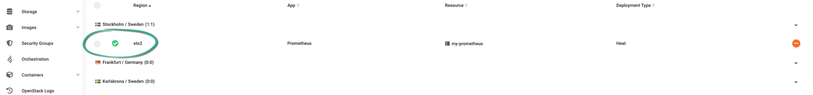
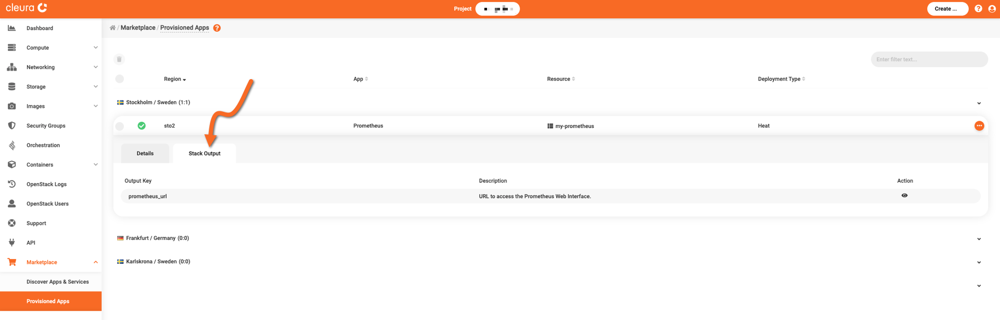
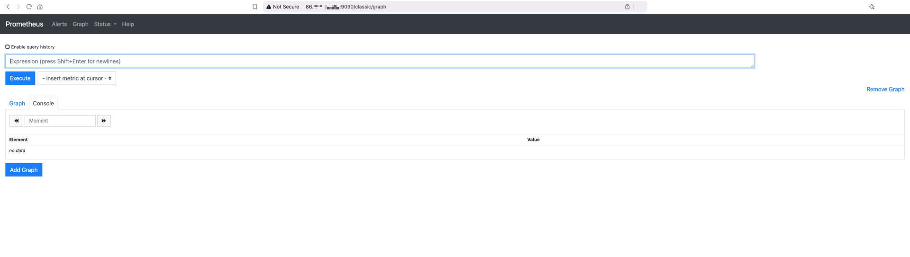

# Creating a Prometheus instance

This guide covers the deployment of a self-hosted Prometheus service.

To proceed, make sure you have an [account in {{brand}}](../../getting-started/create-account.md), and you are logged in to the [{{gui}}](https://{{gui_domain}}).

## Step-by-step deployment

In the left vertical pane of the {{gui}}, expand the *Marketplace* category and click on *Discover Apps and Services*.
In the central pane, you will see all available applications and services.
Locate the *Prometheus* box and click the green *View* button.

You will see the *Prometheus* information page, where you can learn more about its features, and obtain pricing information.
Click the orange *Deploy this App* button to start the deployment process.

The Prometheus application is hosted on a [Nova VM](../../openstack/nova/new-server.md), so now you may select a region, a name, a flavor, a public network, a keypair, and a security group for it.
Regarding the security group, [make sure it includes a rule](../../openstack/neutron/create-security-groups.md) allowing incoming TCP connections to port 9090.

Read and agree to the *Terms and Conditions.*
When you are ready, click the green *Create* button.

The deployment takes some minutes to complete.
To check how it is going, expand the *Marketplace* category in the vertical pane on the left and click *Provisioned Apps*.
In the central pane, watch the Prometheus Heat stack row.
The animated icon at the left marks the deployment progress.

When the deployment is complete, you will see a white check mark in a green circle.

## Logging into the Prometheus dashboard

You need your deployment's URL.
For that, make sure you are in the *Provisioned Apps* pane.
Click on the Prometheus row to expand it, and select the *Stack Output* tab.

Click the icon at the right of the *prometheus_url* row.
A pop-up window appears.
Click the blue *Copy Output!* button to copy the URL into the clipboard.

Using your favorite web browser, navigate to your Prometheus deployment's URL.
The Prometheus page appears.

We recommend you start with the official [Getting Started](https://prometheus.io/docs/prometheus/latest/getting_started/) page to learn how to use your new monitoring service.
