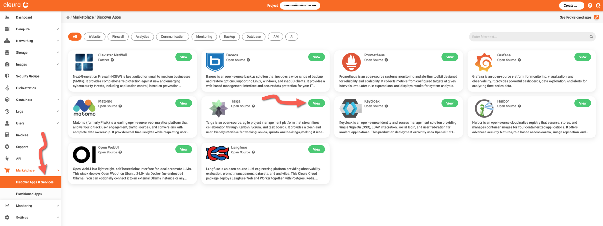
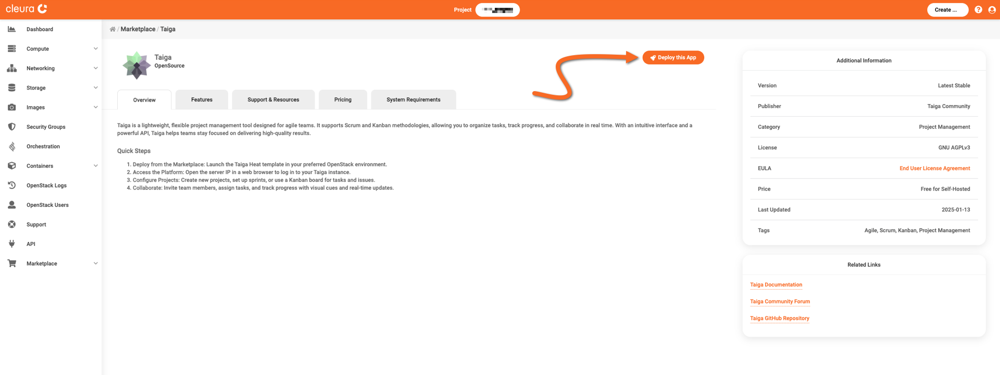
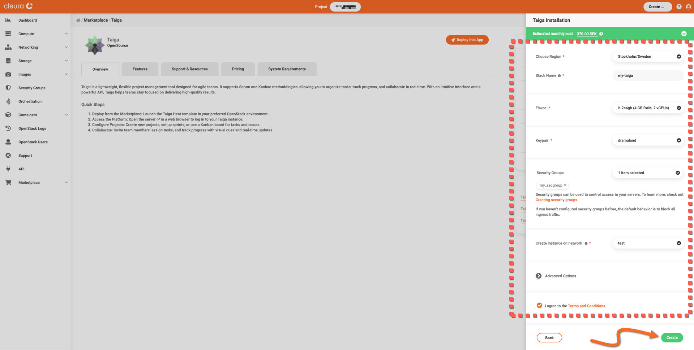
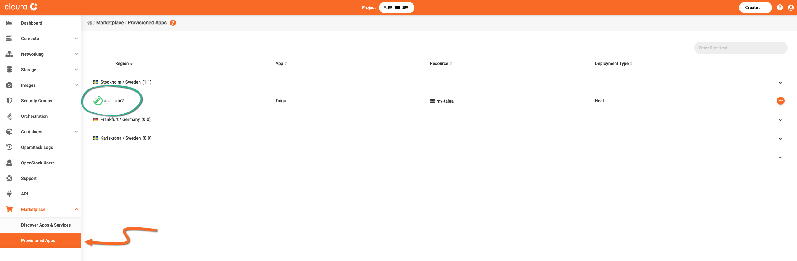
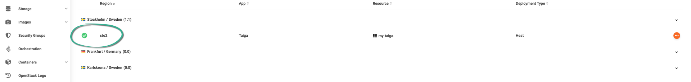
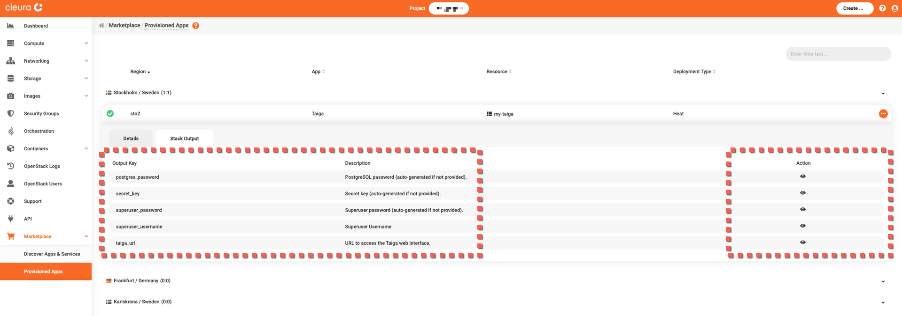
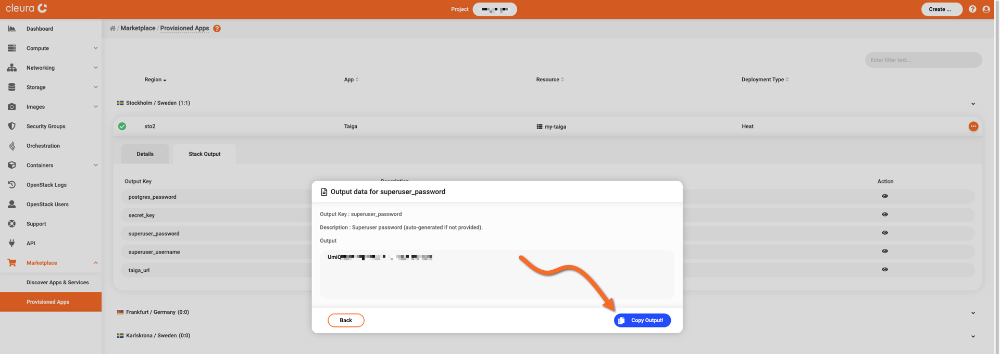
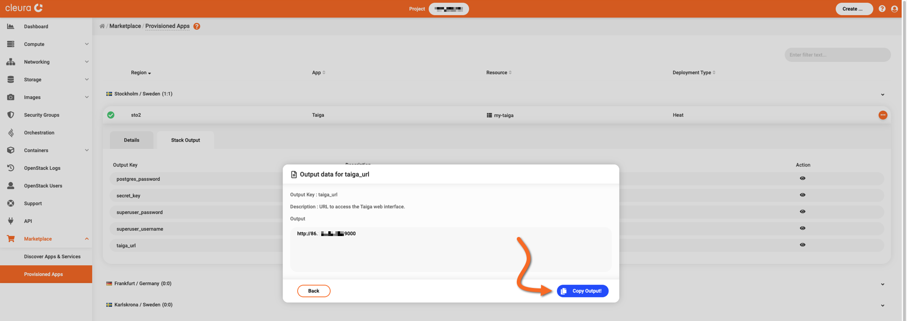
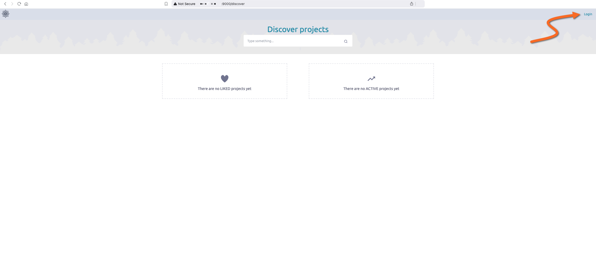
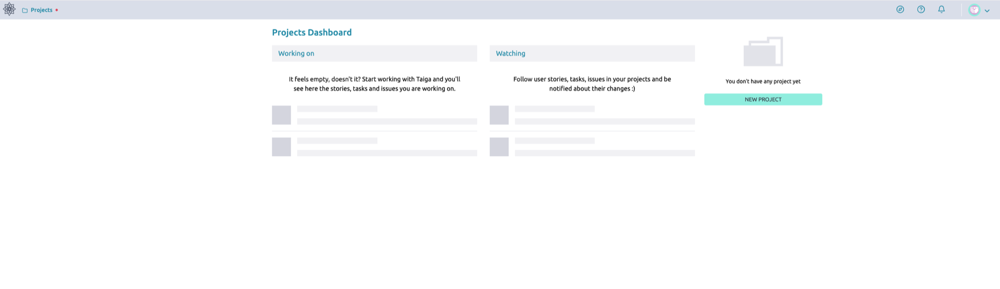

# Creating a Taiga instance

This guide covers the deployment of a self-hosted Taiga service.

To proceed, make sure you have an [account in {{brand}}](../../getting-started/create-account.md), and you are logged in to the [{{gui}}](https://{{gui_domain}}).

## Step-by-step deployment

In the left vertical pane of the {{gui}}, expand the *Marketplace* category and click on *Discover Apps and Services*.
In the central pane, you will see all available applications and services.
Locate the *Taiga* box and click the green *View* button.

You will see the *Taiga* information page, where you can learn more about its features, and obtain pricing information.
Click the orange *Deploy this App* button to start the deployment process.

The Taiga application is hosted on a [Nova VM](../../openstack/nova/new-server.md), so now you may select a region, a name, a flavor, a public network, a keypair, and a security group for it.
Regarding the security group, [make sure it includes a rule](../../openstack/neutron/create-security-groups.md) allowing incoming TCP connections to port 9000.

Read and agree to the *Terms and Conditions.*
When you are ready, click the green *Create* button.

The deployment takes some minutes to complete.
To check how it is going, expand the Marketplace category in the vertical pane on the left and click *Provisioned Apps*.
In the central pane, watch the Taiga Heat stack row.
The animated icon at the left marks the deployment progress.

When the deployment is complete, you will see a white check mark in a green circle.

## Logging into the Taiga dashboard

You have to know Taiga's URL and the password automatically generated for the `admin` user.
For that, make sure you are in the *Provisioned Apps* pane.
Click on the Taiga row to expand it, and select the *Stack Output* tab.

In the *superuser_password* row, click the icon in the *Action* column.
A pop-up window appears.
Click the blue *Copy Output!* button to copy the password displayed in the *Output* box to the clipboard.
Then, paste that password into a new text editor window, but don't save it in a new file.
Instead, we recommend you create a new entry in your password manager of choice and move the password there.
Close the pop-up window by clicking on the *Back* button.

In the *superuser_username* row, click the icon in the *Action* column.
You will see that the user name in question is `admin`, so you might want to put that in the corresponding password manager entry.

Next, get a pop-up window revealing the particular Taiga deployment URL.
Click the icon in the *Action* column of the *taiga_url* row, then click the blue *Copy Output!* button.
Paste the URL into that password manager entry you just created.

Using your favorite web browser, navigate to the URL you just retrieved.
The Taiga dashboard loads.
Notice the *Login* link and click on it.

You are directed to the Taiga login page.
Type in the user name (`admin`), paste the password from your password manager, and click on the *LOGIN* button below.

You now see the main Taiga page.

On a separate browser window or tab, navigate to the [Taiga basics community page](https://community.taiga.io/c/learn-taiga-basic/) to learn how you can start using your new self-hosted project management service.
