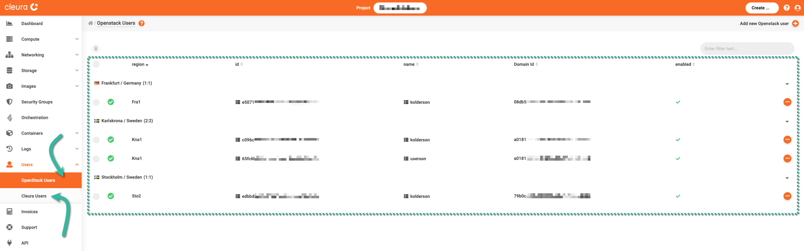
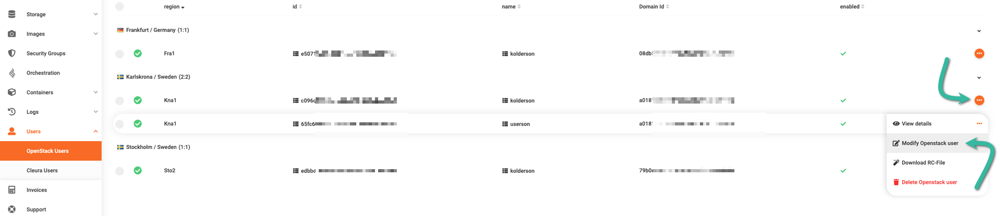
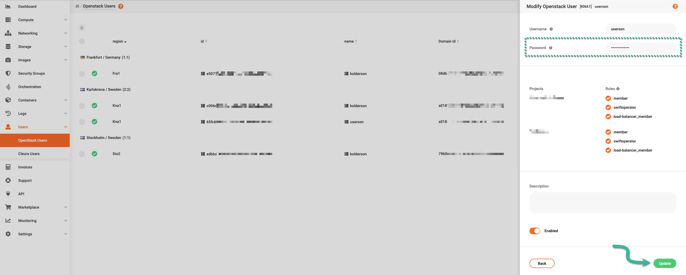

# Changing the password of an OpenStack user

Having created at least one [OpenStack API user](../../getting-started/enable-openstack-cli.md), you may at any time change their password.
You do so using the {{gui}}, or the OpenStack CLI.

=== "{{gui}}"
    From your favorite web browser, navigate to the [{{gui}}](https://{{gui_domain}}) start page, and login into your {{brand}} account.

    Make sure the left-hand side vertical pane is fully visible, click the _Users_ category to expand it, and click once more on _Openstack Users_.

    All of your OpenStack users, categorized by {{brand}} region, appear on the main pane.

    

    Locate the OpenStack user you wish to change their password, click the orange :material-dots-horizontal-circle: icon at the right of its row, and from the drop-down menu that appears, select _Modify Openstack user_.

    

    A vertical pane, titled _Modify Openstack User_, slides over from the right-hand side of the browser window.
    Notice the text field labeled _Password_.
    There, type-in a new password for the OpenStack user.
    When ready, confirm with a click on the green _Update_ button.

    
=== "OpenStack CLI"
    First, source the RC file of the OpenStack user you wish to change their password.
    Then, change it as follows:

    ```console
    $ openstack user password set
    Current Password:
    New Password:
    Repeat New Password:
    ```

    Before the new password is set, you are asked to enter the current password.
    Next, you enter the new password two times, for security reasons.
    Notice that what you type is not echoed on the terminal.

    Whenever the command above executes successfully, it returns no further output.

## Updating local files

After changing the password of a specific OpenStack user, please do not forget to update your local copy of the corresponding RC file -- and then source it.

Finally, do the same for any `clouds.yaml` file that still has the old OpenStack user password.
