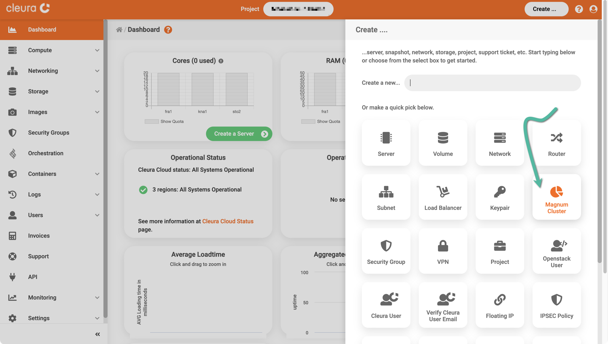
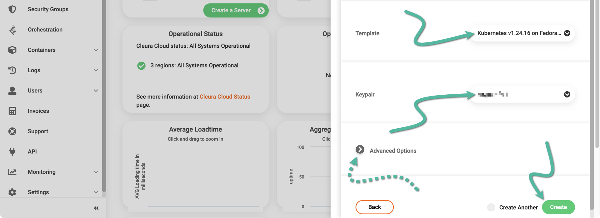
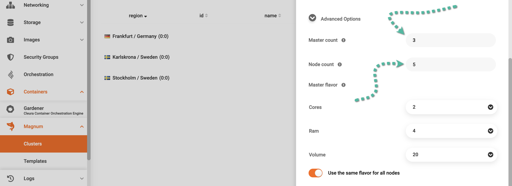
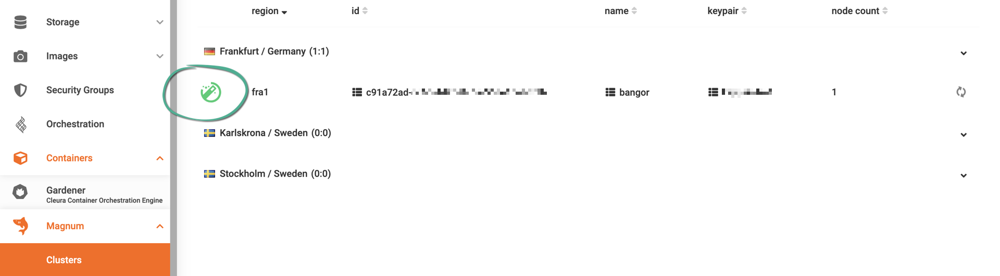
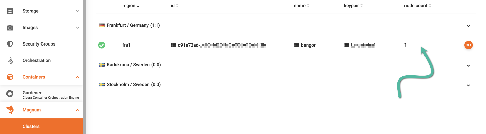
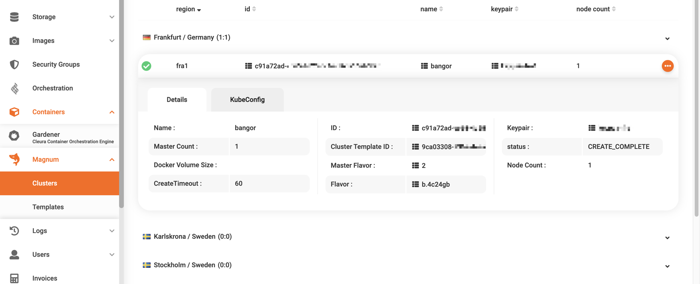

# Creating a Kubernetes cluster

By employing OpenStack
[Magnum](https://docs.openstack.org/magnum) you can create
Kubernetes clusters via OpenStack, using the {{gui}} or the OpenStack
CLI.

## Prerequisites

First and foremost, you need an [account in
{{brand}}](../../getting-started/create-account.md). Should you choose to
work from your terminal, you will also need to [enable the OpenStack
CLI](../../getting-started/enable-openstack-cli.md). In that case, in
addition to the Python `openstackclient` module, make sure you also
install the corresponding plugin module for Magnum. Use either the
package manager of your operating system or `pip`:

=== "Debian/Ubuntu"
    ```bash
    apt install python3-magnumclient
    ```
=== "Mac OS X with Homebrew"
    This Python module is unavailable via `brew`, but you can install it
    via `pip`.
=== "Python Package"
    ```bash
    pip install python-magnumclient
    ```

## Creating a Kubernetes cluster

=== "{{gui}}"
    Fire up your favorite web browser, navigate to the
    [{{gui}}](https://{{gui_domain}}) start page, and log into your
    {{brand}} account. On the top right-hand side of the {{gui}}, click the
    *Create* button. A new pane titled *Create* slides into view.

    

    You will notice several rounded boxes on that pane, each for defining,
    configuring, and instantiating a different {{brand}} object. Go ahead
    and click the *Magnum Cluster* box. A new vertical pane titled *Create a
    Magnum Cluster* slides over. At the top, type in a name for the new
    cluster and select one of the available regions.

    

    A bit further below, use the drop-down menus to select a template and a keypair for the cluster nodes.
    Notice the *Docker volume size* option which, by default, is set to 50 GiB.
    This pertains to the size of the extra block device each cluster node will have.
    That whole storage capacity will be used for saving persistent data.
    If you believe the default size is too much or too little, change it accordingly.
    Unless you want to define the number of master nodes or the number of worker nodes, click the green *Create* button now.

    

    If you do want to play with the aforementioned parameters, then before
    clicking the *Create* button go ahead and expand the *Advanced Options*
    section. Since the new cluster templates come with the master load
    balancer enabled by default, you might want to equip your new cluster
    with 3 master nodes. Optionally, increase the number of worker nodes
    from 1 (the default) to, say, 3. Contrary to the number of master nodes,
    you may change the number of worker nodes *after* the cluster is created.

    

    When the cluster creation process begins, please keep in mind that it
    takes some time to complete. While waiting, bring the vertical pane on
    the left-hand side of the {{gui}} in full view, select
    *Magnum* → *Clusters*, and in the main pane, take a look at the creation
    progress. You can tell when the whole process is complete by the animated
    icon at the left of the cluster row.

    
=== "OpenStack CLI"
    A simple, general command for creating a new Kubernetes cluster with
    Magnum looks like this:

    ```bash
    openstack coe cluster create \
        --cluster-template $CLUSTER_TMPL \
        --keypair $KEYPAIR \
        --docker-volume-size $PERSIST_VOL_SIZE \
        $CLUSTER_NAME
    ```

    First, list all available templates in the region:

    ```console
    $ openstack coe cluster template list
    +--------------------------------------+---------------------------------------------+------+
    | uuid                                 | name                                        | tags |
    +--------------------------------------+---------------------------------------------+------+
    | 3f476f01-b3de-4687-a188-6829ed947db0 | Kubernetes 1.15.5 on Fedora-atomic 29       | None |
    |                                      | 4C-8GB-20GB No Master LB                    |      |
    | c458f02d-54b0-4ef8-abbc-e1c25b61165a | Kubernetes 1.15.5 on Fedora-atomic 29       | None |
    |                                      | 2C-4GB-20GB No Master LB                    |      |
    | f9e1a2ea-b1ff-43e7-8d1e-6dd5861b82cf | Kubernetes 1.18.6 on Fedora-coreos 33       | None |
    |                                      | 2C-4GB-20GB No Master LB                    |      |
    | 59bd894b-0f5f-4a6e-98d3-a3eb7040faab | Kubernetes v1.23.3 on Fedora-coreos 35      | None |
    | 9ca03308-996e-4eaa-b507-5730dcc19fcc | Kubernetes v1.24.16 on Fedora-coreos 37     | None |
    +--------------------------------------+---------------------------------------------+------+
    ```

    Select the template you want by setting the corresponding `name`
    value to the `CLUSTER_TMPL` variable:

    ```console
    $ CLUSTER_TMPL="Kubernetes v1.24.16 on Fedora-coreos 37"
    ```

    Then, list all available keypairs...

    ```console
    $ openstack keypair list
    +----------+-------------------------------------------------+------+
    | Name     | Fingerprint                                     | Type |
    +----------+-------------------------------------------------+------+
    | lefkanti | e7:e9:c5:95:ee:7b:72:37:3c:89:c5:fc:6e:8c:a1:72 | ssh  |
    +----------+-------------------------------------------------+------+
    ```

    ...and set the `KEYPAIR` variable to the `Name` of the keypair you
    want:

    ```console
    $ KEYPAIR="lefkanti" # this is just an example
    ```

    Besides the OS disk, all cluster nodes have an extra disk for permanently storing application data.
    The size of this extra disk is specified during cluster creation via the `--docker-volume-size` parameter.
    Staying loyal to the theme of setting parameters via shell variables, decide on the size of this extra volume like so:

    ```console
    $ PERSIST_VOL_SIZE=50
    ```

    The size is expressed in Gibibytes, and in the example above, we decided to go with a 50GiB extra volume.
    Finally, decide on a name for your new Kubernetes cluster:

    ```console
    $ CLUSTER_NAME="bangor"
    ```

    With everything in place, go ahead and create your new Kubernetes
    cluster like so:

    ```console
    $ openstack coe cluster create \
        --cluster-template "$CLUSTER_TMPL" \
        --keypair $KEYPAIR \
        --docker-volume-size $PERSIST_VOL_SIZE \
        $CLUSTER_NAME
    ```

    New Magnum clusters start with 1 master node and 1 worker node by default.
    Since the new cluster templates have the master load balancer enabled,
    you might want to give your cluster 3 master nodes from the get-go.
    Optionally, you can increase the number of worker nodes from 1 to 3 or to 5.
    Contrary to the number of master nodes, you can always change the number of
    worker nodes *after* the cluster is created. So, to start the new cluster
    with 3 master nodes and 5 worker nodes, type the following:

    ```console
    $ openstack coe cluster create \
        --cluster-template "$CLUSTER_TMPL" \
        --keypair $KEYPAIR \
        --docker-volume-size $PERSIST_VOL_SIZE \
        --master-count 3 \
        --node-count 3 \
        $CLUSTER_NAME
    ```

    In any case, if everything went well with your request for a new cluster,
    on the terminal, you will see a message like the following:

    ```plain
    Request to create cluster 7ca7838a-aa33-4259-8784-02e5941a2cf0 accepted
    ```

    The cluster creation process takes some time to complete, and while
    you are waiting, you can check if everything is progressing smoothly:

    ```console
    $ openstack coe cluster list -c status
    +--------------------+
    | status             |
    +--------------------+
    | CREATE_IN_PROGRESS |
    +--------------------+
    ```

    If everything is going well, the message you will get will be
    `CREATE_IN_PROGRESS`. When Magnum has finished creating the cluster, the
    message will be `CREATE_COMPLETE`.

    ```console
    $ openstack coe cluster list -c status
    +-----------------+
    | status          |
    +-----------------+
    | CREATE_COMPLETE |
    +-----------------+
    ```

## Viewing the Kubernetes cluster

After the Kubernetes cluster is ready, you may at any time view it and
get detailed information about it.

=== "{{gui}}"
    Bring the vertical pane on the left-hand side of the {{gui}} in full
    view, then select *Magnum* → *Clusters*. In the main pane, take a look
    at the row of the cluster you are interested in. In our example, there
    is only one cluster, hence only one row.

    

    To see more of the cluster, just click on its row.
    Then, all relative information will appear below.

    
=== "OpenStack CLI"
    To list all available Kubernetes clusters, type:

    ```console
    $ openstack coe cluster list
    +---------------+--------+----------+------------+--------------+---------------+---------------+
    | uuid          | name   | keypair  | node_count | master_count | status        | health_status |
    +---------------+--------+----------+------------+--------------+---------------+---------------+
    | 7ca7838a-     | bangor | lefkanti |          1 |            1 | CREATE_COMPLE | HEALTHY       |
    | aa33-4259-    |        |          |            |              | TE            |               |
    | 8784-         |        |          |            |              |               |               |
    | 02e5941a2cf0  |        |          |            |              |               |               |
    +---------------+--------+----------+------------+--------------+---------------+---------------+
    ```

    For many more details on a specific cluster, issue a command like this:

    ```console
    $ openstack coe cluster show $CLUSTER_NAME
    +----------------------+---------------------------------------------------------------------------+
    | Field                | Value                                                                     |
    +----------------------+---------------------------------------------------------------------------+
    | status               | CREATE_COMPLETE                                                           |
    | health_status        | HEALTHY                                                                   |
    | cluster_template_id  | 9ca03308-996e-4eaa-b507-5730dcc19fcc                                      |
    | node_addresses       | ['198.51.100.5']                                                          |
    | uuid                 | 7ca7838a-aa33-4259-8784-02e5941a2cf0                                      |
    | stack_id             | 923c938a-81cd-4a0d-b645-0681ff507bc5                                      |
    | status_reason        | None                                                                      |
    | created_at           | 2024-07-05T12:00:41+00:00                                                 |
    | updated_at           | 2024-07-05T12:08:52+00:00                                                 |
    | coe_version          | v1.24.16-rancher1                                                         |
    | labels               | {'container_runtime': 'containerd', 'cinder_csi_enabled': 'True',         |
    |                      | 'cloud_provider_enabled': 'True', 'docker_volume_size': '20', 'kube_tag': |
    |                      | 'v1.24.16-rancher1', 'hyperkube_prefix': 'docker.io/rancher/'}            |
    | labels_overridden    | {}                                                                        |
    | labels_skipped       | {}                                                                        |
    | labels_added         | {}                                                                        |
    | fixed_network        | None                                                                      |
    | fixed_subnet         | None                                                                      |
    | floating_ip_enabled  | True                                                                      |
    | faults               |                                                                           |
    | keypair              | lefkanti                                                                  |
    | api_address          | https://203.0.113.129:6443                                                |
    | master_addresses     | ['203.0.113.144']                                                         |
    | master_lb_enabled    | True                                                                      |
    | create_timeout       | 60                                                                        |
    | node_count           | 1                                                                         |
    | discovery_url        | https://discovery.etcd.io/f1473529bd109bea2fb02ac936497b95                |
    | docker_volume_size   | 50                                                                        |
    | master_count         | 1                                                                         |
    | container_version    | 1.12.6                                                                    |
    | name                 | bangor                                                                    |
    | master_flavor_id     | b.2c4gb                                                                   |
    | flavor_id            | b.4c24gb                                                                  |
    | health_status_reason | {'bangor-xh3fuqin3arw-master-0.Ready': 'True', 'bangor-xh3fuqin3arw-      |
    |                      | node-0.Ready': 'True', 'api': 'ok'}                                       |
    | project_id           | dfc700467396428bacba4376e72cc3e9                                          |
    +----------------------+---------------------------------------------------------------------------+
    ```

## Interacting with your cluster

Once your new Magnum-managed Kubernetes cluster is operational, you can [start interacting with it](kubectl.md).
