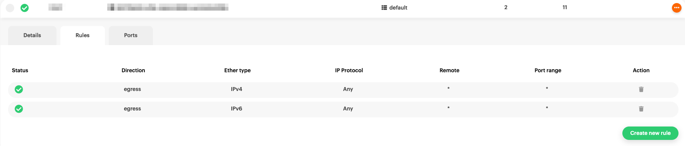

# Creating security groups

[By definition](https://docs.openstack.org/nova/latest/admin/security-groups.html),
security groups are _"[...] sets of IP filter rules that are applied
to all project instances, which define networking access to the
instance. Group rules are project specific; project members can edit
the default rules for their group and add new rule sets."_

## Creating a security group

Navigate to the [{{gui}}](https://{{gui_domain}}) page, and log into
your {{brand}} account. On the other hand, if you prefer to work with
the OpenStack CLI, please do not forget
to [source the RC file first](../../getting-started/enable-openstack-cli.md).

=== "{{gui}}"
    To create a security group click on _Security Groups_ in the left-hand
    side navigation menu:

    

    and then click on _Create new Security Group_ in the top-right corner:

    

    > An alternative way to create a Security Group is by clicking on
    _Create ..._ button in the top bar.

    Now give the security group a name and description, and choose in
    which region to create it, then click _create_:

    

=== "OpenStack CLI"
    To create a security group use the following command:

    ```bash
    openstack security group create <name>
    ```

    When the command is executed successfully, you will get
    information regarding your new security group:

    ```plain
    +-----------------+--------------------------------------------------------------------------------+
    | Field           | Value                                                                          |
    +-----------------+--------------------------------------------------------------------------------+
    | created_at      | 2025-02-19T17:58:05Z                                                           |
    | description     | <name>                                                                         |
    | id              | a463b1de-7b12-43a0-b080-189f0fb09fd8                                           |
    | name            | <name>                                                                         |
    | project_id      | d42230ea21674515ab9197af89fa5192                                               |
    | revision_number | 1                                                                              |
    | rules           | created_at='2025-02-19T17:58:05Z', direction='egress', ethertype='IPv4',       |
    |                 | id='45dee5b4-2d3b-4ac0-9304-02e3ca6229fe', standard_attr_id='305189',          |
    |                 | updated_at='2025-02-19T17:58:05Z'                                              |
    |                 | created_at='2025-02-19T17:58:05Z', direction='egress', ethertype='IPv6',       |
    |                 | id='a48fbf92-a608-4518-97a4-24e6c9fa8caf', standard_attr_id='305192',          |
    |                 | updated_at='2025-02-19T17:58:05Z'                                              |
    | shared          | False                                                                          |
    | stateful        | True                                                                           |
    | tags            | []                                                                             |
    | updated_at      | 2025-02-19T17:58:05Z                                                           |
    +-----------------+--------------------------------------------------------------------------------+
    ```

## Removing default ingress rules

By default, a security group named `default` has been already created
for you, blocking all traffic from any source (ingress), except from
servers and ports being in the same security group. All traffic to any
destination (egress) is allowed by default.

=== "{{gui}}"
    Navigate to the security groups page, click on `default` security
    group and select the _Rules_ tab to view its rules:

    

=== "OpenStack CLI"
    View the details of the `default` security group using the
    following command:

    ```bash
    openstack security group show default
    ```

    you will get a printout similar to this:

    ```plain
    +-----------------+--------------------------------------------------------------------------------+
    | Field           | Value                                                                          |
    +-----------------+--------------------------------------------------------------------------------+
    | created_at      | 2024-04-11T07:02:49Z                                                           |
    | description     | Default security group                                                         |
    | id              | 5b6a6004-d40e-41ed-938e-48fc09f950f2                                           |
    | name            | default                                                                        |
    | project_id      | d42230ea21674515ab9197af89fa5192                                               |
    | revision_number | 1                                                                              |
    | rules           | belongs_to_default_sg='True', created_at='2024-04-11T07:02:49Z',               |
    |                 | direction='egress', ethertype='IPv6',                                          |
    |                 | id='486f7d60-a486-46e6-ab70-7d91ce65cdc7', standard_attr_id='73',              |
    |                 | updated_at='2024-04-11T07:02:49Z'                                              |
    |                 | belongs_to_default_sg='True', created_at='2024-04-11T07:02:49Z',               |
    |                 | direction='ingress', ethertype='IPv4',                                         |
    |                 | id='58785232-3635-49ca-a9d9-5f762c26c92a',                                     |
    |                 | remote_group_id='5b6a6004-d40e-41ed-938e-48fc09f950f2', standard_attr_id='67', |
    |                 | updated_at='2024-04-11T07:02:49Z'                                              |
    |                 | belongs_to_default_sg='True', created_at='2024-04-11T07:02:49Z',               |
    |                 | direction='egress', ethertype='IPv4',                                          |
    |                 | id='5a7fca17-f02a-4c72-a4a3-19ce4618a0cc', standard_attr_id='64',              |
    |                 | updated_at='2024-04-11T07:02:49Z'                                              |
    |                 | belongs_to_default_sg='True', created_at='2024-04-11T07:02:49Z',               |
    |                 | direction='ingress', ethertype='IPv6',                                         |
    |                 | id='baf7d080-32b0-49e3-aa04-b91a20358fd5',                                     |
    |                 | remote_group_id='5b6a6004-d40e-41ed-938e-48fc09f950f2', standard_attr_id='70', |
    |                 | updated_at='2024-04-11T07:02:49Z'                                              |
    | shared          | False                                                                          |
    | stateful        | True                                                                           |
    | tags            | []                                                                             |
    | updated_at      | 2024-04-11T07:02:49Z                                                           |
    +-----------------+--------------------------------------------------------------------------------+
    ```

If you want to restrict the ingress rules to disallow access from
other servers and ports in the group, you need to
**remove the default two ingress rules.**

=== "{{gui}}"
    Click on the trashcan action button on the right-hand side for
    **both ingress** rules.

    Your `default` or newly created security group rules will now
    look like this:

    

=== "OpenStack CLI"
    To view the rules use the following command:

    ```bash
    openstack security group rule list default
    ```

    The printout will be similar to this:

    ```plain
    +-----------+-------------+-----------+-----------+------------+-----------+-----------------------+----------------------+
    | ID        | IP Protocol | Ethertype | IP Range  | Port Range | Direction | Remote Security Group | Remote Address Group |
    +-----------+-------------+-----------+-----------+------------+-----------+-----------------------+----------------------+
    | 486f7d60- | None        | IPv6      | ::/0      |            | egress    | None                  | None                 |
    | a486-     |             |           |           |            |           |                       |                      |
    | 46e6-     |             |           |           |            |           |                       |                      |
    | ab70-     |             |           |           |            |           |                       |                      |
    | 7d91ce65c |             |           |           |            |           |                       |                      |
    | dc7       |             |           |           |            |           |                       |                      |
    | 58785232- | None        | IPv4      | 0.0.0.0/0 |            | ingress   | 5b6a6004-d40e-41ed-   | None                 |
    | 3635-     |             |           |           |            |           | 938e-48fc09f950f2     |                      |
    | 49ca-     |             |           |           |            |           |                       |                      |
    | a9d9-     |             |           |           |            |           |                       |                      |
    | 5f762c26c |             |           |           |            |           |                       |                      |
    | 92a       |             |           |           |            |           |                       |                      |
    | 5a7fca17- | None        | IPv4      | 0.0.0.0/0 |            | egress    | None                  | None                 |
    | f02a-     |             |           |           |            |           |                       |                      |
    | 4c72-     |             |           |           |            |           |                       |                      |
    | a4a3-     |             |           |           |            |           |                       |                      |
    | 19ce4618a |             |           |           |            |           |                       |                      |
    | 0cc       |             |           |           |            |           |                       |                      |
    | baf7d080- | None        | IPv6      | ::/0      |            | ingress   | 5b6a6004-d40e-41ed-   | None                 |
    | 32b0-     |             |           |           |            |           | 938e-48fc09f950f2     |                      |
    | 49e3-     |             |           |           |            |           |                       |                      |
    | aa04-     |             |           |           |            |           |                       |                      |
    | b91a20358 |             |           |           |            |           |                       |                      |
    | fd5       |             |           |           |            |           |                       |                      |
    +-----------+-------------+-----------+-----------+------------+-----------+-----------------------+----------------------+
    ```

    The IDs of the two ingress rules, one for IPv4 traffic and one for
    IPv6, in this case are: `58785232-3635-49ca-a9d9-5f762c26c92a` and
    `baf7d080-32b0-49e3-aa04-b91a20358fd5`.

    Delete them by using the following command:

    ```bash
    openstack security group rule delete \
      58785232-3635-49ca-a9d9-5f762c26c92a baf7d080-32b0-49e3-aa04-b91a20358fd5
    ```

    Print the rules again:

    ```bash
    openstack security group rule list default
    ```

    Now the remaining rules are only the egress ones.

    ```plain
    +-----------+-------------+-----------+-----------+------------+-----------+-----------------------+----------------------+
    | ID        | IP Protocol | Ethertype | IP Range  | Port Range | Direction | Remote Security Group | Remote Address Group |
    +-----------+-------------+-----------+-----------+------------+-----------+-----------------------+----------------------+
    | 486f7d60- | None        | IPv6      | ::/0      |            | egress    | None                  | None                 |
    | a486-     |             |           |           |            |           |                       |                      |
    | 46e6-     |             |           |           |            |           |                       |                      |
    | ab70-     |             |           |           |            |           |                       |                      |
    | 7d91ce65c |             |           |           |            |           |                       |                      |
    | dc7       |             |           |           |            |           |                       |                      |
    | 5a7fca17- | None        | IPv4      | 0.0.0.0/0 |            | egress    | None                  | None                 |
    | f02a-     |             |           |           |            |           |                       |                      |
    | 4c72-     |             |           |           |            |           |                       |                      |
    | a4a3-     |             |           |           |            |           |                       |                      |
    | 19ce4618a |             |           |           |            |           |                       |                      |
    | 0cc       |             |           |           |            |           |                       |                      |
    +-----------+-------------+-----------+-----------+------------+-----------+-----------------------+----------------------+
    ```

## Allowing SSH access

The next thing to do, is to allow SSH access on **port 22** to the
server, only from specific networks.

=== "{{gui}}"
    To do this, click on the _Create new rule_ button.
    

=== "OpenStack CLI"
    To create this rule use the following command:

    ```bash
    openstack security group rule create \
      --protocol tcp --dst-port 22 --remote-ip 203.0.113.58/32 default
    ```

> If you don't know your IP, simply visit
> [icanhazip.com](https://ipv4.icanhazip.com/). In this example your
> IP is 203.0.113.58, and if you want to allow SSH access from this IP
> address only, enter `203.0.113.58/32` as CIDR. If you want to allow
> SSH access from any address in that [Class C
> subnet](https://en.wikipedia.org/wiki/Classful_network), instead
> enter `203.0.113.0/24` as CIDR.

## Allowing Web Traffic

Next create the rules that allow anyone to access the server on **port
80** and **port 443**.

=== "{{gui}}"
    Using the same logic as before, click on _Create new rule_. Select
    TCP Protocol and port 80 as both min and max range value. This
    time, _CIDR_ is left empty, allowing incoming traffic from any
    IP/source.

    

    The same applies to port 443.

    

    
=== "OpenStack CLI"
    This time don't specify _--remote-ip_ to allow traffic from all
    sources, using the following command:

    ```bash
    openstack security group rule create --protocol tcp --dst-port 80 default
    ```
    One more time for port 443:

    ```bash
    openstack security group rule create --protocol tcp --dst-port 443 default
    ```

    To view the updated rules, print the them again:

    ```bash
    openstack security group rule list default
    ```

    ```plain
    +-----------+-------------+-----------+-----------+------------+-----------+-----------------------+----------------------+
    | ID        | IP Protocol | Ethertype | IP Range  | Port Range | Direction | Remote Security Group | Remote Address Group |
    +-----------+-------------+-----------+-----------+------------+-----------+-----------------------+----------------------+
    | 486f7d60- | None        | IPv6      | ::/0      |            | egress    | None                  | None                 |
    | a486-     |             |           |           |            |           |                       |                      |
    | 46e6-     |             |           |           |            |           |                       |                      |
    | ab70-     |             |           |           |            |           |                       |                      |
    | 7d91ce65c |             |           |           |            |           |                       |                      |
    | dc7       |             |           |           |            |           |                       |                      |
    | 5a7fca17- | None        | IPv4      | 0.0.0.0/0 |            | egress    | None                  | None                 |
    | f02a-     |             |           |           |            |           |                       |                      |
    | 4c72-     |             |           |           |            |           |                       |                      |
    | a4a3-     |             |           |           |            |           |                       |                      |
    | 19ce4618a |             |           |           |            |           |                       |                      |
    | 0cc       |             |           |           |            |           |                       |                      |
    | 8f73d70a- | tcp         | IPv4      | 0.0.0.0/0 | 443:443    | ingress   | None                  | None                 |
    | d4c0-     |             |           |           |            |           |                       |                      |
    | 4a9a-     |             |           |           |            |           |                       |                      |
    | 8206-     |             |           |           |            |           |                       |                      |
    | 5e5feef8b |             |           |           |            |           |                       |                      |
    | 458       |             |           |           |            |           |                       |                      |
    | 9fc7ff29- | tcp         | IPv4      | 203.0.113 | 22:22      | ingress   | None                  | None                 |
    | c2d8-     |             |           | .58/32    |            |           |                       |                      |
    | 4e7a-     |             |           |           |            |           |                       |                      |
    | 853c-     |             |           |           |            |           |                       |                      |
    | 488d1e6fc |             |           |           |            |           |                       |                      |
    | 9ec       |             |           |           |            |           |                       |                      |
    | db332763- | tcp         | IPv4      | 0.0.0.0/0 | 80:80      | ingress   | None                  | None                 |
    | 19ce-     |             |           |           |            |           |                       |                      |
    | 4a09-     |             |           |           |            |           |                       |                      |
    | 8d7b-     |             |           |           |            |           |                       |                      |
    | c2659a1c9 |             |           |           |            |           |                       |                      |
    | e2f       |             |           |           |            |           |                       |                      |
    +-----------+-------------+-----------+-----------+------------+-----------+-----------------------+----------------------+
    ```

All the rules for a simple web server are now in place.

For any additional protocol or ingress rule, simply follow the same
procedure as above.
