# Creating security groups

[By definition](https://docs.openstack.org/nova/latest/admin/security-groups.html), security groups are _"[...] sets of IP filter rules that are applied to all project instances, which define networking access to the instance.
Group rules are project specific; project members can edit the default rules for their group and add new rule sets."_

## Creating a security group

Navigate to the [{{gui}}](https://{{gui_domain}}) page, and log into your {{brand}} account.
On the other hand, if you prefer to work with the OpenStack CLI, please do not forget to [source the RC file first](../../getting-started/enable-openstack-cli.md).

=== "{{gui}}"
    To create a security group, first make sure the left-hand side vertical pane is fully visible.
    Click on _Security&nbsp;Groups_, and then on the top-right corner of the central pane, click on _Create new Security Group_.

    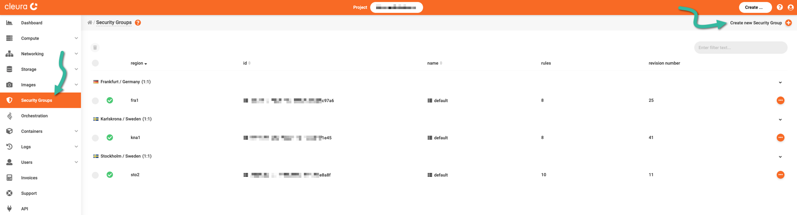

    > An alternative way to create a Security&nbsp;Group is by clicking on the round-cornered _Create_ button, in the top bar.

    Type in a _Name_ for the new security group, and choose a _Region_ to create it in.
    You may optionally type in a _Description_ for the security group.
    Click on the green _Create_ button when you are ready.

    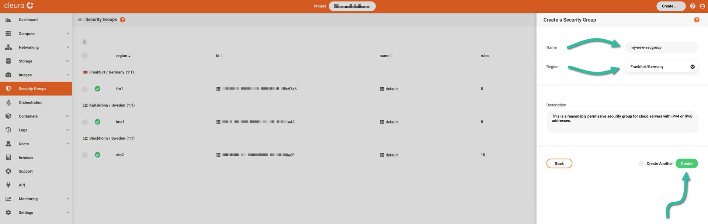
=== "OpenStack CLI"
    To create a security group, use the following command:

    ```bash
    openstack security group create <name>
    ```

    When the command is executed successfully, you will get information regarding your new security group:

    ```plain
    +-----------------+--------------------------------------------------------------------------------+
    | Field           | Value                                                                          |
    +-----------------+--------------------------------------------------------------------------------+
    | created_at      | 2022-11-14T09:15:14Z                                                           |
    | description     | <name>                                                                         |
    | id              | 736da1d1-aa98-4da4-9ba4-2ab9aeea6a57                                           |
    | name            | <name>                                                                         |
    | project_id      | cb43f189f7904fb88f3bbcfa22653ab8                                               |
    | revision_number | 1                                                                              |
    | rules           | created_at='2022-11-14T09:15:14Z', direction='egress', ethertype='IPv4',       |
    |                 | id='1f4c57cb-8e34-420c-a7e3-3b5625c79481', standard_attr_id='10579829',        |
    |                 | updated_at='2022-11-14T09:15:14Z'                                              |
    |                 | created_at='2022-11-14T09:15:14Z', direction='egress', ethertype='IPv6',       |
    |                 | id='7c2c287e-9596-42ef-a5a8-0b09e38b206a', standard_attr_id='10579832',        |
    |                 | updated_at='2022-11-14T09:15:14Z'                                              |
    | stateful        | True                                                                           |
    | tags            | []                                                                             |
    | updated_at      | 2022-11-14T09:15:14Z                                                           |
    +-----------------+--------------------------------------------------------------------------------+
    ```

## Removing default ingress rules

By default, a security group named `default` has already been created for you.
Its rules block all traffic from any source (ingress), except from servers and ports in the same security group.
All traffic to any destination (egress) is allowed by default.

> For accounts created before 2022-11-16, the default security group ingress rules allow all incoming traffic.
> See [Adjusting a permissive default security group](#adjusting-a-permissive-default-security-group), to learn how to configure this security group according to our recommendations.

=== "{{gui}}"
    Navigate to the _Security&nbsp;Groups_ page.
    Click on the `default` security group and select the _Rules_ tab to view its rules.

    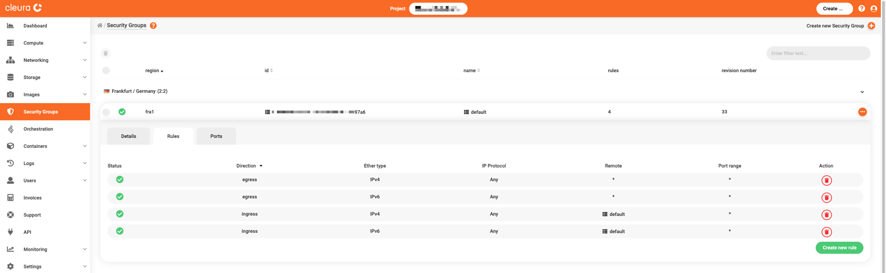

=== "OpenStack CLI"
    View the details of the `default` security group using the following command:

    ```bash
    openstack security group show default
    ```

    You will get a printout similar to this:

    ```plain
    +-----------------+--------------------------------------------------------------------------------+
    | Field           | Value                                                                          |
    +-----------------+--------------------------------------------------------------------------------+
    | created_at      | 2022-09-12T15:00:57Z                                                           |
    | description     | Default security group                                                         |
    | id              | 935b1317-a0c0-42e9-b68d-7cf16637df14                                           |
    | name            | default                                                                        |
    | project_id      | cb43f189f7904fb88f3bbcfa22653ab8                                               |
    | revision_number | 5                                                                              |
    | rules           | created_at='2022-09-12T15:00:59Z', direction='ingress', ethertype='IPv4',      |
    |                 | id='5e5e9f4d-1faa-492d-91f1-c105b464072b', protocol='0',                       |
    |                 | remote_group_id='60776d43-a78c-4eb4-8998-cea7a04c5f9b',                        |
    |                 | standard_attr_id='10422245', updated_at='2022-09-12T15:00:59Z'                 |
    |                 | created_at='2022-09-12T15:00:59Z', direction='ingress', ethertype='IPv6',      |
    |                 | id='86b9413a-ad23-46c4-a35e-9306945dc63c', protocol='0',                       |
    |                 | remote_group_id='60776d43-a78c-4eb4-8998-cea7a04c5f9b',                        |
    |                 | standard_attr_id='10422248', updated_at='2022-09-12T15:00:59Z'                 |
    |                 | created_at='2022-09-12T15:00:57Z', direction='egress', ethertype='IPv6',       |
    |                 | id='ad4a19ef-7fab-4eba-9982-e5b109be121c', standard_attr_id='10422242',        |
    |                 | updated_at='2022-09-12T15:00:57Z'                                              |
    |                 | created_at='2022-09-12T15:00:57Z', direction='egress', ethertype='IPv4',       |
    |                 | id='f53b1a12-edbb-480b-910b-a71c4836346f', standard_attr_id='10422236',        |
    |                 | updated_at='2022-09-12T15:00:57Z'                                              |
    | stateful        | True                                                                           |
    | tags            | []                                                                             |
    | updated_at      | 2022-09-12T15:00:59Z                                                           |
    +-----------------+--------------------------------------------------------------------------------+
    ```

If you want to restrict the ingress rules to disallow access from other servers and ports in the group, you need to **remove the default two ingress rules.**

=== "{{gui}}"
    Click each of the red :material-delete-circle: buttons on the right-hand side of the **IPv4 ingress** and also of the **IPv6 ingress** rows.

    Your `default` or newly created security group rules will now look like the following example.

    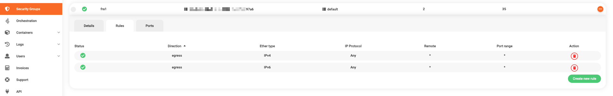

=== "OpenStack CLI"
    To view the rules, use the following command:

    ```bash
    openstack security group rule list default
    ```

    The printout will be similar to this:

    ```plain
    +-----------+-------------+-----------+-----------+------------+-----------+-----------------------+----------------------+
    | ID        | IP Protocol | Ethertype | IP Range  | Port Range | Direction | Remote Security Group | Remote Address Group |
    +-----------+-------------+-----------+-----------+------------+-----------+-----------------------+----------------------+
    | 5e5e9f4d- | None        | IPv4      | 0.0.0.0/0 |            | ingress   | 60776d43-a78c-4eb4-   | None                 |
    | 1faa-     |             |           |           |            |           | 8998-cea7a04c5f9b     |                      |
    | 492d-     |             |           |           |            |           |                       |                      |
    | 91f1-     |             |           |           |            |           |                       |                      |
    | c105b4640 |             |           |           |            |           |                       |                      |
    | 72b       |             |           |           |            |           |                       |                      |
    | 86b9413a- | None        | IPv6      | ::/0      |            | ingress   | 60776d43-a78c-4eb4-   | None                 |
    | ad23-     |             |           |           |            |           | 8998-cea7a04c5f9b     |                      |
    | 46c4-     |             |           |           |            |           |                       |                      |
    | a35e-     |             |           |           |            |           |                       |                      |
    | 9306945dc |             |           |           |            |           |                       |                      |
    | 63c       |             |           |           |            |           |                       |                      |
    | ad4a19ef- | None        | IPv6      | ::/0      |            | egress    | None                  | None                 |
    | 7fab-     |             |           |           |            |           |                       |                      |
    | 4eba-     |             |           |           |            |           |                       |                      |
    | 9982-     |             |           |           |            |           |                       |                      |
    | e5b109be1 |             |           |           |            |           |                       |                      |
    | 21c       |             |           |           |            |           |                       |                      |
    | f53b1a12- | None        | IPv4      | 0.0.0.0/0 |            | egress    | None                  | None                 |
    | edbb-     |             |           |           |            |           |                       |                      |
    | 480b-     |             |           |           |            |           |                       |                      |
    | 910b-     |             |           |           |            |           |                       |                      |
    | a71c48363 |             |           |           |            |           |                       |                      |
    | 46f       |             |           |           |            |           |                       |                      |
    +-----------+-------------+-----------+-----------+------------+-----------+-----------------------+----------------------+
    ```

    The IDs of the two ingress rules, one for IPv4 traffic and one for IPv6, in this case, are:
    `5e5e9f4d-1faa-492d-91f1-c105b464072b` and `86b9413a-ad23-46c4-a35e-9306945dc63c`.

    Delete them by using the following command:

    ```bash
    openstack security group rule delete \
      5e5e9f4d-1faa-492d-91f1-c105b464072b 86b9413a-ad23-46c4-a35e-9306945dc63c
    ```

    Print the rules again:

    ```bash
    openstack security group rule list default
    ```

    Now, the remaining rules are only the egress ones.

    ```plain
    +-----------+-------------+-----------+-----------+------------+-----------+-----------------------+----------------------+
    | ID        | IP Protocol | Ethertype | IP Range  | Port Range | Direction | Remote Security Group | Remote Address Group |
    +-----------+-------------+-----------+-----------+------------+-----------+-----------------------+----------------------+
    | ad4a19ef- | None        | IPv6      | ::/0      |            | egress    | None                  | None                 |
    | 7fab-     |             |           |           |            |           |                       |                      |
    | 4eba-     |             |           |           |            |           |                       |                      |
    | 9982-     |             |           |           |            |           |                       |                      |
    | e5b109be1 |             |           |           |            |           |                       |                      |
    | 21c       |             |           |           |            |           |                       |                      |
    | f53b1a12- | None        | IPv4      | 0.0.0.0/0 |            | egress    | None                  | None                 |
    | edbb-     |             |           |           |            |           |                       |                      |
    | 480b-     |             |           |           |            |           |                       |                      |
    | 910b-     |             |           |           |            |           |                       |                      |
    | a71c48363 |             |           |           |            |           |                       |                      |
    | 46f       |             |           |           |            |           |                       |                      |
    +-----------+-------------+-----------+-----------+------------+-----------+-----------------------+----------------------+
    ```

## Allowing SSH access

The next thing to do is allow SSH access on **port 22** for IPv4 and IPv6 client connections -- but _only_ from specific addresses or subnets.

=== "{{gui}}"
    To do this, while on the _Rules_ tab, click on the green _Create new rule_ button.
    A pane named _Create a Security Group Rule_ will slide over from the right-hand side of the browser window.

    For the IPv4 ingress SSH rule, make sure you set _Protocol_ to _TCP_, _Direction_ to _Ingress_, and _Ether&nbsp;Type_ to _IPv4_.
    Then, set _From_ to _Network/IP_ and, in the _Custom&nbsp;CIDR_ text box below, type in either the IPv4 address of your client host or the CIDR of your client subnet.

    To create the new rule, click the green _Create_ button.

    

    You may work similarly for the IPv6 ingress SSH rule;
    just be sure to set _Ether&nbsp;Type_ to _IPv6_.

    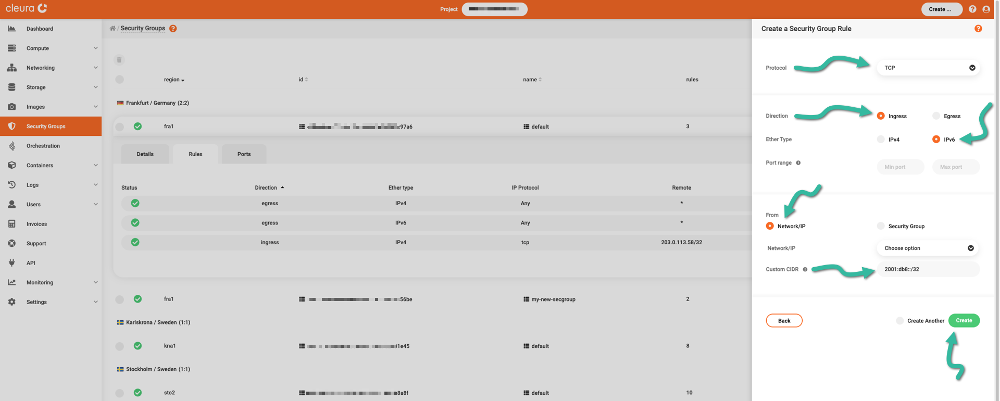

    When you are done creating the two ingress rules for SSH, you see them listed in the _Rules_ tab of the security group.

    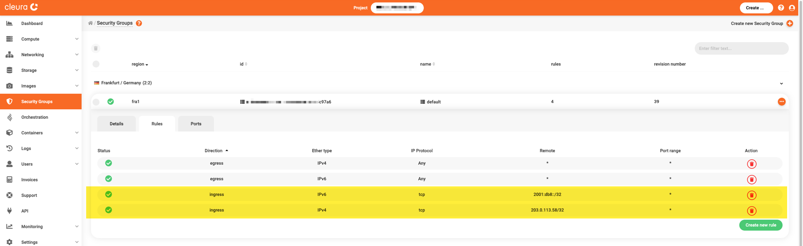
=== "OpenStack CLI"
    To create this rule for IPv4 client connections, use the following command:

    ```bash
    openstack security group rule create \
      --protocol tcp --dst-port 22 \
      --remote-ip 203.0.113.0/24 \
      default
    ```
    
    To create the same rule but this time for IPv6 client connections, use a command like the following:
    
    ```bash
    openstack security group rule create \
      --protocol tcp --dst-port 22 --ethertype IPv6 \
      --remote-ip 2001:db8::/32 \
      default
    ```

> If you don't know your IPv4 or IPv6 address, visit [icanhazip.com](https://icanhazip.com/).

In this example, your IPv4 address is 203.0.113.58, and if you want to allow SSH access from this address only, enter `203.0.113.58/32` as CIDR.
If you want to allow SSH access from _any_ address in that [Class C subnet](https://en.wikipedia.org/wiki/Classful_network), instead enter `203.0.113.0/24` as CIDR.
Regarding the IPv6 address, in the example we use the `2001:db8::/32` address block.
Alternatively, you may use a single IPv6 address, like `2001:db8:ffff:ffff:ffff:ffff:ffff:ffff/128`.

## Allowing Web Traffic

Next, create the rules that allow anyone to access a server on **port 80** and **port 443**.

=== "{{gui}}"
    Following a similar routine as before, begin by clicking on the green _Create new rule_ button.
    To create an ingress rule for IPv4 connections to 80/TCP, set _Protocol_, _Direction_, and _Ether&nbsp;Type_ accordingly.
    Then, in each of the two _Port range_ text boxes, type in `80`.
    This time, leave _CIDR_ empty, essentially allowing incoming traffic from any IPv4 client.
    Click the green _Create_ button to instantiate the new rule.

    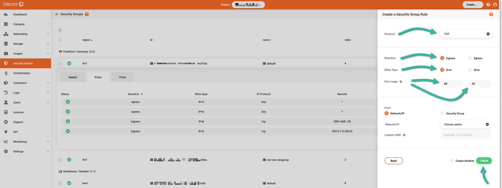

    The same for the ingress rule for IPv4 connections to 443/TCP.
    The only difference is in the _Port range_ text boxes;
    in each of the two, you should now type `443`.

    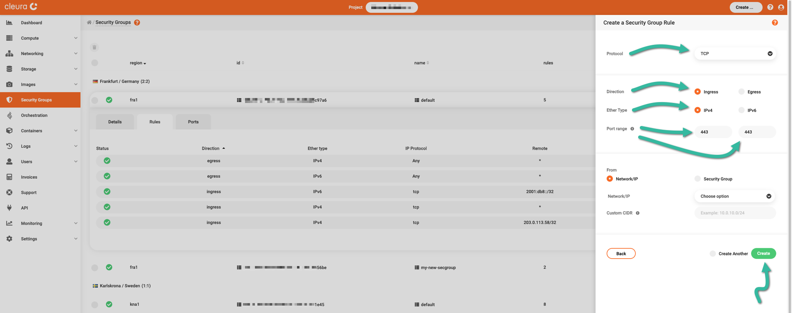

    Just like you did for incoming IPv4 connections, create a new ingress rule for IPv6 clients connecting to 80/TCP...
    
    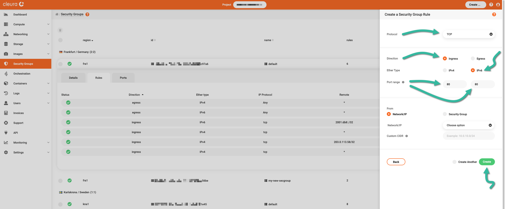

    ...and a new ingress rule for IPv6 clients connecting to 443/TCP.
    
    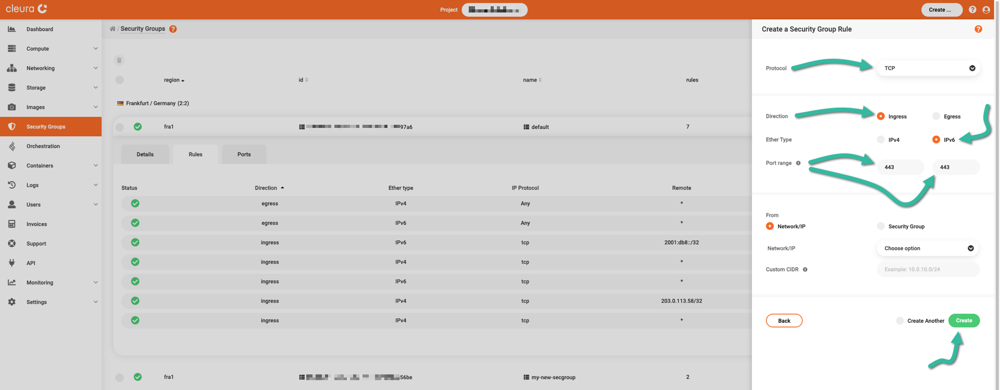

    When you are done creating the new ingress rules, you will see them all listed in the _Rules_ tab of the `default` security group.
    
    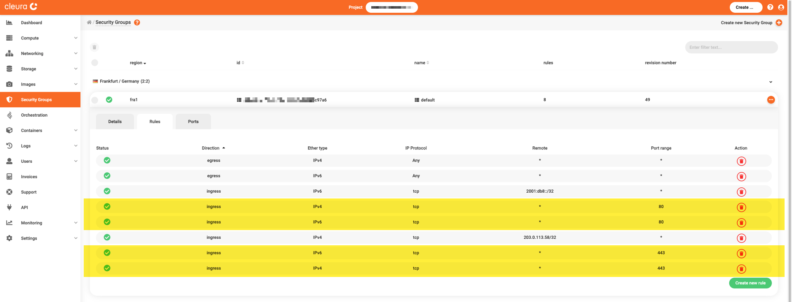

=== "OpenStack CLI"
    This time don't specify `--remote-ip`, to allow traffic from _all_ IPv4 and IPv6 sources:

    ```bash
    openstack security group rule create --protocol tcp --dst-port 80 default
    ```
    
    ```bash
    openstack security group rule create --protocol tcp --dst-port 80 --ethertype IPv6 default
    ```

    One more time for port 443:

    ```bash
    openstack security group rule create --protocol tcp --dst-port 443 default
    ```

    ```bash
    openstack security group rule create --protocol tcp --dst-port 443 --ethertype IPv6 default
    ```

    To view the updated rules, print them again:

    ```bash
    openstack security group rule list default
    ```

    ```plain
    +-----------+-------------+-----------+-----------+------------+-----------+-----------------------+----------------------+
    | ID        | IP Protocol | Ethertype | IP Range  | Port Range | Direction | Remote Security Group | Remote Address Group |
    +-----------+-------------+-----------+-----------+------------+-----------+-----------------------+----------------------+
    | 742bcc46- | tcp         | IPv4      | 0.0.0.0/0 | 80:80      | ingress   | None                  | None                 |
    | beb5-     |             |           |           |            |           |                       |                      |
    | 47a5-     |             |           |           |            |           |                       |                      |
    | 8eb1-     |             |           |           |            |           |                       |                      |
    | eb35da800 |             |           |           |            |           |                       |                      |
    | 6ed       |             |           |           |            |           |                       |                      |
    | 86ab9224- | tcp         | IPv6      | ::/0      | 80:80      | ingress   | None                  | None                 |
    | 4120-     |             |           |           |            |           |                       |                      |
    | 11f0-     |             |           |           |            |           |                       |                      |
    | af79-     |             |           |           |            |           |                       |                      |
    | 5f799899a |             |           |           |            |           |                       |                      |
    | 9cb       |             |           |           |            |           |                       |                      |
    | ad4a19ef- | None        | IPv6      | ::/0      |            | egress    | None                  | None                 |
    | 7fab-     |             |           |           |            |           |                       |                      |
    | 4eba-     |             |           |           |            |           |                       |                      |
    | 9982-     |             |           |           |            |           |                       |                      |
    | e5b109be1 |             |           |           |            |           |                       |                      |
    | 21c       |             |           |           |            |           |                       |                      |
    | cef0cd36- | tcp         | IPv4      | 203.0.113 | 22:22      | ingress   | None                  | None                 |
    | ad78-     |             |           | .58/32    |            |           |                       |                      |
    | 4dbd-     |             |           |           |            |           |                       |                      |
    | b806-     |             |           |           |            |           |                       |                      |
    | 597300fd9 |             |           |           |            |           |                       |                      |
    | e6a       |             |           |           |            |           |                       |                      |
    | f53b1a12- | None        | IPv4      | 0.0.0.0/0 |            | egress    | None                  | None                 |
    | edbb-     |             |           |           |            |           |                       |                      |
    | 480b-     |             |           |           |            |           |                       |                      |
    | 910b-     |             |           |           |            |           |                       |                      |
    | a71c48363 |             |           |           |            |           |                       |                      |
    | 46f       |             |           |           |            |           |                       |                      |
    | f90c598c- | tcp         | IPv4      | 0.0.0.0/0 | 443:443    | ingress   | None                  | None                 |
    | 3a5e-     |             |           |           |            |           |                       |                      |
    | 459f-     |             |           |           |            |           |                       |                      |
    | 8ed3-     |             |           |           |            |           |                       |                      |
    | 3c2538e7a |             |           |           |            |           |                       |                      |
    | 24f       |             |           |           |            |           |                       |                      |
    | dde1a0d8- | tcp         | IPv6      | ::/0      | 443:443    | ingress   | None                  | None                 |
    | 4120-     |             |           |           |            |           |                       |                      |
    | 11f0-     |             |           |           |            |           |                       |                      |
    | acdc-     |             |           |           |            |           |                       |                      |
    | 93df8d8fa |             |           |           |            |           |                       |                      |
    | fae       |             |           |           |            |           |                       |                      |
    +-----------+-------------+-----------+-----------+------------+-----------+-----------------------+----------------------+
    ```

All the rules for a simple web server are now in place.

For any additional protocol or ingress rule, simply follow the same procedure as above.

## Adjusting a permissive default security group

If your {{brand}} account was created before 2022-11-16, and you didn't configure the `default` security group, it is most likely permissive for all incoming traffic.
We recommend either creating and using a new security group, other than the `default` one, or restricting ingress traffic to specific ports and sources.

=== "{{gui}}"
    To check how your `default` security group is configured, click on it and select the _Rules_ tab to view its rules.
    If you have an old, permissive `default` group, the rules should look like this:

    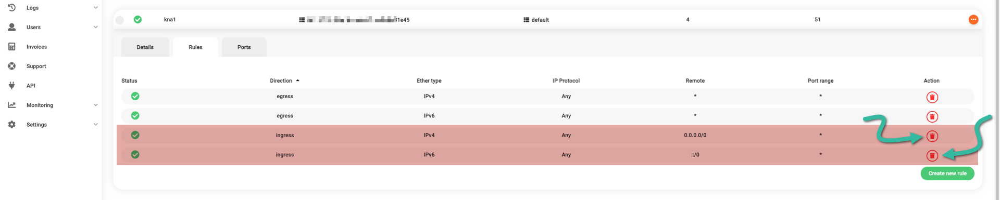

    The ingress rules with the remote access filters of `::/0` and `0.0.0.0/0`, mean that incoming traffic from _all_ sources is allowed.
    
    If you want to use the `default` group, remove the two ingress rules that allow all incoming traffic.
    Click on the :material-delete-circle: button on the right-hand side for **both ingress** rule rows.

    Your `default` or newly created security group rules will now look like the following.

    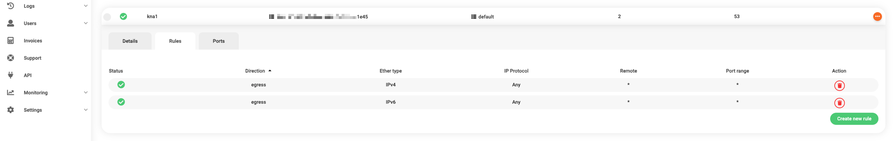

=== "OpenStack CLI"
    To view the rules, use the following command:

    ```bash
    openstack security group rule list default
    ```

    The printout will be similar to this:

    ```plain
    +-----------+-------------+-----------+-----------+------------+-----------+-----------------------+----------------------+
    | ID        | IP Protocol | Ethertype | IP Range  | Port Range | Direction | Remote Security Group | Remote Address Group |
    +-----------+-------------+-----------+-----------+------------+-----------+-----------------------+----------------------+
    | 5e5e9f4d- | None        | IPv4      | 0.0.0.0/0 |            | ingress   | None                  | None                 |
    | 1faa-     |             |           |           |            |           |                       |                      |
    | 492d-     |             |           |           |            |           |                       |                      |
    | 91f1-     |             |           |           |            |           |                       |                      |
    | c105b4640 |             |           |           |            |           |                       |                      |
    | 72b       |             |           |           |            |           |                       |                      |
    | 86b9413a- | None        | IPv6      | ::/0      |            | ingress   | None                  | None                 |
    | ad23-     |             |           |           |            |           |                       |                      |
    | 46c4-     |             |           |           |            |           |                       |                      |
    | a35e-     |             |           |           |            |           |                       |                      |
    | 9306945dc |             |           |           |            |           |                       |                      |
    | 63c       |             |           |           |            |           |                       |                      |
    | ad4a19ef- | None        | IPv6      | ::/0      |            | egress    | None                  | None                 |
    | 7fab-     |             |           |           |            |           |                       |                      |
    | 4eba-     |             |           |           |            |           |                       |                      |
    | 9982-     |             |           |           |            |           |                       |                      |
    | e5b109be1 |             |           |           |            |           |                       |                      |
    | 21c       |             |           |           |            |           |                       |                      |
    | f53b1a12- | None        | IPv4      | 0.0.0.0/0 |            | egress    | None                  | None                 |
    | edbb-     |             |           |           |            |           |                       |                      |
    | 480b-     |             |           |           |            |           |                       |                      |
    | 910b-     |             |           |           |            |           |                       |                      |
    | a71c48363 |             |           |           |            |           |                       |                      |
    | 46f       |             |           |           |            |           |                       |                      |
    +-----------+-------------+-----------+-----------+------------+-----------+-----------------------+----------------------+
    ```

    If the ingress rules have `::/0` and `0.0.0.0/0` values in the `IP Range` column, and `None` in the `Remote Security Group`, then incoming traffic from _any_ source is allowed.

    The IDs of the two ingress rules, one for IPv4 traffic and one for IPv6, are:
    `5e5e9f4d-1faa-492d-91f1-c105b464072b` and `86b9413a-ad23-46c4-a35e-9306945dc63c` respectively.

    Delete them by using the following command:

    ```bash
    openstack security group rule delete \
      5e5e9f4d-1faa-492d-91f1-c105b464072b 86b9413a-ad23-46c4-a35e-9306945dc63c
    ```
    Print the rules again:

    ```bash
    openstack security group rule list default
    ```

    Now the remaining rules are only the egress ones.

    ```plain
    +-----------+-------------+-----------+-----------+------------+-----------+-----------------------+----------------------+
    | ID        | IP Protocol | Ethertype | IP Range  | Port Range | Direction | Remote Security Group | Remote Address Group |
    +-----------+-------------+-----------+-----------+------------+-----------+-----------------------+----------------------+
    | ad4a19ef- | None        | IPv6      | ::/0      |            | egress    | None                  | None                 |
    | 7fab-     |             |           |           |            |           |                       |                      |
    | 4eba-     |             |           |           |            |           |                       |                      |
    | 9982-     |             |           |           |            |           |                       |                      |
    | e5b109be1 |             |           |           |            |           |                       |                      |
    | 21c       |             |           |           |            |           |                       |                      |
    | f53b1a12- | None        | IPv4      | 0.0.0.0/0 |            | egress    | None                  | None                 |
    | edbb-     |             |           |           |            |           |                       |                      |
    | 480b-     |             |           |           |            |           |                       |                      |
    | 910b-     |             |           |           |            |           |                       |                      |
    | a71c48363 |             |           |           |            |           |                       |                      |
    | 46f       |             |           |           |            |           |                       |                      |
    +-----------+-------------+-----------+-----------+------------+-----------+-----------------------+----------------------+
    ```
