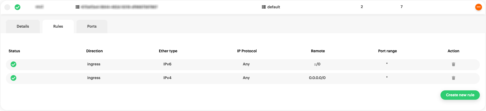
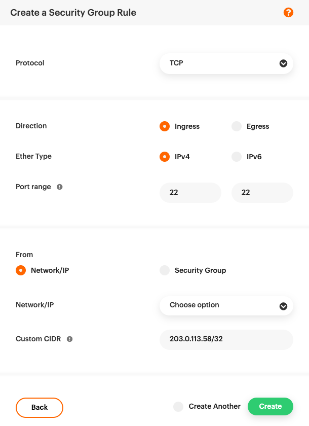
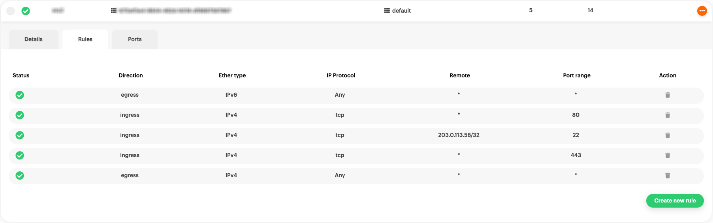

# Creating security groups

[By
definition](https://docs.openstack.org/nova/latest/admin/security-groups.html),
security groups are _"[...] sets of IP filter rules that are applied
to all project instances, which define networking access to the
instance. Group rules are project specific; project members can edit
the default rules for their group and add new rule sets."_

## Creating a security group

Navigate to the [{{gui}}](https://{{gui_domain}}) page, and log into
your {{brand}} account. On the other hand, if you prefer to work with
the OpenStack CLI, please do not forget to [source the RC file
first](/howto/getting-started/enable-openstack-cli).

=== "{{gui}}"
    To create a security group click on _Security Groups_ in the
    left-hand navigation menu:

    

    and then click on _Create new Security Group_ in the top-right corner:

    

    > An alternative way to create a Security Group is by clicking on
    _Create ..._ button in the top bar.

    Now give the security group a name and description, and choose in
    which region to create it, then click _create_:

    
=== "OpenStack CLI"
    To create a security group use the following command:

    ```bash
    openstack security group create <name>
    ```

    When the command is executed successfully, you will get
    information regarding your new security group:

    ```plain
    +-----------------+--------------------------------------------------------------------------------+
    | Field           | Value                                                                          |
    +-----------------+--------------------------------------------------------------------------------+
    | created_at      | 2022-11-14T09:15:14Z                                                           |
    | description     | <name>                                                                         |
    | id              | 736da1d1-aa98-4da4-9ba4-2ab9aeea6a57                                           |
    | name            | <name>                                                                         |
    | project_id      | cb43f189f7904fb88f3bbcfa22653ab8                                               |
    | revision_number | 1                                                                              |
    | rules           | created_at='2022-11-14T09:15:14Z', direction='egress', ethertype='IPv4',       |
    |                 | id='1f4c57cb-8e34-420c-a7e3-3b5625c79481', standard_attr_id='10579829',        |
    |                 | updated_at='2022-11-14T09:15:14Z'                                              |
    |                 | created_at='2022-11-14T09:15:14Z', direction='egress', ethertype='IPv6',       |
    |                 | id='7c2c287e-9596-42ef-a5a8-0b09e38b206a', standard_attr_id='10579832',        |
    |                 | updated_at='2022-11-14T09:15:14Z'                                              |
    | stateful        | True                                                                           |
    | tags            | []                                                                             |
    | updated_at      | 2022-11-14T09:15:14Z                                                           |
    +-----------------+--------------------------------------------------------------------------------+
    ```

## Removing default ingress rules

By default, a security group named `default` has been already created
for you, allowing all traffic from any source (ingress), and to any
destination (egress).

=== "{{gui}}"
    Click on it and select the _Rules_ tab to view its rules:

    
=== "OpenStack CLI"
    View the details of the `default` security group using the
    following command:

    ```bash
    openstack security group show default
    ```

    you will get a printout similar to this:

    ```plain
    +-----------------+--------------------------------------------------------------------------------+
    | Field           | Value                                                                          |
    +-----------------+--------------------------------------------------------------------------------+
    | created_at      | 2022-09-12T15:00:57Z                                                           |
    | description     | Default security group                                                         |
    | id              | 935b1317-a0c0-42e9-b68d-7cf16637df14                                           |
    | name            | default                                                                        |
    | project_id      | cb43f189f7904fb88f3bbcfa22653ab8                                               |
    | revision_number | 5                                                                              |
    | rules           | created_at='2022-09-12T15:00:59Z', direction='ingress', ethertype='IPv4',      |
    |                 | id='5e5e9f4d-1faa-492d-91f1-c105b464072b', normalized_cidr='0.0.0.0/0',        |
    |                 | remote_ip_prefix='0.0.0.0/0', standard_attr_id='10422245',                     |
    |                 | updated_at='2022-09-12T15:00:59Z'                                              |
    |                 | created_at='2022-09-12T15:00:59Z', direction='ingress', ethertype='IPv6',      |
    |                 | id='86b9413a-ad23-46c4-a35e-9306945dc63c', normalized_cidr='::/0',             |
    |                 | remote_ip_prefix='::/0', standard_attr_id='10422248',                          |
    |                 | updated_at='2022-09-12T15:00:59Z'                                              |
    |                 | created_at='2022-09-12T15:00:57Z', direction='egress', ethertype='IPv6',       |
    |                 | id='ad4a19ef-7fab-4eba-9982-e5b109be121c', standard_attr_id='10422242',        |
    |                 | updated_at='2022-09-12T15:00:57Z'                                              |
    |                 | created_at='2022-09-12T15:00:57Z', direction='egress', ethertype='IPv4',       |
    |                 | id='f53b1a12-edbb-480b-910b-a71c4836346f', standard_attr_id='10422236',        |
    |                 | updated_at='2022-09-12T15:00:57Z'                                              |
    | stateful        | True                                                                           |
    | tags            | []                                                                             |
    | updated_at      | 2022-09-12T15:00:59Z                                                           |
    +-----------------+--------------------------------------------------------------------------------+
    ```

We recommend to either create and use a new security group other than
the default one, **or** restrict ingress traffic to specific ports and
sources.

If you want use the default group, **remove the two ingress rules**
that allow all incoming traffic.

=== "{{gui}}"
    Click on the trashcan action button on the right-hand side for
    **both ingress** rules.

    Your `default` or newly created security group rules will now
    looks like this:

    
=== "OpenStack CLI"
    To view the rules use the following command:

    ```bash
    openstack security group rule list default
    ```

    The printout will be similar to this:

    ```plain
    +-----------+-------------+-----------+-----------+------------+-----------+-----------------------+----------------------+
    | ID        | IP Protocol | Ethertype | IP Range  | Port Range | Direction | Remote Security Group | Remote Address Group |
    +-----------+-------------+-----------+-----------+------------+-----------+-----------------------+----------------------+
    | 5e5e9f4d- | None        | IPv4      | 0.0.0.0/0 |            | ingress   | None                  | None                 |
    | 1faa-     |             |           |           |            |           |                       |                      |
    | 492d-     |             |           |           |            |           |                       |                      |
    | 91f1-     |             |           |           |            |           |                       |                      |
    | c105b4640 |             |           |           |            |           |                       |                      |
    | 72b       |             |           |           |            |           |                       |                      |
    | 86b9413a- | None        | IPv6      | ::/0      |            | ingress   | None                  | None                 |
    | ad23-     |             |           |           |            |           |                       |                      |
    | 46c4-     |             |           |           |            |           |                       |                      |
    | a35e-     |             |           |           |            |           |                       |                      |
    | 9306945dc |             |           |           |            |           |                       |                      |
    | 63c       |             |           |           |            |           |                       |                      |
    | ad4a19ef- | None        | IPv6      | ::/0      |            | egress    | None                  | None                 |
    | 7fab-     |             |           |           |            |           |                       |                      |
    | 4eba-     |             |           |           |            |           |                       |                      |
    | 9982-     |             |           |           |            |           |                       |                      |
    | e5b109be1 |             |           |           |            |           |                       |                      |
    | 21c       |             |           |           |            |           |                       |                      |
    | f53b1a12- | None        | IPv4      | 0.0.0.0/0 |            | egress    | None                  | None                 |
    | edbb-     |             |           |           |            |           |                       |                      |
    | 480b-     |             |           |           |            |           |                       |                      |
    | 910b-     |             |           |           |            |           |                       |                      |
    | a71c48363 |             |           |           |            |           |                       |                      |
    | 46f       |             |           |           |            |           |                       |                      |
    +-----------+-------------+-----------+-----------+------------+-----------+-----------------------+----------------------+
    ```

    The IDs of the two ingress rules, one for IPv4 traffic and one for
    IPv6, in this case are: `5e5e9f4d-1faa-492d-91f1-c105b464072b` and
    `86b9413a-ad23-46c4-a35e-9306945dc63c`

    Delete them by using the following command:

    ```bash
    openstack security group rule delete \
      5e5e9f4d-1faa-492d-91f1-c105b464072b 86b9413a-ad23-46c4-a35e-9306945dc63c
    ```

    Print the rules again:

    ```bash
    openstack security group rule list default
    ```

    Now the remaining rules are only the egress ones.

    ```plain
    +-----------+-------------+-----------+-----------+------------+-----------+-----------------------+----------------------+
    | ID        | IP Protocol | Ethertype | IP Range  | Port Range | Direction | Remote Security Group | Remote Address Group |
    +-----------+-------------+-----------+-----------+------------+-----------+-----------------------+----------------------+
    | ad4a19ef- | None        | IPv6      | ::/0      |            | egress    | None                  | None                 |
    | 7fab-     |             |           |           |            |           |                       |                      |
    | 4eba-     |             |           |           |            |           |                       |                      |
    | 9982-     |             |           |           |            |           |                       |                      |
    | e5b109be1 |             |           |           |            |           |                       |                      |
    | 21c       |             |           |           |            |           |                       |                      |
    | f53b1a12- | None        | IPv4      | 0.0.0.0/0 |            | egress    | None                  | None                 |
    | edbb-     |             |           |           |            |           |                       |                      |
    | 480b-     |             |           |           |            |           |                       |                      |
    | 910b-     |             |           |           |            |           |                       |                      |
    | a71c48363 |             |           |           |            |           |                       |                      |
    | 46f       |             |           |           |            |           |                       |                      |
    +-----------+-------------+-----------+-----------+------------+-----------+-----------------------+----------------------+
    ```

## Allowing SSH access

The next thing to do, is to allow SSH access on **port 22** to the
server, only from specific networks.

=== "{{gui}}"
    To do this, click on the _Create new rule_ button.
    

=== "OpenStack CLI"
    To create this rule use the following command:

    ```bash
    openstack security group rule create \
      --protocol tcp --dst-port 22 --remote-ip 203.0.113.58/32 default
    ```

> If you don't know your IP, simply visit
> [icanhazip.com](https://ipv4.icanhazip.com/). In this example your
> IP is 203.0.113.58 and you want to allow SSH access from this IP
> address only, enter `203.0.113.58/32` as CIDR. If you want to allow
> SSH access from any address in that [Class C
> subnet](https://en.wikipedia.org/wiki/Classful_network), instead
> enter `203.0.113.0/24` as CIDR.

## Allowing Web Traffic

Next create the rules that allow anyone access the server on **port
80** and **port 443**.

=== "{{gui}}"
    Using the same logic as before, click on _Create new rule_. Select
    TCP Protocol and port 80 as both min and max range value. This
    time, _CIDR_ is left empty, allowing incoming traffic from any
    IP/source.

    

    The same applies to port 443.

    

    
=== "OpenStack CLI"
    This time don't specify _--remote-ip_ to allow traffic from all
    sources, using the following command:

    ```bash
    openstack security group rule create --protocol tcp --dst-port 80 default
    ```
    One more time for port 443:

    ```bash
    openstack security group rule create --protocol tcp --dst-port 443 default
    ```

    To view the updated rules, print the them again:

    ```bash
    openstack security group rule list default
    ```

    ```plain
    +-----------+-------------+-----------+-----------+------------+-----------+-----------------------+----------------------+
    | ID        | IP Protocol | Ethertype | IP Range  | Port Range | Direction | Remote Security Group | Remote Address Group |
    +-----------+-------------+-----------+-----------+------------+-----------+-----------------------+----------------------+
    | 742bcc46- | tcp         | IPv4      | 0.0.0.0/0 | 80:80      | ingress   | None                  | None                 |
    | beb5-     |             |           |           |            |           |                       |                      |
    | 47a5-     |             |           |           |            |           |                       |                      |
    | 8eb1-     |             |           |           |            |           |                       |                      |
    | eb35da800 |             |           |           |            |           |                       |                      |
    | 6ed       |             |           |           |            |           |                       |                      |
    | ad4a19ef- | None        | IPv6      | ::/0      |            | egress    | None                  | None                 |
    | 7fab-     |             |           |           |            |           |                       |                      |
    | 4eba-     |             |           |           |            |           |                       |                      |
    | 9982-     |             |           |           |            |           |                       |                      |
    | e5b109be1 |             |           |           |            |           |                       |                      |
    | 21c       |             |           |           |            |           |                       |                      |
    | cef0cd36- | tcp         | IPv4      | 203.0.113 | 22:22      | ingress   | None                  | None                 |
    | ad78-     |             |           | .58/32    |            |           |                       |                      |
    | 4dbd-     |             |           |           |            |           |                       |                      |
    | b806-     |             |           |           |            |           |                       |                      |
    | 597300fd9 |             |           |           |            |           |                       |                      |
    | e6a       |             |           |           |            |           |                       |                      |
    | f53b1a12- | None        | IPv4      | 0.0.0.0/0 |            | egress    | None                  | None                 |
    | edbb-     |             |           |           |            |           |                       |                      |
    | 480b-     |             |           |           |            |           |                       |                      |
    | 910b-     |             |           |           |            |           |                       |                      |
    | a71c48363 |             |           |           |            |           |                       |                      |
    | 46f       |             |           |           |            |           |                       |                      |
    | f90c598c- | tcp         | IPv4      | 0.0.0.0/0 | 443:443    | ingress   | None                  | None                 |
    | 3a5e-     |             |           |           |            |           |                       |                      |
    | 459f-     |             |           |           |            |           |                       |                      |
    | 8ed3-     |             |           |           |            |           |                       |                      |
    | 3c2538e7a |             |           |           |            |           |                       |                      |
    | 24f       |             |           |           |            |           |                       |                      |
    +-----------+-------------+-----------+-----------+------------+-----------+-----------------------+----------------------+
    ```

All the rules for a simple web server are now in place.

For any additional protocol or ingress rule, simply follow the same
procedure as above.
