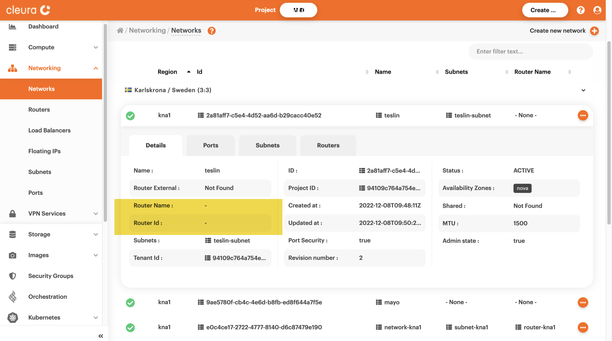

# Deleting networks

Deleting a network in {{brand}} may sound like a pretty straightforward
task --- and it is. It's just that before deleting a network, there are
some steps we almost always need to take. In what follows we show, step
by step and through specific examples, how we delete networks using
either the {{gui}} or the OpenStack CLI.

## Prerequisites

Whether you choose to work from the {{gui}} or with the OpenStack CLI,
you need to [have an account](../../getting-started/create-account.md) in
{{brand}}. Additionally, to use the OpenStack CLI, make sure to [enable
it](../../getting-started/enable-openstack-cli.md) for the region you
will be working in.

## Selecting a network

Unless you already have the ID or know the name of the network you wish
to delete, you may first list all available networks.

=== "{{gui}}"
    Fire up your favorite web browser, navigate to the
    [{{gui}}](https://{{gui_domain}}) start page, and log into your
    {{brand}} account.

    In the vertical pane on the left-hand side of the dashboard, expand the
    _Networking_ section and click _Networks_. In the central pane of the
    page, you will see all networks in all regions you have access to. For
    the purposes of this guide, let us assume you no longer need network
    `carmacks`, so now you want to delete it.

    
=== "OpenStack CLI"
    To list all available networks in the region you are currently in, type
    the following:

    ```bash
    openstack network list --internal
    ```
    ```plain
    +--------------------------------------+--------------+--------------------------------------+
    | ID                                   | Name         | Subnets                              |
    +--------------------------------------+--------------+--------------------------------------+
    | 1f94d315-7ca1-4d44-acc1-09c6c650df74 | mayo         |                                      |
    | 9b127d2c-01d7-4803-994f-f88292870c1d | teslin       | bd1d0ff2-7270-4a9a-a7ad-fff47e997e7b |
    | cb0a298a-bbb6-4ad6-832a-1456dafe45db | carmacks     | 7fa9e5a2-7d5a-466e-b120-7d2bffb99ce5 |
    | e0c4ce17-2722-4777-8140-d6c87479e190 | network-kna1 | 421d8fd2-dd7f-4f7c-9a51-42ef4a866dd9 |
    +--------------------------------------+--------------+--------------------------------------+
    ```

Let us assume you wish to delete the network named `carmacks`.

## Determining component dependencies

If the network to be deleted has a subnet component --- and most likely
it will have ---, you will first have to delete the subnet before
deleting the network. If, in addition, the network is behind a router
(figurately speaking), then before deleting the subnet, you will have
to disconnect it from the router. Finally, you will have the option to
delete the router also. Let us see what the situation is with network
`carmacks`.

=== "{{gui}}"
    For more information on `carmacks`, click the three-dot icon
    (right-hand side of the network row) and select _View details_. Four
    tabs immediately appear below; _Details_, _Ports_, _Subnets_, and
    _Routers_. Looking at the _Details_ tab, it is clear that network
    `carmacks` has a subnet and is behind a router. You may click on tabs
    _Subnets_ and _Routers_, to see more information regarding the network
    subnet and the router in front of the network.

    
=== "OpenStack CLI"
    To quickly check whether network `carmacks` has a subnet or not, type:

    ```bash
    openstack network show carmacks -c subnets
    ```
    ```plain
    +---------+--------------------------------------+
    | Field   | Value                                |
    +---------+--------------------------------------+
    | subnets | 7fa9e5a2-7d5a-466e-b120-7d2bffb99ce5 |
    +---------+--------------------------------------+
    ```

    If the value for the field `subnets` is non-empty, like in the example
    output above, that means the network has a subnet indeed, and the value
    is the ID of that subnet. At this point, it helps to assign the subnet
    ID to an environment variable, like so:

    ```bash
    SUBNET_ID="7fa9e5a2-7d5a-466e-b120-7d2bffb99ce5"
    ```

    What about a router in front of `carmacks`? You might try checking the
    output of this command:

    ```bash
    openstack network show carmacks
    ```
    ```plain
    +---------------------------+--------------------------------------+
    | Field                     | Value                                |
    +---------------------------+--------------------------------------+
    | admin_state_up            | UP                                   |
    | availability_zone_hints   |                                      |
    | availability_zones        | nova                                 |
    | created_at                | 2022-12-09T18:52:09Z                 |
    | description               |                                      |
    | dns_domain                | None                                 |
    | id                        | cb0a298a-bbb6-4ad6-832a-1456dafe45db |
    | ipv4_address_scope        | None                                 |
    | ipv6_address_scope        | None                                 |
    | is_default                | None                                 |
    | is_vlan_transparent       | None                                 |
    | mtu                       | 1500                                 |
    | name                      | carmacks                             |
    | port_security_enabled     | True                                 |
    | project_id                | 94109c764a754e24ac0f6b01aef82359     |
    | provider:network_type     | None                                 |
    | provider:physical_network | None                                 |
    | provider:segmentation_id  | None                                 |
    | qos_policy_id             | None                                 |
    | revision_number           | 2                                    |
    | router:external           | Internal                             |
    | segments                  | None                                 |
    | shared                    | False                                |
    | status                    | ACTIVE                               |
    | subnets                   | 7fa9e5a2-7d5a-466e-b120-7d2bffb99ce5 |
    | tags                      |                                      |
    | tenant_id                 | 94109c764a754e24ac0f6b01aef82359     |
    | updated_at                | 2022-12-09T18:55:18Z                 |
    +---------------------------+--------------------------------------+
    ```

    While it usually pays off to use `openstack` commands with the verb
    `show` on various objects, in this case, you don't get what you're
    looking for --- which is an indication of the presence or absence of a
    router in front of `carmacks`. In cases like this, try looking at
    things from a different vantage point. Try, in particular, to list all
    routers:

    ```bash
    openstack router list
    ```
    ```plain
    +------------------------+-----------------+--------+-------+------------------------+------+
    | ID                     | Name            | Status | State | Project                | HA   |
    +------------------------+-----------------+--------+-------+------------------------+------+
    | 5ac45739-a379-4936-    | router-kna1     | ACTIVE | UP    | 94109c764a754e24ac0f6b | True |
    | 8b1b-67d10e017f4d      |                 |        |       | 01aef82359             |      |
    | 79ff91ae-91b5-4991-    | carmacks-router | ACTIVE | UP    | 94109c764a754e24ac0f6b | True |
    | af61-91e923fac87b      |                 |        |       | 01aef82359             |      |
    +------------------------+-----------------+--------+-------+------------------------+------+
    ```

    The name of the second router says it all, but since it is just a name,
    it doesn't hurt to verify the role of this router:

    ```bash
    openstack router show carmacks-router -c interfaces_info
    ```
    ```plain
    +-----------------+--------------------------------------------------------------------------------+
    | Field           | Value                                                                          |
    +-----------------+--------------------------------------------------------------------------------+
    | interfaces_info | [{"port_id": "439bc9d5-c8a9-4de1-93b9-b01e69258a56", "ip_address": "10.1.0.1", |
    |                 | "subnet_id": "7fa9e5a2-7d5a-466e-b120-7d2bffb99ce5"}]                          |
    +-----------------+--------------------------------------------------------------------------------+
    ```

    Looking at the value of `interfaces_info`, it is easy to see that
    `subnet_id` has the value of the variable `SUBNET_ID` you just
    instantiated. In other words, router `carmacks-router` is indeed in
    front of network `carmacks`.

    > There will be times when router names won't help much. Then, try a
    more exhaustive search approach:
    >
    > ```bash
    > for i in $(openstack router list -f value -c Name); \
    >     do echo Checking router "$i"; \
    >     openstack router show "$i" -f json -c interfaces_info \
    >     | grep "$SUBNET_ID"; \
    > done
    > ```
    > ```plain
    > Checking router carmacks-router
    >       "subnet_id": "7fa9e5a2-7d5a-466e-b120-7d2bffb99ce5"
    > Checking router router-kna1
    > ```

## Tearing down networks

Now that you know you're dealing with a full-blown network and a
router, you start by disconnecting the subnet from the router. Then,
you will move on to deleting the subnet and the network, and after
that, you can finish up with deleting the router.

=== "{{gui}}"
    Go to the _Subnets_ tab of the `carmacks` network, and click the gray
    notepad-and-pen icon (at the left of the red circle-with-trashcan icon).

    

    A vertical pane titled _Modify Subnet_ will slide over from the
    right-hand side of the page. Pay attention to the _Router Connections_
    section. You will notice an active connection to the router. Click the
    red circle-with-line-over-chainlink icon to deactivate the connection,
    effectively disconnecting the subnet from the router.

    

    A pop-up window will appear, asking if you really want to go ahead with
    the disconnection. Just click the red _Yes, Remove interface_ button.

    

    After disconnecting the subnet, click the red circle-and-trashcan icon
    to delete it. Once more, a pop-up will appear asking for confirmation.
    Click the red _Yes, Delete_ button.

    

    As soon as you delete the subnet, in the _Subnets_ tab you will see the
    message _No subnets found_.

    

    You can now delete the network. Click the three-dot icon (right-hand
    side of the network row) and select _Delete Network_.

    

    Of course, you will have to confirm this action. Clicking the red _Yes,
    Delete_ button is enough.

    

    After deleting the network, it will not be on the list of all available
    networks.

    

    There's still that router lying around, and if you have no use for it,
    go to the _Routers_ page to delete it. In the vertical pane on the
    left, expand the _Networking_ section and click on _Routers_. In the
    central pane of the page, you will see all routers in all regions you
    have access to.

    

    Click the red three-dot icon of the router you wish to delete and
    select _Delete Router_. A pop-up will appear asking for confirmation,
    so click the red _Yes, Delete_ button.

    

    After successfully deleting the router, there will be no trace of it in
    the list of all routers.

    
=== "OpenStack CLI"
    First, take a look at all available subnets:

    ```bash
    openstack subnet list
    ```
    ```plain
    +-------------------------------+-----------------+--------------------------------+---------------+
    | ID                            | Name            | Network                        | Subnet        |
    +-------------------------------+-----------------+--------------------------------+---------------+
    | 421d8fd2-dd7f-4f7c-9a51-      | subnet-kna1     | e0c4ce17-2722-4777-8140-       | 10.15.20.0/24 |
    | 42ef4a866dd9                  |                 | d6c87479e190                   |               |
    | 7fa9e5a2-7d5a-466e-b120-      | carmacks-subnet | cb0a298a-bbb6-4ad6-832a-       | 10.1.0.0/24   |
    | 7d2bffb99ce5                  |                 | 1456dafe45db                   |               |
    | bd1d0ff2-7270-4a9a-a7ad-      | teslin-subnet   | 9b127d2c-01d7-4803-994f-       | 10.254.0.0/24 |
    | fff47e997e7b                  |                 | f88292870c1d                   |               |
    +-------------------------------+-----------------+--------------------------------+---------------+
    ```

    As you would expect, included on the list is subnet `carmacks-subnet`,
    which you are about to delete. That's easier said than done, though:

    ```bash
    openstack subnet delete $SUBNET_ID
    ```
    ```plain
    Failed to delete subnet with name or ID '7fa9e5a2-7d5a-466e-b120-7d2bffb99ce5': ConflictException: 409:
    Client Error for url: kna1.{{brand_domain}}:9696/v2.0/subnets/7fa9e5a2-7d5a-466e-b120-7d2bffb99ce5,
    Unable to complete operation on subnet 7fa9e5a2-7d5a-466e-b120-7d2bffb99ce5:
    One or more ports have an IP allocation from this subnet.
    1 of 1 subnets failed to delete.
    ```

    The trick here is to first disconnect the subnet from the corresponding
    router, which is perfectly doable from the side of the router. As we
    discovered a bit earlier, the router we are talking about is
    `carmacks-router`:

    ```bash
    openstack router remove subnet carmacks-router $SUBNET_ID
    ```

    If the command above is successful, you will see no output on your
    terminal. Now, an attempt to delete `carmacks-subnet` should go through
    with flying colors:

    ```bash
    openstack subnet delete $SUBNET_ID
    ```

    Again, no command output means success, but we suggest you check
    yourself:

    ```bash
    openstack subnet list
    ```
    ```plain
    +--------------------------------+---------------+---------------------------------+---------------+
    | ID                             | Name          | Network                         | Subnet        |
    +--------------------------------+---------------+---------------------------------+---------------+
    | 421d8fd2-dd7f-4f7c-9a51-       | subnet-kna1   | e0c4ce17-2722-4777-8140-        | 10.15.20.0/24 |
    | 42ef4a866dd9                   |               | d6c87479e190                    |               |
    | bd1d0ff2-7270-4a9a-a7ad-       | teslin-subnet | 9b127d2c-01d7-4803-994f-        | 10.254.0.0/24 |
    | fff47e997e7b                   |               | f88292870c1d                    |               |
    +--------------------------------+---------------+---------------------------------+---------------+
    ```

    The subnet `carmacks-subnet` is not on the list, which is what you
    wanted exactly. Next is network `carmacks`, which you should be able to
    delete by now. First, take a look at all available networks:

    ```bash
    openstack network list --internal
    ```
    ```plain
    +--------------------------------------+--------------+--------------------------------------+
    | ID                                   | Name         | Subnets                              |
    +--------------------------------------+--------------+--------------------------------------+
    | 1f94d315-7ca1-4d44-acc1-09c6c650df74 | mayo         |                                      |
    | 9b127d2c-01d7-4803-994f-f88292870c1d | teslin       | bd1d0ff2-7270-4a9a-a7ad-fff47e997e7b |
    | cb0a298a-bbb6-4ad6-832a-1456dafe45db | carmacks     |                                      |
    | e0c4ce17-2722-4777-8140-d6c87479e190 | network-kna1 | 421d8fd2-dd7f-4f7c-9a51-42ef4a866dd9 |
    +--------------------------------------+--------------+--------------------------------------+
    ```

    Network `carmacks` is on the list, and by looking at the `Subnets`
    column, you see that it has no subnet. That's expected, so go ahead and
    delete the network:

    ```bash
    openstack network delete carmacks
    ```

    No command output signals success, but it never hurts to verify yourself:

    ```bash
    openstack network list --internal
    ```
    ```plain
    +--------------------------------------+--------------+--------------------------------------+
    | ID                                   | Name         | Subnets                              |
    +--------------------------------------+--------------+--------------------------------------+
    | 1f94d315-7ca1-4d44-acc1-09c6c650df74 | mayo         |                                      |
    | 9b127d2c-01d7-4803-994f-f88292870c1d | teslin       | bd1d0ff2-7270-4a9a-a7ad-fff47e997e7b |
    | e0c4ce17-2722-4777-8140-d6c87479e190 | network-kna1 | 421d8fd2-dd7f-4f7c-9a51-42ef4a866dd9 |
    +--------------------------------------+--------------+--------------------------------------+
    ```

    Network `carmacks` is gone, and if you have no use of
    `carmacks-router`, go ahead and delete it:

    ```bash
    openstack router delete carmacks-router
    ```

    There is no output on the terminal, and yet the router is gone:

    ```bash
    openstack router list
    ```
    ```plain
    +-----------------------------+-------------+--------+-------+------------------------------+------+
    | ID                          | Name        | Status | State | Project                      | HA   |
    +-----------------------------+-------------+--------+-------+------------------------------+------+
    | 5ac45739-a379-4936-8b1b-    | router-kna1 | ACTIVE | UP    | 94109c764a754e24ac0f6b01aef8 | True |
    | 67d10e017f4d                |             |        |       | 2359                         |      |
    +-----------------------------+-------------+--------+-------+------------------------------+------+
    ```

## Networks with a subnet but no router

These are faster to delete, for there is no router to disconnect the
subnet from. For our demonstration, we created network `teslin`, with
subnet `teslin-subnet` and no router in front of it.

=== "{{gui}}"
    In the vertical pane on the left-hand side of the dashboard, expand the
    _Networking_ section and click _Networks_. In the central pane of the
    page, you will see all networks in all regions you have access to.
    Select a network with a subnet and no router --- like `teslin` in our
    example.

    Looking at the network details, it is immediately apparent that there's
    no router in front of it.

    

    Go to the _Subnets_ tab, and click the red circle-with-trashcan icon to
    delete the subnet.

    

    Then, click the red three-dot icon at the right-hand side of the
    `teslin` row, and select _Delete Network_.

    
=== "OpenStack CLI"
    Let us first take a look at all available networks...

    ```bash
    openstack network list --internal
    ```
    ```plain
    +--------------------------------------+--------------+--------------------------------------+
    | ID                                   | Name         | Subnets                              |
    +--------------------------------------+--------------+--------------------------------------+
    | 1f94d315-7ca1-4d44-acc1-09c6c650df74 | mayo         |                                      |
    | 9b127d2c-01d7-4803-994f-f88292870c1d | teslin       | bd1d0ff2-7270-4a9a-a7ad-fff47e997e7b |
    | e0c4ce17-2722-4777-8140-d6c87479e190 | network-kna1 | 421d8fd2-dd7f-4f7c-9a51-42ef4a866dd9 |
    +--------------------------------------+--------------+--------------------------------------+
    ```

    ...and at all available subnets:

    ```bash
    openstack subnet list
    ```
    ```plain
    +--------------------------------+---------------+---------------------------------+---------------+
    | ID                             | Name          | Network                         | Subnet        |
    +--------------------------------+---------------+---------------------------------+---------------+
    | 421d8fd2-dd7f-4f7c-9a51-       | subnet-kna1   | e0c4ce17-2722-4777-8140-        | 10.15.20.0/24 |
    | 42ef4a866dd9                   |               | d6c87479e190                    |               |
    | bd1d0ff2-7270-4a9a-a7ad-       | teslin-subnet | 9b127d2c-01d7-4803-994f-        | 10.254.0.0/24 |
    | fff47e997e7b                   |               | f88292870c1d                    |               |
    +--------------------------------+---------------+---------------------------------+---------------+
    ```

    Since there is nothing to disconnect the `teslin-subnet` from, you may
    go ahead and delete the subnet:

    ```bash
    openstack subnet delete teslin-subnet
    ```

    There is no command output. This is expected, but why not check
    yourself?

    ```bash
    openstack subnet list
    ```
    ```plain
    +---------------------------------+-------------+----------------------------------+---------------+
    | ID                              | Name        | Network                          | Subnet        |
    +---------------------------------+-------------+----------------------------------+---------------+
    | 421d8fd2-dd7f-4f7c-9a51-        | subnet-kna1 | e0c4ce17-2722-4777-8140-         | 10.15.20.0/24 |
    | 42ef4a866dd9                    |             | d6c87479e190                     |               |
    +---------------------------------+-------------+----------------------------------+---------------+
    ```

    Finally, network `teslin` can go away with a single command:

    ```bash
    openstack network delete teslin
    ```

    The absence of any output means the command was successful. Take a look
    yourself:

    ```bash
    openstack network list --internal
    ```
    ```plain
    +--------------------------------------+--------------+--------------------------------------+
    | ID                                   | Name         | Subnets                              |
    +--------------------------------------+--------------+--------------------------------------+
    | 1f94d315-7ca1-4d44-acc1-09c6c650df74 | mayo         |                                      |
    | e0c4ce17-2722-4777-8140-d6c87479e190 | network-kna1 | 421d8fd2-dd7f-4f7c-9a51-42ef4a866dd9 |
    +--------------------------------------+--------------+--------------------------------------+
    ```

## Networks with no subnet and no router

You may directly, without the slightest preparation, delete networks
like these. For our demonstration, we created a network named `mayo`,
with no subnet and no router in front of it.

=== "{{gui}}"
    While viewing all available networks, click the red three-dot icon at
    the right-hand side of the `mayo` row and select _Delete Network_. You
    will have to confirm the action, and the network will be gone as soon
    as you do.

    
=== "OpenStack CLI"
    Once more, take a look at all remaining networks:

    ```bash
    openstack network list --internal
    ```
    ```plain
    +--------------------------------------+--------------+--------------------------------------+
    | ID                                   | Name         | Subnets                              |
    +--------------------------------------+--------------+--------------------------------------+
    | 1f94d315-7ca1-4d44-acc1-09c6c650df74 | mayo         |                                      |
    | e0c4ce17-2722-4777-8140-d6c87479e190 | network-kna1 | 421d8fd2-dd7f-4f7c-9a51-42ef4a866dd9 |
    +--------------------------------------+--------------+--------------------------------------+
    ```

    Since `mayo` has no subnet, issue a single command to delete it:

    ```bash
    openstack network delete mayo
    ```

    And, yes, it is still a good idea to check yourself:

    ```bash
    openstack network list --internal
    ```
    ```plain
    +--------------------------------------+--------------+--------------------------------------+
    | ID                                   | Name         | Subnets                              |
    +--------------------------------------+--------------+--------------------------------------+
    | e0c4ce17-2722-4777-8140-d6c87479e190 | network-kna1 | 421d8fd2-dd7f-4f7c-9a51-42ef4a866dd9 |
    +--------------------------------------+--------------+--------------------------------------+
    ```

## Recap: Of networks and towns

Depending on the features of a Neutron network, deleting it may require
some preparation work. For the purposes of this guide, we created three
different networks with different characteristics; `carmacks`, `teslin`,
and `mayo`. Then, either from the {{gui}} or with the help of OpenStack
CLI, we showed how we discover any component dependencies and how we
work towards deletion. Eventually, all three test networks were gone.
We should point out, though, that all three namesake towns in Yukon are
still there.
