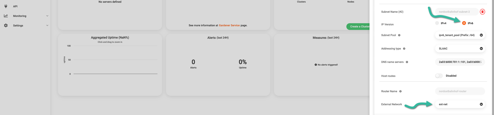

# Creating new networks

Before creating a server in {{brand}}, you need at least
one network to make the new server a member of. Since you may have
more than one network per region, let us now walk through creating
a new network using the {{gui}} or the OpenStack CLI.

## Prerequisites

Whether you choose to work from the {{gui}} or with the OpenStack CLI,
you need to [have an account](../../getting-started/create-account.md)
in {{brand}}. Additionally, to use the OpenStack CLI make sure to
[enable it first](../../getting-started/enable-openstack-cli.md).

## Creating a network

To create a network from the {{gui}}, fire up your favorite web
browser, navigate to the [Cleura Cloud](https://{{gui_domain}}) start
page, and login into your {{brand}} account. On the other hand, if you
prefer to work with OpenStack CLI, please do not forget to source the
RC file first.

=== "{{gui}}"
    On the top right-hand side of the {{gui}}, click the _Create_
    button. A new pane will slide into view from the right-hand side of
    the browser window, titled _Create_.

    

    You will notice several rounded boxes prominently displayed on that
    pane, each for defining, configuring, and instantiating a different
    {{brand}} object. Go ahead and click the _Network_ box. A
    new pane titled _Create Network_ will slide over. At the top, type
    in a name and select one of the available regions for the new
    network.

    
=== "OpenStack CLI"
    Start by creating a new network.
    In our example, let's name it `nordostbahnhof`:

    ```bash
    openstack network create nordostbahnhof
    ```

    After issuing the command above, you immediately get information
    regarding the new network:

    ```plain
    +---------------------------+------------------------------------------------------------+
    | Field                     | Value                                                      |
    +---------------------------+------------------------------------------------------------+
    | admin_state_up            | UP                                                         |
    | availability_zone_hints   |                                                            |
    | availability_zones        |                                                            |
    | created_at                | 2025-05-07T17:38:31Z                                       |
    | description               |                                                            |
    | dns_domain                |                                                            |
    | id                        | f1f1b1f6-2b65-11f0-9769-080027af5a23                       |
    | ipv4_address_scope        | None                                                       |
    | ipv6_address_scope        | None                                                       |
    | is_default                | False                                                      |
    | is_vlan_transparent       | None                                                       |
    | location                  | cloud='', project.domain_id=,                              |
    |                           | project.domain_name='CCP_Domain_pqrxy',                    |
    |                           | project.id='hdzqyxmxnixcdtgldkhhwdewfacyjdbub',            |
    |                           | project.name='Nuuk-to-Iqaluit', region_name='Fra1',        |
    |                           | zone=                                                      |
    | mtu                       | 1500                                                       |
    | name                      | nordostbahnhof                                             |
    | port_security_enabled     | True                                                       |
    | project_id                | hdzqyxmxnixcdtgldkhhwdewfacyjdbub                          |
    | provider:network_type     | None                                                       |
    | provider:physical_network | None                                                       |
    | provider:segmentation_id  | None                                                       |
    | qos_policy_id             | None                                                       |
    | revision_number           | 1                                                          |
    | router:external           | Internal                                                   |
    | segments                  | None                                                       |
    | shared                    | False                                                      |
    | status                    | ACTIVE                                                     |
    | subnets                   |                                                            |
    | tags                      |                                                            |
    | updated_at                | 2025-05-07T17:38:31Z                                       |
    +---------------------------+------------------------------------------------------------+
    ```

## Adding a subnet and a router

Creating a new network does not necessarily mean it has all the
features you most likely would expect. Unless you work from the
{{gui}}, where almost every component is activated for you with
a few clicks here and there, when you use the OpenStack CLI there is
some extra work you need to do before you get a network you would
characterize as useful.

=== "{{gui}}"
    Expand the _Advanced Options_ section below, make sure _Port Security_
    is enabled, and leave the MTU parameter blank.

    

    Assuming you are going for a full-featured network, activate the _Create a complete network, containing a subnet and a router_ option.

    Notice that, by default, this sets things up for the the creation of an IPv4-based subnet.
    In particular, by looking at the new _Subnet Name (#1)_ section, it is immediately apparent that you get the following:

    - A subnet expressed in [CIDR notation](https://en.wikipedia.org/wiki/Classless_Inter-Domain_Routing#CIDR_notation),
    - two DNS servers,
    - a Gateway, and
    - a DHCP server.

    For the _Gateway IP_, accept the suggested address, or type in one chosen from the subnet above.
    As for the DHCP, either accept the defaults or type in _Start_ and _End_ addresses -- again chosen from the subnet above.
    
    

    Alongside your IPv4-based subnet, you may also have an IPv6-based subnet;
    both subnets will be members of the network you are now creating.
    
    To create a second, IPv6-based subnet, click the orange :fontawesome-solid-circle-plus: icon at the top of the _Subnet Name (#1)_ section.
    In the new _Subnet Name (#2)_ section that appears, be sure to set _IP Version_ to _IPv6_ abd you will get the following:

    - One 64bit-prefixed subnet with
    - SLAAC addressing, and
    - two DNS servers with IPv6 addresses.

    

    Scroll down a bit if you have to. Assuming you want your cloud
    servers to reach hosts on the Internet, for the _External network_
    parameter make sure you select _ext-net_. Then, click the green
    _Create_ button.
    In a few seconds, the new network will be readily available.

    
=== "OpenStack CLI"
    You now have to create a subnet for the new network.
    Since Neutron networks can have more than one subnets, and subnets can be either IPv4-based or IPv6-based, let us now create two;
    one IPv4-based (`nordostbahnhof-subnet-ipv4`), and one IPv4-based (`nordostbahnhof-subnet-ipv6`).

    For the IPv4-based subnet, type the following:

    ```bash
    openstack subnet create nordostbahnhof-subnet-ipv4 \
        --network nordostbahnhof --subnet-range 10.20.30.0/24
    ```

    You will get detailed information regarding subnet `nordostbahnhof-subnet-ipv4`:

    ```plain
    +----------------------+-----------------------------------------------------------------+
    | Field                | Value                                                           |
    +----------------------+-----------------------------------------------------------------+
    | allocation_pools     | 10.20.30.2-10.20.30.254                                         |
    | cidr                 | 10.20.30.0/24                                                   |
    | created_at           | 2025-05-07T17:45:06Z                                            |
    | description          |                                                                 |
    | dns_nameservers      |                                                                 |
    | dns_publish_fixed_ip | None                                                            |
    | enable_dhcp          | True                                                            |
    | gateway_ip           | 10.20.30.1                                                      |
    | host_routes          |                                                                 |
    | id                   | 4231daa6-a619-468e-9283-520054810eca                            |
    | ip_version           | 4                                                               |
    | ipv6_address_mode    | None                                                            |
    | ipv6_ra_mode         | None                                                            |
    | location             | cloud='', project.domain_id=,                                   |
    |                      | project.domain_name='CCP_Domain_pqrxy',                         |
    |                      | project.id='hdzqyxmxnixcdtgldkhhwdewfacyjdbub',                 |
    |                      | project.name='Nuuk-to-Iqaluit', region_name='Fra1', zone=       |
    | name                 | nordostbahnhof-subnet-ipv4                                      |
    | network_id           | f1f1b1f6-2b65-11f0-9769-080027af5a23                            |
    | prefix_length        | None                                                            |
    | project_id           | hdzqyxmxnixcdtgldkhhwdewfacyjdbub                               |
    | revision_number      | 0                                                               |
    | segment_id           | None                                                            |
    | service_types        |                                                                 |
    | subnetpool_id        | None                                                            |
    | tags                 |                                                                 |
    | updated_at           | 2025-05-07T17:45:06Z                                            |
    +----------------------+-----------------------------------------------------------------+
    ```

    For the IPv6-based subnet, type the following:

    ```bash
    openstack subnet create nordostbahnhof-subnet-ipv6 --network nordostbahnhof \
        --ip-version 6 \
        --ipv6-ra-mode slaac \
        --ipv6-address-mode slaac \
        --use-default-subnet-pool
    ```

    Again, you will get detailed information regarding subnet `nordostbahnhof-subnet-ipv6`:

    ```plain
    +----------------------+-----------------------------------------------------------------+
    | Field                | Value                                                           |
    +----------------------+-----------------------------------------------------------------+
    | allocation_pools     | 2a03:b000:702:13::2-2a03:b000:702:13:ffff:ffff:ffff:ffff        |
    | cidr                 | 2a03:b000:702:13::/64                                           |
    | created_at           | 2025-05-07T17:48:33Z                                            |
    | description          |                                                                 |
    | dns_nameservers      |                                                                 |
    | dns_publish_fixed_ip | None                                                            |
    | enable_dhcp          | True                                                            |
    | gateway_ip           | 2a03:b000:702:13::1                                             |
    | host_routes          |                                                                 |
    | id                   | c787c7fc-9405-443c-99bf-fefd8df0ec7f                            |
    | ip_version           | 6                                                               |
    | ipv6_address_mode    | slaac                                                           |
    | ipv6_ra_mode         | slaac                                                           |
    | location             | cloud='', project.domain_id=,                                   |
    |                      | project.domain_name='CCP_Domain_pqrxy',                         |
    |                      | project.id='hdzqyxmxnixcdtgldkhhwdewfacyjdbub',                 |
    |                      | project.name='Nuuk-to-Iqaluit', region_name='Fra1', zone=       |
    | name                 | nordostbahnhof-subnet-ipv6                                      |
    | network_id           | f1f1b1f6-2b65-11f0-9769-080027af5a23                            |
    | prefix_length        | None                                                            |
    | project_id           | hdzqyxmxnixcdtgldkhhwdewfacyjdbub                               |
    | revision_number      | 0                                                               |
    | segment_id           | None                                                            |
    | service_types        |                                                                 |
    | subnetpool_id        | d21fa4e4-2b67-11f0-b570-080027af5a23                            |
    | tags                 |                                                                 |
    | updated_at           | 2025-05-07T17:48:33Z                                            |
    +----------------------+-----------------------------------------------------------------+
    ```

    If you want servers connected to the `nordostbahnhof` network to have
    Internet access, you need a router in front of the network. Following
    our unofficial naming convention, go ahead and create a new router
    called `nordostbahnhof-router`:

    ```bash
    openstack router create nordostbahnhof-router 
    ```

    As expected, you will see lots of information regarding the new router:

    ```plain
    +-------------------------+--------------------------------------------------------------+
    | Field                   | Value                                                        |
    +-------------------------+--------------------------------------------------------------+
    | admin_state_up          | UP                                                           |
    | availability_zone_hints |                                                              |
    | availability_zones      |                                                              |
    | created_at              | 2025-05-07T17:52:39Z                                         |
    | description             |                                                              |
    | external_gateway_info   | null                                                         |
    | flavor_id               | None                                                         |
    | ha                      | True                                                         |
    | id                      | 1ca6aaf8-2b68-11f0-833a-080027af5a23                         |
    | location                | cloud='', project.domain_id=,                                |
    |                         | project.domain_name='CCP_Domain_pqrxy',                      |
    |                         | project.id='hdzqyxmxnixcdtgldkhhwdewfacyjdbub',              |
    |                         | project.name='Nuuk-to-Iqaluit', region_name='Fra1', zone=    |
    | name                    | nordostbahnhof-router                                        |
    | project_id              | hdzqyxmxnixcdtgldkhhwdewfacyjdbub                            |
    | revision_number         | 1                                                            |
    | routes                  |                                                              |
    | status                  | ACTIVE                                                       |
    | tags                    |                                                              |
    | updated_at              | 2025-05-07T17:52:39Z                                         |
    +-------------------------+--------------------------------------------------------------+
    ```

    You want the `nordostbahnhof-router` connected to the external
    network. The name of this network is `ext-net`:

    ```bash
    openstack router set nordostbahnhof-router --external-gateway ext-net
    ```

    Please note that if the command above is successful, you will get
    no output on your terminal. There is one last step to take, and
    that is to connect router `nordostbahnhof-router` to the subnet
    `nordostbahnhof-subnet-ipv4`...

    ```bash
    openstack router add subnet nordostbahnhof-router nordostbahnhof-subnet-ipv4
    ```

    ...and to the subnet `nordostbahnhof-subnet-ipv6` of network `nordostbahnhof`:

    ```bash
    openstack router add subnet nordostbahnhof-router nordostbahnhof-subnet-ipv6
    ```

    Again, if the commands above are successful, you will get no output.

## Listing networks and getting information

At any time, you may connect to the {{gui}}, list all networks
you have already created, and get detailed information for any of
these networks. Alternatively, you may get all that information using
the OpenStack CLI.

=== "{{gui}}"
    You may see all defined networks, in all supported regions, by
    selecting _Networking_ > _Networks_ (see the left-hand side pane
    on the {{gui}}).

    

    For more information regarding a specific network, select _View details_.
    Then, you can glance over all the details regarding the selected network's ports, subnets, and routers.
    For more information on the network subnets specifically, in the left-hand side pane on the {{gui}} select _Networking_ > _Subnets_.

    
=== "OpenStack CLI"
    To list all available networks in a specific region, just type:

    ```bash
    openstack network list
    ```

    You can always ask for more specific results. For instance, to see
    all internal networks only, type the following:

    ```bash
    openstack network list --internal
    ```

    You can also get detailed information about a specific network:

    ```bash
    openstack network show nordostbahnhof
    ```

    At any time, type `openstack network list --help` or
    `openstack network show --help` to see how to get information
    regarding networks, and what specific pieces of information you
    can have.
