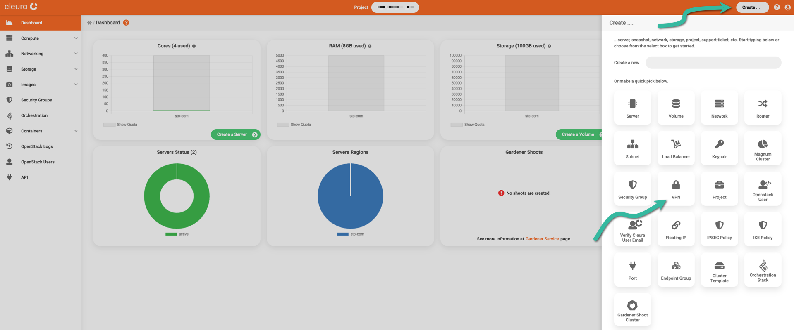
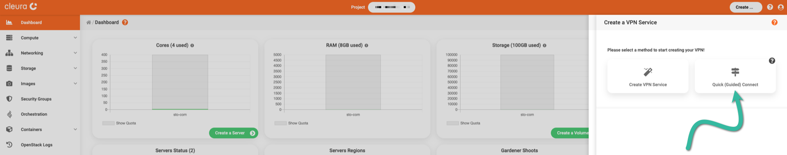
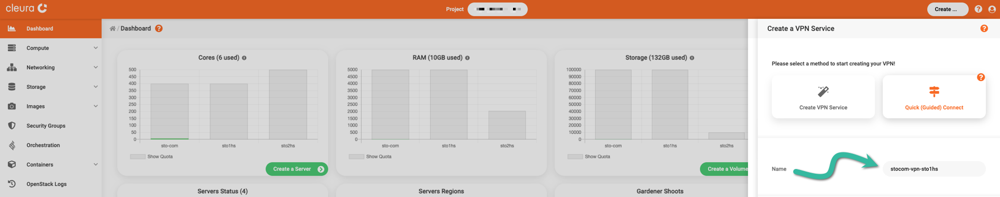
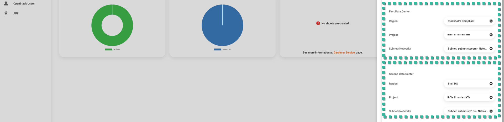
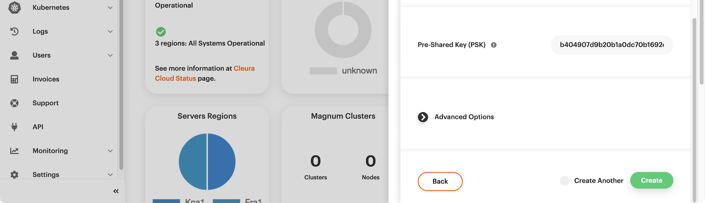
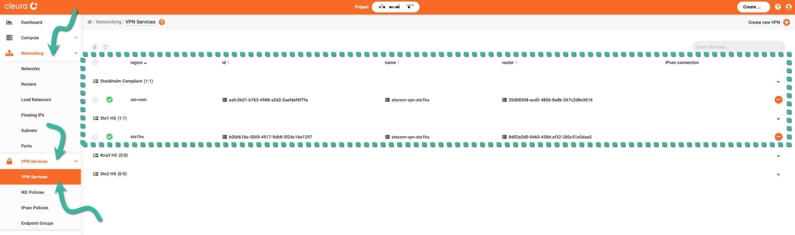
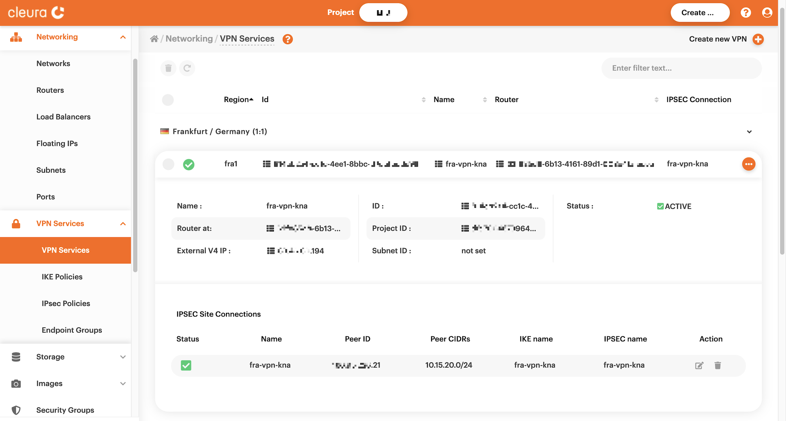

# Creating a VPN connection between regions

Thanks to the Openstack Neutron VPN as a Service (VPNaaS) feature, you
can bridge two different regions via a site-to-site IPSec VPN
connection. This is made possible without setting up and configuring a
virtual machine in any one of the regions. On the contrary, you can
quickly establish such a connection using the {{gui}} or the OpenStack
CLI. Let us demonstrate the process following both approaches.

## Prerequisites

Whether you choose to work from the {{gui}} or with the OpenStack CLI,
you need to [have an account](../../getting-started/create-account.md) in
{{brand}}. If you prefer to work with the [OpenStack
CLI](../../getting-started/enable-openstack-cli.md), then in addition to
the Python `openstackclient` module, you need to install the
Python `neutronclient` module also. Use either the package manager
of your operating system or `pip`:

=== "Debian/Ubuntu"
    ```bash
    apt install python3-neutronclient
    ```
=== "Mac OS X with Homebrew"
    This Python module is unavailable via `brew`, but you can
    install it via `pip`.
=== "Python Package"
    ```bash
    pip install python-neutronclient
    ```

## Creating a VPN connection between two regions

To create and establish such a connection from the {{gui}}, fire up
your favorite web browser, navigate to the
[{{gui}}](https://{{gui_domain}}) start page, and log into your
{{brand}} account. Should you decide to follow the OpenStack CLI route
instead, please make sure you have the appropriate [RC
file](../../getting-started/enable-openstack-cli.md) for each region
involved.

=== "{{gui}}"
    On the top right-hand side of the {{gui}}, click the _Create_
    button. A vertical pane titled _Create_ will slide into view from the
    right-hand side of the browser window. You will notice several rounded
    boxes, each one for defining, configuring, and instantiating a
    different {{brand}} object. Go ahead and click the _VPN_ box.

    

    A new pane titled _Create a VPN Service_ will slide over. Between
    the two boxes, click the one titled _Quick (Guided) Connect_.

    

    Type in a name for the new site-to-site VPN connection.

    

    Select a region, project, and network for each of the two data
    centers involved.

    

    Look at the pre-shared key and, optionally, expand the _Advanced
    Options_ section to see all presets. You do not have to change anything
    there. When you are ready, click the green _Create_ button. The VPN
    connection between the two regions will be established in a few seconds.

    
=== "OpenStack CLI"
    First, you need to have the RC files of the two regions you will be
    connecting. In the example that follows, we demonstrate establishing a
    site-to-site connection between regions `fra1` and `kna1`. This means
    that, while following through, before working in `fra1` you need to
    source the RC file for `fra1`, and before working in `kna1` you need
    to source the RC file for `kna1`.

    > It helps to imagine the site-to-site connection schematically,
    with `fra1` being on the left side and `kna1` being on the right side
    of the connection. That is why we interchange the terms `fra1`, _left_
    and `kna1`, _right_.

    You also have to decide which subnets from either side you will
    connect. Additionally, you need to know the respective CIDR notations
    and routers. In the examples that follow, on the left side we have
    subnet `subnet-fra1` with CIDR `10.15.25.0/24` and router
    `router-fra1`, and on the right side we have subnet `subnet-kna1` with
    CIDR `10.15.20.0/24` and router `router-kna1`. For convenience, we have
    set the shell variables `SUBNET_FRA1` and `SUBNET_KNA1`:

    ```bash
    SUBNET_FRA1="10.15.25.0/24"
    SUBNET_KNA1="10.15.20.0/24"
    ```

    ### Prepare the left side (region `fra1`)

    Begin by creating a new
    [IKE](https://en.wikipedia.org/wiki/Internet_Key_Exchange) policy:

    ```bash
    openstack vpn ike policy create ike-pol-fra1
    ```

    ```plain
    +-------------------------------+--------------------------------------+
    | Field                         | Value                                |
    +-------------------------------+--------------------------------------+
    | Authentication Algorithm      | sha1                                 |
    | Description                   |                                      |
    | Encryption Algorithm          | aes-128                              |
    | ID                            | 5782b141-afcc-4327-9ac5-b8cd2e110c6a |
    | IKE Version                   | v1                                   |
    | Lifetime                      | {'units': 'seconds', 'value': 3600}  |
    | Name                          | ike-pol-fra1                         |
    | Perfect Forward Secrecy (PFS) | group5                               |
    | Phase1 Negotiation Mode       | main                                 |
    | Project                       | dfc700467396428bacba4376e72cc3e9     |
    | project_id                    | dfc700467396428bacba4376e72cc3e9     |
    +-------------------------------+--------------------------------------+
    ```

    Then, create a new [IPSec](https://en.wikipedia.org/wiki/IPsec)
    policy:

    ```bash
    openstack vpn ipsec policy create ipsec-pol-fra1
    ```

    ```plain
    +-------------------------------+--------------------------------------+
    | Field                         | Value                                |
    +-------------------------------+--------------------------------------+
    | Authentication Algorithm      | sha1                                 |
    | Description                   |                                      |
    | Encapsulation Mode            | tunnel                               |
    | Encryption Algorithm          | aes-128                              |
    | ID                            | 15ec761f-1642-49b6-b5a2-e43624c5752d |
    | Lifetime                      | {'units': 'seconds', 'value': 3600}  |
    | Name                          | ipsec-pol-fra1                       |
    | Perfect Forward Secrecy (PFS) | group5                               |
    | Project                       | dfc700467396428bacba4376e72cc3e9     |
    | Transform Protocol            | esp                                  |
    | project_id                    | dfc700467396428bacba4376e72cc3e9     |
    +-------------------------------+--------------------------------------+
    ```

    You are ready to create a new VPN service:

    ```bash
    openstack vpn service create --router router-fra1 vpn-service-fra1
    ```

    ```plain
    +----------------+--------------------------------------+
    | Field          | Value                                |
    +----------------+--------------------------------------+
    | Description    |                                      |
    | Flavor         | None                                 |
    | ID             | d74d51f0-182d-4d88-952a-1d593ce696fd |
    | Name           | vpn-service-fra1                     |
    | Project        | dfc700467396428bacba4376e72cc3e9     |
    | Router         | 62f885d8-6b13-4161-89d1-003c4fafec55 |
    | State          | True                                 |
    | Status         | PENDING_CREATE                       |
    | Subnet         | None                                 |
    | external_v4_ip | 198.51.100.50                        |
    | external_v6_ip | 2a03:b000:701:5:f816:3eff:feb5:be0e  |
    | project_id     | dfc700467396428bacba4376e72cc3e9     |
    +----------------+--------------------------------------+
    ```

    Notice in the command output that the `Status` is `PENDING_CREATE`.
    This is expected. Also, jot down the value of the `external_v4_ip`
    parameter. Better yet, set this value to a new variable, `EXT_IP_FRA1`,
    for you will soon need it:

    ```bash
    EXT_IP_FRA1="198.51.100.50"
    ```

    The site-to-site connection you are about to create needs two
    end-point groups on the left, and two end-point groups on the right.
    More specifically, on either side of the connection, there should be
    one end-point group for the local subnet and one end-point group for
    the peer (remote) subnet. You are now on the left side of the
    connection (region `fra1`), so begin with the left local end-point
    group...

    ```bash
    openstack vpn endpoint group create \
        --type subnet --value subnet-fra1 local-epg-fra1
    ```

    ```plain
    +-------------+------------------------------------------+
    | Field       | Value                                    |
    +-------------+------------------------------------------+
    | Description |                                          |
    | Endpoints   | ['df6fb6ca-4751-4b74-8b3e-5fbda0117cea'] |
    | ID          | 51895e0e-fa3a-43d3-8037-5eea073fb77f     |
    | Name        | local-epg-fra1                           |
    | Project     | dfc700467396428bacba4376e72cc3e9         |
    | Type        | subnet                                   |
    | project_id  | dfc700467396428bacba4376e72cc3e9         |
    +-------------+------------------------------------------+
    ```

    ...and then move on to creating the left peer end-point group:

    ```bash
    openstack vpn endpoint group create \
        --type cidr --value $SUBNET_KNA1 peer-epg-fra1
    ```

    ```plain
    +-------------+--------------------------------------+
    | Field       | Value                                |
    +-------------+--------------------------------------+
    | Description |                                      |
    | Endpoints   | ['10.15.20.0/24']                    |
    | ID          | a96bb9ef-d0ec-4174-93ae-a8e655910f94 |
    | Name        | peer-epg-fra1                        |
    | Project     | dfc700467396428bacba4376e72cc3e9     |
    | Type        | cidr                                 |
    | project_id  | dfc700467396428bacba4376e72cc3e9     |
    +-------------+--------------------------------------+
    ```

    ### Prepare the right side (region `kna1`)

    Before establishing a site-to-site VPN connection between the two
    regions, you must make similar preparations on the right side of the
    connection (region `kna1`). You should adjust all commands you entered
    above and execute them on the right side. For your convenience, these
    are all the adjusted commands with the respective outputs:

    Create a new IKE policy:

    ```bash
    openstack vpn ike policy create ike-pol-kna1
    ```

    ```plain
    +-------------------------------+--------------------------------------+
    | Field                         | Value                                |
    +-------------------------------+--------------------------------------+
    | Authentication Algorithm      | sha1                                 |
    | Description                   |                                      |
    | Encryption Algorithm          | aes-128                              |
    | ID                            | 6af4f52c-6522-483d-bb70-b144657489f3 |
    | IKE Version                   | v1                                   |
    | Lifetime                      | {'units': 'seconds', 'value': 3600}  |
    | Name                          | ike-pol-kna1                         |
    | Perfect Forward Secrecy (PFS) | group5                               |
    | Phase1 Negotiation Mode       | main                                 |
    | Project                       | 94109c764a754e24ac0f6b01aef82359     |
    | project_id                    | 94109c764a754e24ac0f6b01aef82359     |
    +-------------------------------+--------------------------------------+
    ```

    Create a new IPSec policy:

    ```bash
    openstack vpn ipsec policy create ipsec-pol-kna1
    ```

    ```plain
    +-------------------------------+--------------------------------------+
    | Field                         | Value                                |
    +-------------------------------+--------------------------------------+
    | Authentication Algorithm      | sha1                                 |
    | Description                   |                                      |
    | Encapsulation Mode            | tunnel                               |
    | Encryption Algorithm          | aes-128                              |
    | ID                            | 8f9c2219-a931-46eb-b3f5-22d76cbc89d0 |
    | Lifetime                      | {'units': 'seconds', 'value': 3600}  |
    | Name                          | ipsec-pol-kna1                       |
    | Perfect Forward Secrecy (PFS) | group5                               |
    | Project                       | 94109c764a754e24ac0f6b01aef82359     |
    | Transform Protocol            | esp                                  |
    | project_id                    | 94109c764a754e24ac0f6b01aef82359     |
    +-------------------------------+--------------------------------------+
    ```

    Create a new VPN service:

    ```bash
    openstack vpn service create --router router-kna1 vpn-service-kna1
    ```

    ```plain
    +----------------+--------------------------------------+
    | Field          | Value                                |
    +----------------+--------------------------------------+
    | Description    |                                      |
    | Flavor         | None                                 |
    | ID             | bb1a307d-6f8f-4a0a-83db-7c705403485d |
    | Name           | vpn-service-kna1                     |
    | Project        | 94109c764a754e24ac0f6b01aef82359     |
    | Router         | 5ac45739-a379-4936-8b1b-67d10e017f4d |
    | State          | True                                 |
    | Status         | PENDING_CREATE                       |
    | Subnet         | None                                 |
    | external_v4_ip | 203.0.113.101                        |
    | external_v6_ip | 2a00:16d8:0:3b:f816:3eff:fe0e:2074   |
    | project_id     | 94109c764a754e24ac0f6b01aef82359     |
    +----------------+--------------------------------------+
    ```

    For convenience, set the value of parameter `external_v4_ip ` to a
    shell variable:

    ```bash
    EXT_IP_KNA1="203.0.113.101"
    ```

    Create a local end-point group:

    ```bash
    openstack vpn endpoint group create \
        --type subnet --value subnet-kna1 local-epg-kna1
    ```

    ```plain
    +-------------+------------------------------------------+
    | Field       | Value                                    |
    +-------------+------------------------------------------+
    | Description |                                          |
    | Endpoints   | ['421d8fd2-dd7f-4f7c-9a51-42ef4a866dd9'] |
    | ID          | c1937c3d-77e7-4f2c-842d-70b5e10df9a8     |
    | Name        | local-epg-kna1                           |
    | Project     | 94109c764a754e24ac0f6b01aef82359         |
    | Type        | subnet                                   |
    | project_id  | 94109c764a754e24ac0f6b01aef82359         |
    +-------------+------------------------------------------+
    ```

    Create a peer (remote) end-point group:

    ```bash
    openstack vpn endpoint group create \
        --type cidr --value $SUBNET_FRA1 peer-epg-kna1
    ```

    ```plain
    +-------------+--------------------------------------+
    | Field       | Value                                |
    +-------------+--------------------------------------+
    | Description |                                      |
    | Endpoints   | ['10.15.25.0/24']                    |
    | ID          | 2e627315-02f0-4d68-8683-14230b166060 |
    | Name        | peer-epg-kna1                        |
    | Project     | 94109c764a754e24ac0f6b01aef82359     |
    | Type        | cidr                                 |
    | project_id  | 94109c764a754e24ac0f6b01aef82359     |
    +-------------+--------------------------------------+
    ```

    ### Instantiate a pre-shared key

    Before establishing a site-to-site IPSec VPN connection, you must
    have a randomly generated pre-shared key. You may use `openssl` for
    generating a random string and immediately set it to a shell variable:

    ```bash
    PRE_SHARED_KEY=$(openssl rand -hex 24)
    ```

    The above is just an example. The key should not necessarily be a
    hexadecimal string, nor do you have to use `openssl`. Another option
    would be to use the fine `pwgen` tool, for example like this:

    ```bash
    PRE_SHARED_KEY=$(pwgen 64 1)
    ```

    ### Establish a left-to-right connection (region `fra1`)

    To create a VPN connection from left to right, i.e., from region
    `fra1` to region `kna1`, issue the following command:

    ```bash
    openstack vpn ipsec site connection create \
      --vpnservice vpn-service-fra1 \
      --ikepolicy ike-pol-fra1 \
      --ipsecpolicy ipsec-pol-fra1 \
      --local-endpoint-group local-epg-fra1 \
      --peer-address $EXT_IP_KNA1 \
      --peer-id $EXT_IP_KNA1 \
      --peer-endpoint-group peer-epg-fra1 \
      --psk $PRE_SHARED_KEY \
      vpn-conn-to-kna1
    ```

    ```plain
    +--------------------------+----------------------------------------------------+
    | Field                    | Value                                              |
    +--------------------------+----------------------------------------------------+
    | Authentication Algorithm | psk                                                |
    | Description              |                                                    |
    | ID                       | 5f44be31-0588-4f33-883d-9e2d97be55e1               |
    | IKE Policy               | 5782b141-afcc-4327-9ac5-b8cd2e110c6a               |
    | IPSec Policy             | 15ec761f-1642-49b6-b5a2-e43624c5752d               |
    | Initiator                | bi-directional                                     |
    | Local Endpoint Group ID  | 51895e0e-fa3a-43d3-8037-5eea073fb77f               |
    | Local ID                 |                                                    |
    | MTU                      | 1500                                               |
    | Name                     | vpn-conn-to-kna1                                   |
    | Peer Address             | 203.0.113.101                                      |
    | Peer CIDRs               |                                                    |
    | Peer Endpoint Group ID   | a96bb9ef-d0ec-4174-93ae-a8e655910f94               |
    | Peer ID                  | 203.0.113.101                                      |
    | Pre-shared Key           | de12db260ee1b9c0b9e624d910c9a9dbddec13dc24d60332   |
    | Project                  | dfc700467396428bacba4376e72cc3e9                   |
    | Route Mode               | static                                             |
    | State                    | True                                               |
    | Status                   | PENDING_CREATE                                     |
    | VPN Service              | d74d51f0-182d-4d88-952a-1d593ce696fd               |
    | dpd                      | {'action': 'hold', 'interval': 30, 'timeout': 120} |
    | project_id               | dfc700467396428bacba4376e72cc3e9                   |
    +--------------------------+----------------------------------------------------+
    ```

    ### Establish a right-to-left connection (region `kna1`)

    Similarly, to create a VPN connection from right to left, i.e.,
    from region `kna1` to region `fra1`, issue the following command:

    ```bash
    openstack vpn ipsec site connection create \
      --vpnservice vpn-service-kna1 \
      --ikepolicy ike-pol-kna1 \
      --ipsecpolicy ipsec-pol-kna1 \
      --local-endpoint-group local-epg-kna1 \
      --peer-address $EXT_IP_FRA1 \
      --peer-id $EXT_IP_FRA1 \
      --peer-endpoint-group peer-epg-kna1 \
      --psk $PRE_SHARED_KEY \
      vpn-conn-to-fra1
    ```

    ```plain
    +--------------------------+----------------------------------------------------+
    | Field                    | Value                                              |
    +--------------------------+----------------------------------------------------+
    | Authentication Algorithm | psk                                                |
    | Description              |                                                    |
    | ID                       | 7705afc7-d0ff-444a-9474-3614e21d2399               |
    | IKE Policy               | 6af4f52c-6522-483d-bb70-b144657489f3               |
    | IPSec Policy             | 8f9c2219-a931-46eb-b3f5-22d76cbc89d0               |
    | Initiator                | bi-directional                                     |
    | Local Endpoint Group ID  | c1937c3d-77e7-4f2c-842d-70b5e10df9a8               |
    | Local ID                 |                                                    |
    | MTU                      | 1500                                               |
    | Name                     | vpn-conn-to-fra1                                   |
    | Peer Address             | 198.51.100.50                                      |
    | Peer CIDRs               |                                                    |
    | Peer Endpoint Group ID   | 2e627315-02f0-4d68-8683-14230b166060               |
    | Peer ID                  | 198.51.100.50                                      |
    | Pre-shared Key           | de12db260ee1b9c0b9e624d910c9a9dbddec13dc24d60332   |
    | Project                  | 94109c764a754e24ac0f6b01aef82359                   |
    | Route Mode               | static                                             |
    | State                    | True                                               |
    | Status                   | PENDING_CREATE                                     |
    | VPN Service              | bb1a307d-6f8f-4a0a-83db-7c705403485d               |
    | dpd                      | {'action': 'hold', 'interval': 30, 'timeout': 120} |
    | project_id               | 94109c764a754e24ac0f6b01aef82359                   |
    +--------------------------+----------------------------------------------------+
    ```

## Viewing VPN connections and getting details

No matter if you use the {{gui}} or the OpenStack CLI, you may at any
time list all VPN connections and get relevant details.

=== "{{gui}}"
    In the vertical pane on the left-hand side of the {{gui}}, expand
    the _Networking_ section and then the _VPN Services_ subsection. From
    the available options, click _VPN Services_ again. You will see two VPN
    connections in the main pane, each from one region to the other.

    

    For more information regarding a specific connection, click the
    corresponding three-dot icon (right-hand side) and select _View
    details_. Then, you can glance over all the details regarding, for
    example, the connection status and public IP address.

    
=== "OpenStack CLI"
    You can list all IPSec VPN connections working from any of the two
    regions involved. See, for example, the view from `fra1`:

    ```bash
    openstack vpn ipsec site connection list
    ```

    ```plain
    +--------------------------+------------------+---------------+--------------------------+--------+
    | ID                       | Name             | Peer Address  | Authentication Algorithm | Status |
    +--------------------------+------------------+---------------+--------------------------+--------+
    | 5f44be31-0588-4f33-883d- | vpn-conn-to-kna1 | 203.0.113.101 | psk                      | ACTIVE |
    | 9e2d97be55e1             |                  |               |                          |        |
    +--------------------------+------------------+---------------+--------------------------+--------+
    ```

    If you want more information regarding a specific connection, type
    something like this:

    ```bash
    openstack vpn ipsec site connection show vpn-conn-to-kna1
    ```

    ```plain
    +--------------------------+----------------------------------------------------+
    | Field                    | Value                                              |
    +--------------------------+----------------------------------------------------+
    | Authentication Algorithm | psk                                                |
    | Description              |                                                    |
    | ID                       | 5f44be31-0588-4f33-883d-9e2d97be55e1               |
    | IKE Policy               | 5782b141-afcc-4327-9ac5-b8cd2e110c6a               |
    | IPSec Policy             | 15ec761f-1642-49b6-b5a2-e43624c5752d               |
    | Initiator                | bi-directional                                     |
    | Local Endpoint Group ID  | 51895e0e-fa3a-43d3-8037-5eea073fb77f               |
    | Local ID                 |                                                    |
    | MTU                      | 1500                                               |
    | Name                     | vpn-conn-to-kna1                                   |
    | Peer Address             | 203.0.113.101                                      |
    | Peer CIDRs               |                                                    |
    | Peer Endpoint Group ID   | a96bb9ef-d0ec-4174-93ae-a8e655910f94               |
    | Peer ID                  | 203.0.113.101                                      |
    | Pre-shared Key           | de12db260ee1b9c0b9e624d910c9a9dbddec13dc24d60332   |
    | Project                  | dfc700467396428bacba4376e72cc3e9                   |
    | Route Mode               | static                                             |
    | State                    | True                                               |
    | Status                   | ACTIVE                                             |
    | VPN Service              | d74d51f0-182d-4d88-952a-1d593ce696fd               |
    | dpd                      | {'action': 'hold', 'interval': 30, 'timeout': 120} |
    | project_id               | dfc700467396428bacba4376e72cc3e9                   |
    +--------------------------+----------------------------------------------------+
    ```

## Testing the site-to-site VPN connection

One way to test the VPN connection is to have two servers (e.g.,
`server-fra1` and `server-kna1`), each on a different region (e.g.,
`fra1` and `kna1` respectively), ping each other using private IP
addresses. With no VPN connection between the two regions, pinging
should not be possible:

```console
ubuntu@server-fra1:~$ ping -c 3 10.15.20.148
PING 10.15.20.148 (10.15.20.148) 56(84) bytes of data.

--- 10.15.20.148 ping statistics ---
3 packets transmitted, 0 received, 100% packet loss, time 2050ms
```

```console
ubuntu@server-kna1:~$ ping -c 3 10.15.25.58
PING 10.15.25.58 (10.15.25.58) 56(84) bytes of data.

--- 10.15.25.58 ping statistics ---
3 packets transmitted, 0 received, 100% packet loss, time 2045ms
```

On the other hand, with a VPN connection established between the two
regions, pinging should be all possible:

```console
ubuntu@server-fra1:~$ ping -c 3 10.15.20.148
PING 10.15.20.148 (10.15.20.148) 56(84) bytes of data.
64 bytes from 10.15.20.148: icmp_seq=1 ttl=62 time=32.8 ms
64 bytes from 10.15.20.148: icmp_seq=2 ttl=62 time=32.5 ms
64 bytes from 10.15.20.148: icmp_seq=3 ttl=62 time=32.6 ms

--- 10.15.20.148 ping statistics ---
3 packets transmitted, 3 received, 0% packet loss, time 2003ms
rtt min/avg/max/mdev = 32.544/32.624/32.761/0.096 ms
```

```console
ubuntu@server-kna1:~$ ping -c 3 10.15.25.58
PING 10.15.25.58 (10.15.25.58) 56(84) bytes of data.
64 bytes from 10.15.25.58: icmp_seq=1 ttl=62 time=33.3 ms
64 bytes from 10.15.25.58: icmp_seq=2 ttl=62 time=32.5 ms
64 bytes from 10.15.25.58: icmp_seq=3 ttl=62 time=32.6 ms

--- 10.15.25.58 ping statistics ---
3 packets transmitted, 3 received, 0% packet loss, time 2003ms
rtt min/avg/max/mdev = 32.533/32.832/33.336/0.358 ms
```

## Disabling an active connection

You may, at any time, disable an active site-to-site VPN connection.

=== "{{gui}}"
    Currently, there is no way to disable an active connection from the
    {{gui}}. If you want to disable an active connection, please use the
    OpenStack CLI.
=== "OpenStack CLI"
    All you have to do is get on either side of the connection and
    disable the VPN connection across the other side. Suppose you are on
    the left side of the connection (region `fra1`), and for whatever
    reason, you want to disable the site-to-site connection between left
    and right (regions `fra1` and `kna1`). First, you might want to
    remember the name of the VPN connection to the right:

    ```bash
    openstack vpn ipsec site connection list
    ```

    ```plain
    +--------------------------+------------------+---------------+--------------------------+--------+
    | ID                       | Name             | Peer Address  | Authentication Algorithm | Status |
    +--------------------------+------------------+---------------+--------------------------+--------+
    | 5f44be31-0588-4f33-883d- | vpn-conn-to-kna1 | 203.0.113.101 | psk                      | ACTIVE |
    | 9e2d97be55e1             |                  |               |                          |        |
    +--------------------------+------------------+---------------+--------------------------+--------+
    ```

    That would be `vpn-conn-to-kna1`, and according to the command
    output above, it is active. To disable it, type the following:

    ```bash
    openstack vpn ipsec site connection set --disable vpn-conn-to-kna1
    ```

    Check if it is really disabled:

    ```bash
    openstack vpn ipsec site connection show vpn-conn-to-kna1 -c Status
    ```

    ```plain
    +--------+-------+
    | Field  | Value |
    +--------+-------+
    | Status | DOWN  |
    +--------+-------+
    ```

    It looks like it is disabled --- or `DOWN`.

    > You will probably have to wait several seconds before seeing a
    status change. If you are impatient, try something like this:
    ```bash
    watch "openstack vpn ipsec site connection show vpn-conn-to-kna1 -c Status"
    ```
    Hit CTRL+C as soon as you see the status change you expect.

    Now, get on the right side of the connection (region `kna1`),
    optionally look for the name of the VPN connection to the left (in our
    example, that would be `vpn-conn-to-fra1`), and check its status:

    ```bash
    openstack vpn ipsec site connection show vpn-conn-to-fra1 -c Status
    ```

    ```plain
    +--------+-------+
    | Field  | Value |
    +--------+-------+
    | Status | DOWN  |
    +--------+-------+
    ```

    It turns out that this direction of the connection is also disabled.

To test that a previously enabled site-to-site connection is now disabled,
select a server from one region and try to ping a server in another region.
Suppose, for example, that a now-disabled connection involved regions
`fra1` and `kna1`, and that we have servers `server-fra1` (in `fra1`) and
`server-kna1` (in `kna1`). With the VPN connection between the two regions
now disabled, pinging should not be possible:

```console
ubuntu@server-fra1:~$ ping -c 3 10.15.20.148
PING 10.15.20.148 (10.15.20.148) 56(84) bytes of data.

--- 10.15.20.148 ping statistics ---
3 packets transmitted, 0 received, 100% packet loss, time 2055ms
```

```console
ubuntu@server-kna1:~$ ping -c 3 10.15.25.58
PING 10.15.25.58 (10.15.25.58) 56(84) bytes of data.

--- 10.15.25.58 ping statistics ---
3 packets transmitted, 0 received, 100% packet loss, time 2050ms
```

## Enabling an inactive connection

You can easily enable an inactive site-to-site VPN connection.

=== "{{gui}}"
    Currently, there is no way to enable an inactive connection from
    the {{gui}}. If you want to re-enable an inactive connection,
    please use the OpenStack CLI.
=== "OpenStack CLI"
    Make sure you hop on the side where you initially disabled the
    connection. According to the example scenario we described in the
    previous section, that would be the left side (region `fra1`), and the
    name of the disabled connection would be `vpn-conn-to-kna1`. Make sure
    the connection status is `DOWN`:

    ```bash
    openstack vpn ipsec site connection show vpn-conn-to-kna1 -c Status
    ```

    ```plain
    +--------+-------+
    | Field  | Value |
    +--------+-------+
    | Status | DOWN  |
    +--------+-------+
    ```

    Note that if you issued a similar command from the right side of
    the connection (region `kna1`), you would also get a `DOWN` status.
    Being on the left side, all you have to do to enable the inactive
    connection is type the following:

    ```bash
    openstack vpn ipsec site connection set --enable vpn-conn-to-kna1
    ```

    Check the connection status --- it should be `ACTIVE`:

    ```bash
    openstack vpn ipsec site connection show vpn-conn-to-kna1 -c Status
    ```

    ```plain
    +--------+--------+
    | Field  | Value  |
    +--------+--------+
    | Status | ACTIVE |
    +--------+--------+
    ```

    You get the same status by issuing a similar command from the right
    side.

    > Again, since you may have to wait several seconds before seeing
    the status change you expect, try something like this:
    ```bash
    watch "openstack vpn ipsec site connection show vpn-conn-to-kna1 -c Status"
    ```
    Hit CTRL+C to stop watching.

To test that a previously disabled site-to-site connection is now enabled,
select a server from one region and try to ping a server in another region.
Suppose, for example, that a re-enabled connection involves regions
`fra1` and `kna1`, and that we have servers `server-fra1` (in `fra1`) and
`server-kna1` (in `kna1`). With the VPN connection between the two regions
now re-established, pinging should be possible:

```console
ubuntu@server-fra1:~$ ping -c 3 10.15.20.148
PING 10.15.20.148 (10.15.20.148) 56(84) bytes of data.
64 bytes from 10.15.20.148: icmp_seq=1 ttl=62 time=32.6 ms
64 bytes from 10.15.20.148: icmp_seq=2 ttl=62 time=32.6 ms
64 bytes from 10.15.20.148: icmp_seq=3 ttl=62 time=32.7 ms

--- 10.15.20.148 ping statistics ---
3 packets transmitted, 3 received, 0% packet loss, time 2003ms
rtt min/avg/max/mdev = 32.619/32.634/32.662/0.019 ms
```

```console
ubuntu@server-kna1:~$ ping -c 3 10.15.25.58
PING 10.15.25.58 (10.15.25.58) 56(84) bytes of data.
64 bytes from 10.15.25.58: icmp_seq=1 ttl=62 time=32.8 ms
64 bytes from 10.15.25.58: icmp_seq=2 ttl=62 time=32.6 ms
64 bytes from 10.15.25.58: icmp_seq=3 ttl=62 time=33.4 ms

--- 10.15.25.58 ping statistics ---
3 packets transmitted, 3 received, 0% packet loss, time 2003ms
rtt min/avg/max/mdev = 32.560/32.899/33.357/0.336 ms
```
