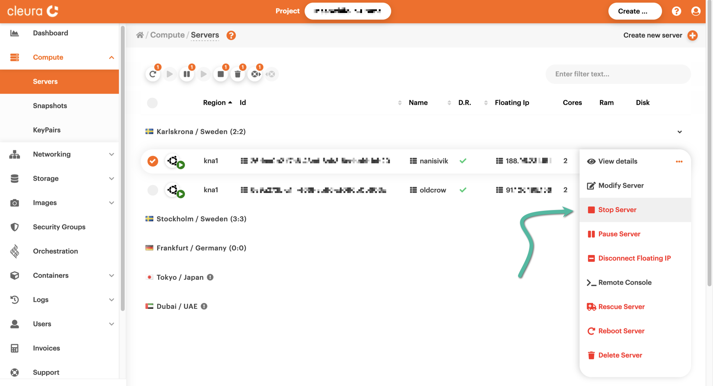
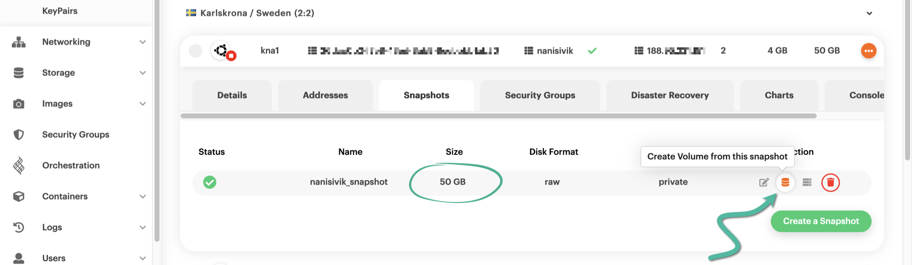
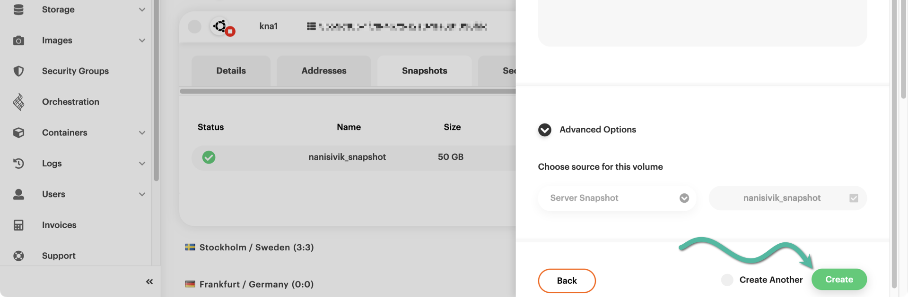

# Converting a boot-from-image server to boot-from-volume

You can freely move any server [between {{brand}}
regions](move-server-between-regions.md), provided it boots from a volume
(which we generally recommend, since it affords more flexibility than
booting from an image). You may still have boot-from-image servers,
though. To verify that a particular server is of that type, you can go
to the {{gui}}, locate the server, and expand its detailed view. Go to
the *Details* tab and pay attention to the *Boot Target* field. If this
is a boot-from-image server, it says *Ephemeral Disk*.


Whenever you decide to move a boot-from-image server between regions,
you will discover that you cannot do so. The solution is first to
convert it to a boot-from-volume server and then move it. In the
following, we show how to perform the conversion using the {{gui}} or
the OpenStack CLI.

## Preparation

=== "{{gui}}"
    Fire up your favorite web browser and navigate to the
    [{{gui}}](https://{{gui_domain}}) start page. Log into your {{brand}}
    account if you have to.
=== "OpenStack CLI"
    To work with the OpenStack CLI, make sure to properly [enable
    it](../../getting-started/enable-openstack-cli.md) for the region your
    boot-from-image server resides in.

## Shutting down the server

=== "{{gui}}"
    Make sure the left-hand side vertical pane is in full view, then select
    *Compute* → [*Servers*](https://{{gui_domain}}/compute/servers). You will
    see all supported {{brand}} regions in the main pane. Expand the one
    with the boot-from-image server you want to convert to boot-from-volume.
    Click the orange three-dots-in-a-circle icon at the right of the
    server row, and from the pop-up menu that appears, select *Stop Server*.

    

    A pop-up window appears, asking if you want to stop the server. Confirm
    by clicking on the red button labeled *Yes, Stop*.
    
     
=== "OpenStack CLI"
    Assuming your boot-from-image server is named
    [`nanisivik`](https://en.wikipedia.org/wiki/Nanisivik), using your
    favorite terminal application, shut it down by typing the following:

    ```bash
    openstack server stop nanisivik
    ```

    To confirm that it has finished shutting down, type:

    ```bash
    openstack server show nanisivik -c status -f value
    ```

    You should see this:

    ```plain
    SHUTOFF
    ```

## Taking a snapshot

=== "{{gui}}"
    When the server is shut off, click on its row to get the detailed view
    and go to the *Snapshots* tab. There, click the green button labeled
    *Create a Snapshot*.

    

    A pop-up window appears, where you have to type in a name for the
    snapshot. You must also be explicit regarding the operation you are
    about to perform, by activating the switch at the left of the
    corresponding question. When you are ready, click the green button
    labeled *Create*.

    
=== "OpenStack CLI"
    To take a snapshot of the server, all you have to do is type something
    like the following:

    ```bash
    openstack server image create --name nanisivik_snap nanisivik
    ```

    ```plain
    +------------+-------------------------------------------------------------------------------------+
    | Field      | Value                                                                               |
    +------------+-------------------------------------------------------------------------------------+
    | created_at | 2023-05-10T13:31:46Z                                                                |
    | file       | /v2/images/1a50720b-af1c-4a16-ba19-b89dbee251f0/file                                |
    | id         | 1a50720b-af1c-4a16-ba19-b89dbee251f0                                                |
    | min_disk   | 50                                                                                  |
    | min_ram    | 0                                                                                   |
    | name       | nanisivik_snap                                                                      |
    | owner      | 94109c764a754e24ac0f6b01aef82359                                                    |
    | properties | base_image_ref='d6b012ee-c6d3-4672-9399-b87d025ddb14', boot_roles='load-            |
    |            | balancer_member,_member_,swiftoperator,creator', hw_machine_type='pc',              |
    |            | hw_qemu_guest_agent='yes', image_type='snapshot',                                   |
    |            | instance_uuid='19ffeb4d-3016-481f-886e-6caecc525fc2', locations='[]',               |
    |            | os_hidden='False', owner_project_name='Meanwhile-in-Drama',                         |
    |            | owner_user_name='kolderson', user_id='c096cf99f65a4d22a6954b67d2ec11d7'             |
    | protected  | False                                                                               |
    | schema     | /v2/schemas/image                                                                   |
    | status     | queued                                                                              |
    | tags       |                                                                                     |
    | updated_at | 2023-05-10T13:31:46Z                                                                |
    | visibility | private                                                                             |
    +------------+-------------------------------------------------------------------------------------+
    ```

    At first, the status of the snapshot is `queued`. To make sure the
    snapshot has been successfully created, type:

    ```bash
    openstack image show nanisivik_snap -c status -f value
    ```

    You should see this:

    ```plain
    active
    ```

## Creating a volume from the snapshot

=== "{{gui}}"
    After a few seconds, the snapshot will be created and listed in the
    *Snapshots* tab. Before you proceed, take note of its size. At the
    right-hand side of the snapshot row, click the :fontawesome-solid-database:
    icon to create a new volume off of the snapshot you just created.

    

    A new vertical pane will slide over from the right-hand side of the
    {{gui}}. Type in a name for the new volume, and choose a volume size
    **bigger** than the snapshot size. Then, you need to type in a
    description regarding the new volume.

    

    Scroll down a bit if you have to, and click the green *Create* button.

    
=== "OpenStack CLI"
    Before creating a volume off of the snapshot you just created, jot down
    its size like this:

    ```bash
    openstack image show nanisivik_snap -c min_disk -f value
    ```

    In our example, the size of the snapshot is `50`
    [gibibytes](https://en.wikipedia.org/wiki/Gigabyte#Base_2_(binary)).
    Now, go ahead and create a volume slightly larger than the size of the
    snapshot:

    ```bash
    openstack volume create --size 56 --image nanisivik_snap nanisivik_vol
    ```

    ```plain
    +---------------------+--------------------------------------+
    | Field               | Value                                |
    +---------------------+--------------------------------------+
    | attachments         | []                                   |
    | availability_zone   | nova                                 |
    | bootable            | false                                |
    | consistencygroup_id | None                                 |
    | created_at          | 2023-05-10T13:39:04.379098           |
    | description         | None                                 |
    | encrypted           | False                                |
    | id                  | e402ecda-5222-4082-93bb-c0cafce00d8d |
    | multiattach         | False                                |
    | name                | nanisivik_vol                        |
    | properties          |                                      |
    | replication_status  | None                                 |
    | size                | 56                                   |
    | snapshot_id         | None                                 |
    | source_volid        | None                                 |
    | status              | creating                             |
    | type                | ceph_hdd                             |
    | updated_at          | None                                 |
    | user_id             | c096cf99f65a4d22a6954b67d2ec11d7     |
    +---------------------+--------------------------------------+
    ```

    As you can see in the example above, we named our volume
    `nanisivik_vol`, and its `status` was at first `creating`. You may check
    the progress of this operation by typing this:

    ```bash
    openstack volume show nanisivik_vol -c status -f value
    ```

    As soon as the new volume is ready, the `status` becomes `available`.

## Viewing the new volume

=== "{{gui}}"
    In the left-hand side vertical pane, select *Storage* →
    [*Volumes*](https://{{gui_domain}}/storage/volumes). In the main pane,
    select the region your boot-from-image server resides in. You will see
    the volume you created in the previous step. In the intersection of the
    volume row and the column labeled *Attached To*, it will say *-No
    attachments-*. That is expected.

    
=== "OpenStack CLI"
    To view all details regarding the volume you just created off of the
    boot-from-image server snapshot, type the following:

    ```bash
    openstack volume show nanisivik_vol
    ```

    ```plain
    +------------------------------+-------------------------------------------------------------------+
    | Field                        | Value                                                             |
    +------------------------------+-------------------------------------------------------------------+
    | attachments                  | []                                                                |
    | availability_zone            | nova                                                              |
    | bootable                     | true                                                              |
    | consistencygroup_id          | None                                                              |
    | created_at                   | 2023-05-10T13:39:04.000000                                        |
    | description                  | None                                                              |
    | encrypted                    | False                                                             |
    | id                           | e402ecda-5222-4082-93bb-c0cafce00d8d                              |
    | multiattach                  | False                                                             |
    | name                         | nanisivik_vol                                                     |
    | os-vol-tenant-attr:tenant_id | 94109c764a754e24ac0f6b01aef82359                                  |
    | properties                   |                                                                   |
    | replication_status           | None                                                              |
    | size                         | 56                                                                |
    | snapshot_id                  | None                                                              |
    | source_volid                 | None                                                              |
    | status                       | available                                                         |
    | type                         | ceph_hdd                                                          |
    | updated_at                   | 2023-05-10T13:39:05.000000                                        |
    | user_id                      | c096cf99f65a4d22a6954b67d2ec11d7                                  |
    | volume_image_metadata        | {'hw_qemu_guest_agent': 'yes', 'base_image_ref':                  |
    |                              | 'd6b012ee-c6d3-4672-9399-b87d025ddb14', 'owner_user_name':        |
    |                              | 'kolderson', 'owner_project_name': 'Meanwhile-in-Drama',          |
    |                              | 'boot_roles': 'load-                                              |
    |                              | balancer_member,_member_,swiftoperator,creator',                  |
    |                              | 'hw_machine_type': 'pc', 'instance_uuid':                         |
    |                              | '19ffeb4d-3016-481f-886e-6caecc525fc2', 'user_id':                |
    |                              | 'c096cf99f65a4d22a6954b67d2ec11d7', 'image_type': 'snapshot',     |
    |                              | 'owner_id': '94109c764a754e24ac0f6b01aef82359', 'image_state':    |
    |                              | 'available', 'image_location': 'snapshot', 'image_id':            |
    |                              | '1a50720b-af1c-4a16-ba19-b89dbee251f0', 'image_name':             |
    |                              | 'nanisivik_snap', 'container_format': 'bare', 'disk_format':      |
    |                              | 'raw', 'min_disk': '50', 'min_ram': '0', 'size': '53687091200'}   |
    +------------------------------+-------------------------------------------------------------------+
    ```

## Deleting the boot-from-image server

=== "{{gui}}"
    Go to the servers view by selecting *Compute* →
    [*Servers*](https://{{gui_domain}}/compute/servers), and locate the
    boot-from-image server. It is time to delete it, so click the orange
    three-dots-in-a-circle icon at the right of the server row, and
    from the pop-up menu that appears, select *Delete Server*.

    

    A window titled *About to delete a server* will appear, asking you if
    you want to proceed with the deletion. Click the red button labeled
    *Yes, Delete*.

    
=== "OpenStack CLI"
    Since you have a snapshot and a volume of your server, you can now
    delete it:

    ```bash
    openstack server delete nanisivik
    ```

    If the operation succeeds, you should see no output on your terminal.

## Creating a new boot-from-volume server

=== "{{gui}}"
    Now, go back to your volumes by selecting *Storage* →
    [*Volumes*](https://{{gui_domain}}/storage/volumes). Tick the volume you
    created a bit earlier, click the orange three-dots-in-a-circle
    icon at the right of the volume row, and from the pop-up menu that
    appears, select *Create Server*. A vertical pane will slide over from
    the right-hand side of the {{gui}}, titled *Create a Server*.

    

    Type in a name for the new server. That could as well be the name your
    boot-from-image server had. Notice that the server region is
    pre-selected and the same as the one in which the volume resides. The
    boot source of the server is also pre-selected and is the volume itself.

    

    Scroll down a bit if you have to. Take notice of the *Boot Target*,
    which should be *Volume (Recommended)*. Select a flavor for the new
    boot-from-volume server, similar to or even the same as the flavor the
    boot-from-image server had.

    

    Consider leaving the [*Disaster
    recovery*](../../../background/disaster-recovery.md) option enabled, and see if you
    want an external IP address for the server.

    

    Select the *default* security group and choose a *keypair* for the
    server.

    

    To create it, click the green button labeled *Create*.

    
=== "OpenStack CLI"
    To create your new boot-from-volume server, which will be using the
    volume you got starting from the snapshot of the old boot-from-image
    server, type something like the following:

    ```bash
    openstack server create \
        --flavor b.2c4gb \
        --volume nanisivik_vol \
        --network network-kna1 \
        --security-group default \
        --key-name karlskrona \
        --wait \
        nanisivik
    ```

    The most important parameter in the command above is `--volume`, which
    is used to specify the boot volume of the server. Regarding server
    creation in general, you might want to [check the corresponding
    guide](new-server.md).

## Viewing the new server

=== "{{gui}}"
    In the left-hand side vertical pane, select *Compute* →
    [*Servers*](https://{{gui_domain}}/compute/servers). In the main pane of
    the {{gui}}, go to the region the new server resides, select it and
    click on its row to see all its characteristics. In the *Details* tab,
    you will notice, among other things, that it has one attached volume;
    that would be the one you created from the snapshot you created from the
    old boot-from-image server.

    
=== "OpenStack CLI"
    You may see all details regarding the new boot-from-volume server, by
    typing something like the following:

    ```bash
    openstack server show nanisivik
    ```

    ```plain
    +-----------------------------+----------------------------------------------------------+
    | Field                       | Value                                                    |
    +-----------------------------+----------------------------------------------------------+
    | OS-DCF:diskConfig           | MANUAL                                                   |
    | OS-EXT-AZ:availability_zone | nova                                                     |
    | OS-EXT-STS:power_state      | Running                                                  |
    | OS-EXT-STS:task_state       | None                                                     |
    | OS-EXT-STS:vm_state         | active                                                   |
    | OS-SRV-USG:launched_at      | 2023-05-10T15:06:28.000000                               |
    | OS-SRV-USG:terminated_at    | None                                                     |
    | accessIPv4                  |                                                          |
    | accessIPv6                  |                                                          |
    | addresses                   | network-kna1=10.15.20.165                                |
    | config_drive                |                                                          |
    | created                     | 2023-05-10T15:06:20Z                                     |
    | flavor                      | b.2c4gb (2d49822b-a1d8-4f9c-a12c-cba8150611d1)           |
    | hostId                      | 975f93445c8d4e1d7df89729f7712b704fafca8c35c8eeb86150a68a |
    | id                          | 8249b090-d5ea-403c-a636-5e27925c83bb                     |
    | image                       | N/A (booted from volume)                                 |
    | key_name                    | karlskrona                                               |
    | name                        | nanisivik                                                |
    | progress                    | 0                                                        |
    | project_id                  | 94109c764a754e24ac0f6b01aef82359                         |
    | properties                  |                                                          |
    | security_groups             | name='default'                                           |
    | status                      | ACTIVE                                                   |
    | updated                     | 2023-05-10T15:06:28Z                                     |
    | user_id                     | c096cf99f65a4d22a6954b67d2ec11d7                         |
    | volumes_attached            | id='e402ecda-5222-4082-93bb-c0cafce00d8d'                |
    +-----------------------------+----------------------------------------------------------+
    ```

    Pay attention to the value of the `image` field, which confirms that
    this is indeed a boot-from-volume server.
