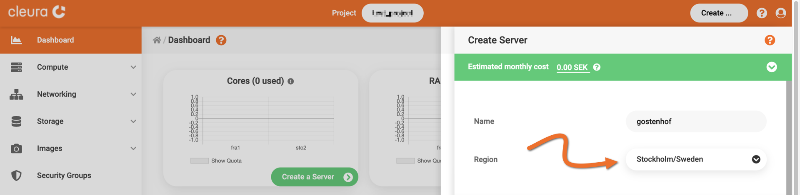
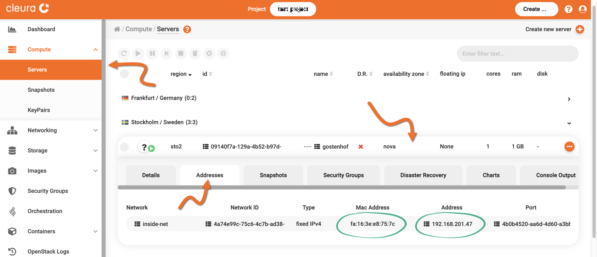
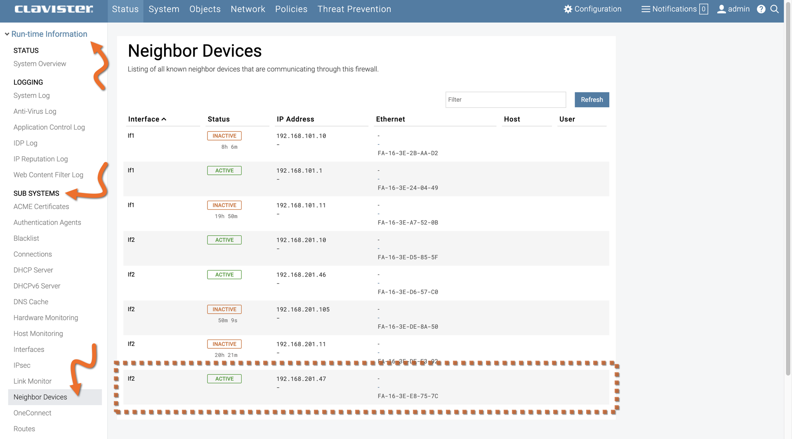

# Creating servers behind a Clavister NetWall instance

Provided you have a [Clavister NetWall instance](../../marketplace/clavister/deploy.md) up and running, you may use the {{gui}} to create a new server and place it behind the firewall.

## Creating a new server

You may follow our [server creation guide](new-server.md) using the {{gui}} *almost* to the letter.
You should only pay *extra* attention to the region the new server will reside in and the network it will be connected to.

More specifically:

- The new server must be in the region where the Clavister NetWall instance you are interested in resides.

- The new server must belong in a network behind the Clavister NetWall instance.

## Getting network connectivity information

Make sure the vertical pane on the left-hand side of the page is expanded.
From it, select *Compute*, then *Servers*.
In the central pane, select the region in which your new server resides.
Click on the server row to expand it, and go to the *Addresses* tab.

There, you can see the IP address of the server.
You might also want to jot down the corresponding MAC address.

## Viewing the new server from the Clavister NetWall dashboard

Login to the Clavister NetWall instance.
From the left-hand side vertical pane, make sure you have expanded the *Run-time Information* category.
Go to the *SUB SYSTEMS* sub-category and select *Neighbor Devices*.
The firewall has two network interfaces: `if1` is the external interface, and `if2` is the internal interface, which any server behind the firewall faces.

You will notice the IP address of the new server you just spun up and the corresponding MAC address.
Finally, in the *Status* column, there is a green box labeled *ACTIVE*, indicating that the server is accessible to the firewall.
