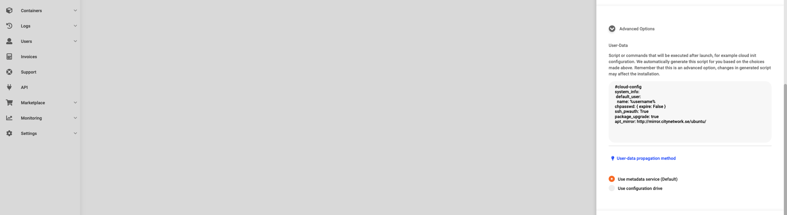
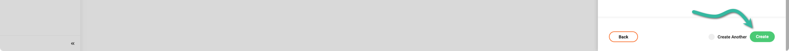
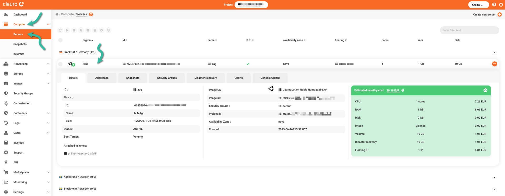
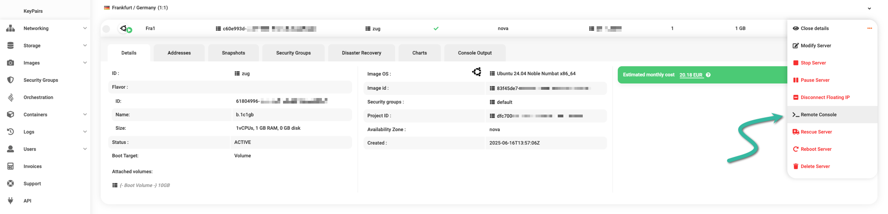
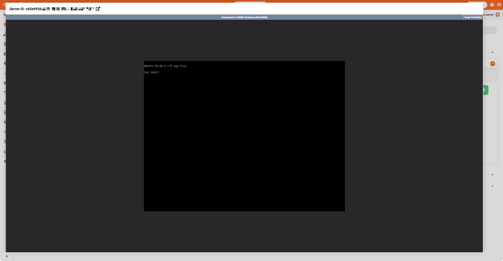

# Creating new servers

Once you have an [account in
{{brand}}](../../getting-started/create-account.md), you can create virtual machines --- henceforth simply _servers_ --- using either the {{gui}} or the OpenStack CLI.
Let us demonstrate the creation of a new server, following both approaches.

## Prerequisites

You need to [have at least one network](../neutron/new-network.md) in the region you are interested in.
Additionally, if you prefer to work with the OpenStack CLI, then make sure to properly [enable it first](../../getting-started/enable-openstack-cli.md).

## Creating a server

To create a server from the {{gui}}, fire up your favorite web browser, navigate to the [{{gui}}](https://{{gui_domain}}) start page, and log into your {{brand}} account.
On the other hand, if you prefer to work with the OpenStack CLI, please do not forget to [source the RC file first](../../getting-started/enable-openstack-cli.md).

=== "{{gui}}"
    On the top right-hand side of the {{gui}}, click the _Create_ button.
    A new pane titled _Create_ slides into view.

    

    Notice all these rounded boxes on that pane, each for defining, configuring, and instantiating a different {{brand}} object.
    Go ahead and click the _Server_ box.
    
    Another pane, titled _Create a Server_, slides over.
    At the top, type in a name for the new server and select one of the available regions.

    

    Set the _Connect to_ parameter to _Network_.
    Select at least one of the available networks to attach the new server to.

    

    If that network is dual-stack or has one IPv4-based subnet, you may want the server to be publicly accessible via an IPv4 address.
    In that case, make sure to activate the _Connect&nbsp;a&nbsp;floating&nbsp;IP&nbsp;to&nbsp;the&nbsp;server_ switch.
    Then, use the dropdown menu below to set the _Create&nbsp;External&nbsp;IP&nbsp;on_ parameter to the network you have already attached the server to.
    
    Now, pay attention to the _Server profile_ parameter.
    
    
        
    From the corresponding dropdown menu, you must select a profile.
    Currently, the following profiles are available:

    *  _Generic_,
    * _High CPU_, and
    * _Low Latency Disk_.

    Selecting one of those gives you access to a subset of all available [_flavors_](../../../reference/flavors/index.md).

    As the profile names suggest, each profile but the _Generic_ points to a subset of flavors suitable for servers intended to run specific types of applications:

    * the _Generic_ profile is for general-purpose cloud servers,
    * the _High CPU_ profile is for servers designed to host CPU-intensive applications, and
    * the _Low Latency Disk_ profile is for servers that use a local low-latency disk.

    We should point out that some profiles may not be available in all regions.
    Choose the _Generic_ profile for now, which is available in any of the regions.

    In the _Boot source_ section below, click the dropdown menu on the left and make sure you select _Image_, so you can choose one of the readily available OS images to boot the new server off of.
    
    

    To pick a specific image, click on the dropdown menu on the right.
    In this example, we have chosen _ubuntu_ in general and *Ubuntu 24.04 Noble Numbat x86_64* in particular.

    Next, notice that the _Boot Target_ is preselected for you.
    Depending on the server profile you have already selected, the boot target will be either _Volume_ or _Ephemeral_.
    Specifically:

    * for the _Generic_ and _High CPU_ profiles, the boot target is _Volume_, and
    * for the _Low Latency Disk_ profile, the boot target is _Ephemeral_.

    

    Regarding the server's CPU core count and amount of memory, set the [_Flavor_](../../../reference/flavors/index.md) accordingly.
    We suggest selecting a flavor that specifies a server with 1 CPU core and 1 GiB of RAM.

    Note that, depending on the chosen flavor, the estimated monthly cost of the server changes.
    (While a server is shut off, you are still getting charged for it, but less so.)
    At any time, this estimated cost is displayed in the green rectangular area at the top.

    Something else that affects the cost is the size of the root device.
    Take a look at the _Volume_ parameter below, and notice the default (in [gibibytes](https://en.wikipedia.org/wiki/Gigabyte#Base_2_(binary))).
    You may leave the root device size unchanged, or modify it to be a bit higher than the default.

    When, at a later time, you decide to delete the server, you can do so but **keep** its boot volume (you may want, for example, to attach that volume to a new server).
    Just disable the _Delete&nbsp;on&nbsp;termination_ option if you want this kind of flexibility.
    On the other hand, if you want your root volume to be automatically deleted when the server is deleted, the _Delete&nbsp;on&nbsp;termination_ option is already enabled for you.
    In any case, use this option with caution.
    
    
    
    Also, notice the _Storage classes (types)_ parameter, which actually deals with [volume types](../../../reference/volumes/index.md).
    By default, this parameter is set to _cbs_.

    You may want to leave the _Disaster&nbsp;recovery_ option enabled.
    If you do, then daily server snapshots will be created, and you will have the option for easy and fast roll-ups to previous snapshots.
    Please be aware that leaving this option enabled increases the server's monthly estimated cost (again, it is displayed in the green rectangular area at the top).

    

    To control network access to the server, use the dropdown menu to the right of [_Security Groups_](../neutron/create-security-groups.md) and choose one.

    

    If you already have one or more key pairs in your {{brand}} account, you can now select a public key to be included in the `~/.ssh/authorized_keys` file of the server's default user.
    (For the image you have selected, that user would be `ubuntu`.)
    That way, you can securely log into the remote user's account via SSH without typing a password.
    
    

    In case there are no key pairs to choose from, activate the _Set&nbsp;password_ option and set a password for the default user account (`ubuntu`).

    

    A configuration script is automatically prepared based on the choices you have already made.
    That script runs during system boot and performs housekeeping tasks like user account creation, enabling acceptable authentication methods, and configuring remote package repositories.
    Click on _Advanced Options_ to see the default script.

    

    Regarding the _User-data propagation method_ above, notice that the _Use&nbsp;metadata&nbsp;service_ is pre-selected for you.
    For more on what this is and why you might want to select the _Use&nbsp;configuration&nbsp;drive_ method, please read our guide on [launching a server with a configuration drive](config-drive.md).
    
    It is now time to create your {{brand}} server.
    Click the green _Create_ button, and the new server will be readily available in a few seconds.

    
=== "OpenStack CLI"
    An `openstack` command for creating a server may look like this:

    ```bash
    openstack server create \
        --flavor $FLAVOR_NAME \
        --image $IMAGE_NAME \
        --boot-from-volume $VOL_SIZE \
        --network $NETWORK_NAME \
        --security-group $SEC_GROUP_NAME \
        --key-name $KEY_NAME \
        --wait \
        $SERVER_NAME
    ```

    Each variable represents a piece of information we have to look for or, in the cases of `KEY_NAME` and `SERVER_NAME`, arbitrarily define.

    Let us begin with the [_flavors_](../../../reference/flavors/index.md) (`FLAVOR_NAME`), which describe combinations of CPU core count and memory size.
    Each server has a distinct flavor, and to see all available flavors type:

    ```bash
    openstack flavor list
    ```

    You will get a pretty long list of flavors.
    For our demonstration, we suggest you go with `b.1c1gb`.
    A server with this particular flavor will have one CPU core and one [gibibyte](https://en.wikipedia.org/wiki/Gigabyte#Base_2_(binary)) of RAM.
    Go ahead and set `FLAVOR_NAME` accordingly:

    ```bash
    FLAVOR_NAME="b.1c1gb"
    ```

    Your server should have an image to boot off of (`IMAGE_NAME`).
    For a list of all available images in {{brand}}, type:

    ```bash
    openstack image list
    ```

    This time, you get a shorter list, but you can still filter for images with the OS you prefer.
    For example, filter for Ubuntu:

    ```bash
    openstack image list --tag "os:ubuntu"
    ```

    Continue with the `Ubuntu 24.04 Noble Numbat x86_64` image:

    ```bash
    IMAGE_NAME="Ubuntu 24.04 Noble Numbat x86_64"
    ```

    Before you go on, decide on the capacity (in gibibytes) of the server's boot volume (`VOL_SIZE`).
    We suggest you start with 10 gibibytes:

    ```bash
    VOL_SIZE="10"
    ```

    You need at least one network in the region you're about to create your new server (`NETWORK_NAME`).
    To get the names of all available (internal) networks, type:

    ```console
    $ openstack network list --internal -c Name

    +----------------+
    | Name           |
    +----------------+
    | nordostbahnhof |
    +----------------+
    ```

    Set the `NETWORK_NAME` variable accordingly:

    ```bash
    NETWORK_NAME="nordostbahnhof"
    ```

    Regarding the security group (`SEC_GROUP_NAME`), unless you have already created one yourself, you will find only one per region:

    ```console
    $ openstack security group list -c Name -c Description

    +---------+------------------------+
    | Name    | Description            |
    +---------+------------------------+
    | default | Default security group |
    +---------+------------------------+
    ```

    Go ahead and set `SEC_GROUP_NAME`:

    ```bash
    SEC_GROUP_NAME="default"
    ```

    You most likely want a server you can remotely connect to via SSH without typing a password.
    Upload one of our public keys to your {{brand}} account:

    ```bash
    openstack keypair create --public-key ~/.ssh/id_ed25519.pub bahnhof
    ```

    In the example above, we uploaded the public key `~/.ssh/id_ed25519.pub` to our {{brand}} account and named it `bahnhof`.
    Follow our example, and do not forget to set the `KEY_NAME`:

    ```bash
    KEY_NAME="bahnhof"
    ```

    By the way, check all uploaded public keys...

    ```bash
    openstack keypair list
    ```

    ...and get more information regarding the one you just uploaded:

    ```bash
    openstack keypair show $KEY_NAME
    ```

    You are almost ready to create your new server. Decide on a name...

    ```bash
    SERVER_NAME="zug" # just an example
    ```

    ...and then go ahead and create it:

    ```bash
    openstack server create \
        --flavor b.1c1gb \
        --image $IMAGE_NAME \
        --boot-from-volume 20 \
        --network nordostbahnhof \
        --security-group default \
        --key-name bahnhof \
        --wait \
        zug
    ```

    (For clarity's sake, and with the exception of `$IMAGE_NAME`, we used the actual values and not the variables we so meticulously set.)
    The `--wait` parameter is optional.
    Whenever you choose to use it, you get back control of your terminal only after the server is readily available in {{brand}}.

    The network your server is attached to might be dual-stack, or it might have an IPv4-based subnet.
    If this is the case and, additionally, you want the server to be reachable via a public IPv4 address, then you need to create a floating IP and assign it to your server.
    First, create the floating IP:

    ```bash
    openstack floating ip create ext-net
    ```

    See all floating IPs...

    ```bash
    openstack floating ip list
    ```

    ...and assign the one you just created to your server:

    ```bash
    openstack server add floating ip zug 198.51.100.12
    ```

    The username of the default user account in the Ubuntu image is `ubuntu`, so now you can connect to your remote server via SSH without typing a password:

    ```bash
    ssh ubuntu@198.51.100.12
    ```

    Alternatively, you may also use the following command, which is more flexible though slightly longer:

    ```bash
    openstack server ssh --public zug -- -l ubuntu
    ```

## Viewing information about the newly created server
=== "{{gui}}"
    At any time, from the {{gui}} you may see all servers, and get detailed information regarding each one of them.
    Expand the left-hand side vertical pane, click _Compute_, then _Servers_, and, in the central pane, select the region you want.

    
=== "OpenStack CLI"
    To see all available servers in the region, type:

    ```bash
    openstack server list
    ```

    You can always get specific information on a particular server:

    ```bash
    openstack server show zug
    ```
## Connecting to the server console
=== "{{gui}}"
    While viewing information regarding your server, you may get its IPv6 or public IPv4 address (e.g., from the _Addresses_ tab), and connect to it remotely via SSH.
    Alternatively, you may launch a web console and log in.
    Click on the three-dot icon on the right of the server header, and from the pop-up menu that appears, select _Remote Console_.

    

    A new window pops up, and that's your web console to your {{brand}} server.
    Please note that this window cannot be resized but can be opened in a new browser window or tab.

    
=== "OpenStack CLI"
    You may have access to the web console of your server, and you need the corresponding URL for it:

    ```bash
    openstack console url show zug
    ```

    Usage of the web console is discouraged, though.
    Instead, securely connect to your server via SSH.
