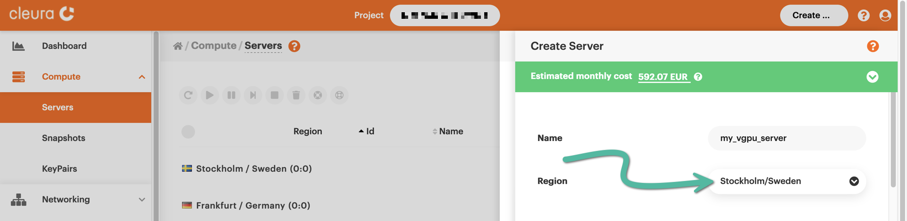
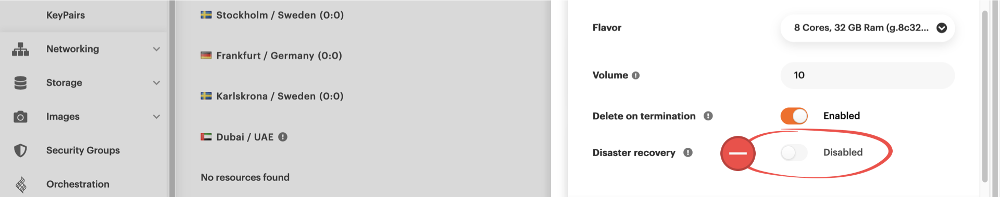
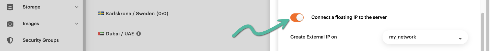

# Creating new servers with virtual GPU support

In select
[{{brand_public}}](../../../reference/features/public.md#virtualization)
and
[{{brand_compliant}}](../../../reference/features/compliant.md#virtualization)
regions, you can instantiate virtual machines --- or simply _servers_
--- with virtual GPU (vGPU) support. For that, you may either use the
{{gui}} or the `openstack` CLI utility.

## Prerequisites

Although not strictly necessary, it is certainly helpful to have some
familiarity with [creating servers in {{brand}}](new-server.md).

## Instantiating a vGPU server

=== "{{gui}}"
    Following the instructions in the [guide on creating
    servers](new-server.md), go ahead and instantiate a new cloud server.

    While you're at it, choose a region where you can have vGPU servers. One
    such region would be `Stockholm/Sweden`.

    

    Also, when selecting a server profile, make sure you indicate the one
    named _GPU_.

    

    Regarding the image your new vGPU server will be based on, your only
    option is `Ubuntu 22.04 NVGRID x86_64`.

    

    Notice that the disaster recovery mechanism is _not_ available for this
    type of server. You will not be able to [restore the server to a
    snapshot](restore-srv-to-snap.md).

    

    Before finalizing your choices and creating the new server, we recommend
    assigning a floating IP to it.

    
=== "OpenStack CLI"
    Before you begin, please make sure to source [your `openstack` RC file
    first](../../getting-started/enable-openstack-cli.md).

    As we discuss in the [guide on creating servers](new-server.md), an
    `openstack` command for instantiating a new server looks like this:

    ```console
    openstack server create \
        --flavor $FLAVOR_NAME \
        --image $IMAGE_NAME \
        --boot-from-volume $VOL_SIZE \
        --network $NETWORK_NAME \
        --security-group $SEC_GROUP_NAME \
        --key-name $KEY_NAME \
        --wait \
        $SERVER_NAME
    ```

    For servers with vGPU support, the only acceptable value for
    `IMAGE_NAME` is `Ubuntu 22.04 NVGRID x86_64`. Additionally, the value
    for `FLAVOR_NAME` should be a flavor [prefixed by
    `g`](../../../reference/flavors/index.md#compute-tiers). To see all such
    flavors, you can type something like the following:

    ```console
    $ openstack flavor list -c Name -f value | grep "^g\."
    g.8c48gb50
    g.24c120gb50
    g.48c240gb
    g.12c48gb50
    g.16c64gb50
    g.12c64gb50
    g.16c84gb50
    g.8c32gb50
    ```

    Taking all of the above into account, an `openstack` command for
    creating a new vGPU server could look like the following:

    ```console
    openstack server create \
        --flavor "g.8c32gb50" \
        --image "Ubuntu 22.04 NVGRID x86_64" \
        --boot-from-volume 32 \
        --network cc-net \
        --security-group default \
        --key-name mykey \
        --wait \
        my-vgpu-server
    ```

    Before you check whether the server does have virtual GPU support, we
    recommend assigning a floating IP to it.

## Checking the status of vGPU support

From your local computer, connect to the new remote server via SSH.
Type, for instance:

```console
ssh ubuntu@<floating_ip_of_new_server>
```

Upon successful connection to the server and logging into the `ubuntu`
account, in your terminal window you will see something like this:

```plain
Welcome to Ubuntu 22.04.2 LTS (GNU/Linux 5.15.0-78-generic x86_64)

 * Documentation:  https://help.ubuntu.com
 * Management:     https://landscape.canonical.com
 * Support:        https://ubuntu.com/advantage

  System information as of Sun Aug 13 06:11:14 UTC 2023

  System load:  0.0                Processes:             159
  Usage of /:   17.2% of 29.90GB   Users logged in:       0
  Memory usage: 1%                 IPv4 address for ens3: 10.254.254.216
  Swap usage:   0%

 * Strictly confined Kubernetes makes edge and IoT secure. Learn how MicroK8s
   just raised the bar for easy, resilient and secure K8s cluster deployment.

   https://ubuntu.com/engage/secure-kubernetes-at-the-edge

Expanded Security Maintenance for Applications is not enabled.

0 updates can be applied immediately.

Enable ESM Apps to receive additional future security updates.
See https://ubuntu.com/esm or run: sudo pro status

The list of available updates is more than a week old.
To check for new updates run: sudo apt update

Last login: Sun Aug 13 05:48:57 2023 from 198.51.100.129
```

Your first clue regarding proper vGPU support should be in the output of
the `lspci` command:

```console
$ lspci

00:00.0 Host bridge: Intel Corporation 440FX - 82441FX PMC [Natoma] (rev 02)
00:01.0 ISA bridge: Intel Corporation 82371SB PIIX3 ISA [Natoma/Triton II]
00:01.1 IDE interface: Intel Corporation 82371SB PIIX3 IDE [Natoma/Triton II]
00:01.2 USB controller: Intel Corporation 82371SB PIIX3 USB [Natoma/Triton II] (rev 01)
00:01.3 Bridge: Intel Corporation 82371AB/EB/MB PIIX4 ACPI (rev 03)
00:02.0 VGA compatible controller: Cirrus Logic GD 5446
00:03.0 Ethernet controller: Red Hat, Inc. Virtio network device
00:04.0 SCSI storage controller: Red Hat, Inc. Virtio SCSI
00:05.0 Communication controller: Red Hat, Inc. Virtio console
00:06.0 3D controller: NVIDIA Corporation GA102GL [A10] (rev a1)
00:07.0 Unclassified device [00ff]: Red Hat, Inc. Virtio memory balloon
00:08.0 Unclassified device [00ff]: Red Hat, Inc. Virtio RNG
```

Notice the line that says `3D controller: NVIDIA Corporation`; that's
good! To get much more information regarding vGPU support, use the
NVIDIA system management interface utility. That would be `nvidia-smi`,
which is installed by default in the `Ubuntu 22.04 NVGRID x86_64` image:

```console
$ nvidia-smi

+-----------------------------------------------------------------------------+
| NVIDIA-SMI 525.105.17   Driver Version: 525.105.17   CUDA Version: 12.0     |
|-------------------------------+----------------------+----------------------+
| GPU  Name        Persistence-M| Bus-Id        Disp.A | Volatile Uncorr. ECC |
| Fan  Temp  Perf  Pwr:Usage/Cap|         Memory-Usage | GPU-Util  Compute M. |
|                               |                      |               MIG M. |
|===============================+======================+======================|
|   0  NVIDIA A10-12C      On   | 00000000:00:06.0 Off |                    0 |
| N/A   N/A    P8    N/A /  N/A |      0MiB / 12288MiB |      0%      Default |
|                               |                      |             Disabled |
+-------------------------------+----------------------+----------------------+

+-----------------------------------------------------------------------------+
| Processes:                                                                  |
|  GPU   GI   CI        PID   Type   Process name                  GPU Memory |
|        ID   ID                                                   Usage      |
|=============================================================================|
|  No running processes found                                                 |
+-----------------------------------------------------------------------------+
```

Among other pieces of information, you get the versions of the
`nvidia-smi` utility, the NVIDIA driver, and the CUDA API.
