# Setting up a TCP load balancer

Octavia is a Load Balancer as a Service (LBaaS) solution designed to work with OpenStack.
In this guide, we show how to instantiate and configure a simple TCP load balancer in {{brand}}.
All intermediate steps are presented and explained through a specific scenario, and we work using either the {{gui}} or the OpenStack CLI.

## Prerequisites

Whether you choose the {{gui}} or the OpenStack CLI, you need to [have an account](../../getting-started/create-account.md) in {{brand}}.
Additionally, to use the OpenStack CLI, make sure to [enable it](../../getting-started/enable-openstack-cli.md) for the region you will be working in.
Besides the Python `openstackclient` module, you will also have to install the Python `octaviaclient` module.
For that, use either the package manager of your operating system or `pip`:

=== "Debian/Ubuntu"
    ```bash
    apt install python3-octaviaclient
    ```
=== "Mac OS X with Homebrew"
    This particular Python module is unavailable via `brew`, but you can install it via `pip`.
=== "Python Package"
    ```bash
    pip install python-octaviaclient
    ```

## Scenario and terminology

To configure and test our basic TCP load balancer, we have two servers in the same {{brand}} region, both having `ncat` listening on port 61234/TCP and returning a greeting to clients asking to connect to that port.
Both servers are in the same internal network, and our load balancer will be responsible for redirecting client connections to them in a round-robin fashion.
The load balancer will have a single floating IP address, so prospective clients will have to know only that address and not any of the backend server addresses.

> Please note that while working with your load balancer, you will encounter some technical terms which go a long way toward conceptualizing the inner logic of the whole LBaaS system.
This guide introduces those terms not beforehand but exactly when needed.

## Creating a load balancer

That is only the first step towards our goal, which is to have a fully functional TCP load balancer.
We will also need a listener and a pool, but first things first.

=== "{{gui}}"
    Fire up your favorite web browser, navigate to the [{{gui}}](https://{{gui_domain}}) start page, and log into your {{brand}} account.
    On the top right-hand side of the {{gui}}, click the _Create_ button.
    A new pane titled _Create_ will slide into view from the right-hand side of the browser window.
    You will notice several rounded boxes on that pane, each for defining, configuring, and instantiating a different {{brand}} object.
    Go ahead and click the _Load Balancer_ box.

    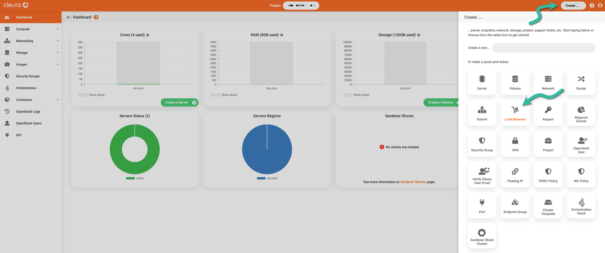

    A new pane titled _Create a Load Balancer_ will slide over.
    At the top, type in a name for the new load balancer and select one of the available regions.
    Optionally, type in a description.

    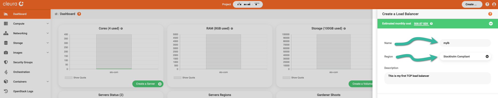

    In the same pane, scroll down a bit if you have to and activate the _Subnet_ radio button.
    Then, from the _Subnet_ dropdown menu below, select an appropriate subnet for the new load balancer to move in front of.
    In our example, the two test servers we have are members of the `network-{{api_region|lower}}` internal network, and `subnet-{{api_region|lower}}` is the name of the corresponding subnet.
    Click the green _Create_ button below to instantiate the new load balancer.

    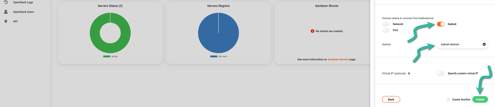

    The creation of the new load balancer starts and, unless something goes wrong, finishes successfully in a minute or so.
    For a view of the load balancer, make sure the left-hand side vertical pane of the {{gui}} is fully visible, click on the _Networking_ category to expand it, and then click once more on the _Load Balancers_ option.
    In the main area of the {{gui}}, select the new load balancer, click the three-dot icon on the right, and select _View details_ from the pop-up menu that appears.

    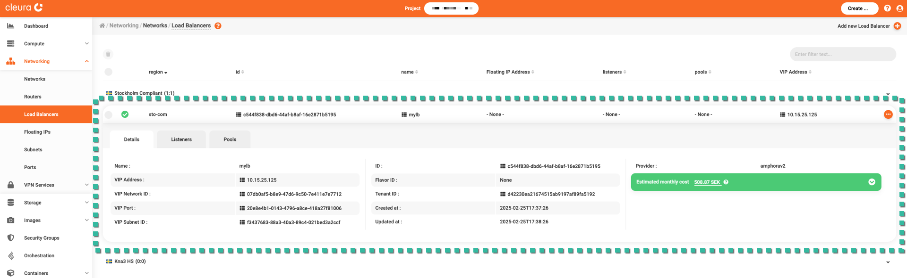
=== "OpenStack CLI"
    To create your load balancer, type something like this:

    ```bash
    openstack loadbalancer create \
        --name mylb --vip-subnet-id subnet-{{api_region|lower}}
    ```

    ```text
    +---------------------+--------------------------------------+
    | Field               | Value                                |
    +---------------------+--------------------------------------+
    | admin_state_up      | True                                 |
    | availability_zone   | None                                 |
    | created_at          | 2025-03-07T11:34:42                  |
    | description         |                                      |
    | flavor_id           | None                                 |
    | id                  | 1ab11475-4700-4047-858c-34bbf2fe1f3e |
    | listeners           |                                      |
    | name                | mylb                                 |
    | operating_status    | OFFLINE                              |
    | pools               |                                      |
    | project_id          | d42230ea21674515ab9197af89fa5192     |
    | provider            | amphorav2                            |
    | provisioning_status | PENDING_CREATE                       |
    | updated_at          | None                                 |
    | vip_address         | 10.15.25.178                         |
    | vip_network_id      | 07db0af5-b8e9-47d6-9c50-7e411e7e7712 |
    | vip_port_id         | 6b642cfc-14f2-4854-b068-a14b7919ae33 |
    | vip_qos_policy_id   | None                                 |
    | vip_subnet_id       | f3437683-88a3-40a3-89c4-021bed3a2ccf |
    | vip_vnic_type       | normal                               |
    | tags                |                                      |
    | additional_vips     | []                                   |
    +---------------------+--------------------------------------+
    ```

    In the example above, the name of the load balancer is `mylb`, and the subnet it will be in front of is named `subnet-{{api_region|lower}}` (this is the subnet our two test servers are members of).
    You will notice in the command output that, at first, the `provisioning_status` is `PENDING_CREATE`.
    To make sure the load balancer has been successfully created, try this command a couple of times:

    ```bash
    openstack loadbalancer show mylb -c provisioning_status
    ```

    ```text
    +---------------------+--------+
    | Field               | Value  |
    +---------------------+--------+
    | provisioning_status | ACTIVE |
    +---------------------+--------+
    ```

## Creating a listener

A load balancer needs a way to listen for incoming client connection requests.
The _listener_ allows a load balancer to do just that.
The load balancer you instantiated has no listener, so let us see how you can equip it with one.

=== "{{gui}}"
    Looking at the detailed view of the new load balancer, you see three tabs: _Details_, _Listeners_, and _Pools_.
    Click the _Listeners_ tab and notice the message: "No Listeners for this LoadBalancer".
    Time to create one, so click the green button labeled _Create a Listener_.

    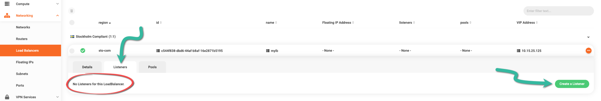

    From the right-hand side of the {{gui}}, a pane named _Create a Listener_ slides over.
    Type in a name for the new listener --- and optionally a description.

    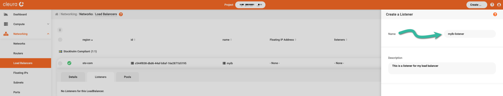

    Further down, from the _Protocol_ dropdown menu, select the protocol the listener will be paying attention to.
    Since you are setting up a TCP load balancer, the protocol for the listener will also have to be TCP.
    Additionally, type in the listening port.
    The load balancer will be redirecting connections to a couple of servers, which listen for connections on port 61234/TCP, so it makes sense ---though it is not necessary--- for the load balancer to use that same listening port.
    Since you have not yet defined a pool, ignore the _Default pool_ dropdown menu for now.
    Instead, go ahead and click the green _Create_ button.

    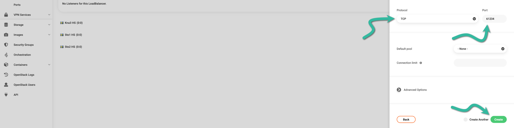

    The listener will be created in no time, and you will be able to see its characteristics in the _Listeners_ tab of your load balancer detailed view.

    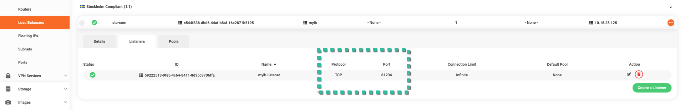
=== "OpenStack CLI"
    Create a listener for your load balancer like this:

    ```bash
    openstack loadbalancer listener create \
        --name mylb-listener --protocol TCP --protocol-port 61234 mylb
    ```

    ```text
    +-----------------------------+--------------------------------------+
    | Field                       | Value                                |
    +-----------------------------+--------------------------------------+
    | admin_state_up              | True                                 |
    | connection_limit            | -1                                   |
    | created_at                  | 2025-03-07T11:40:14                  |
    | default_pool_id             | None                                 |
    | default_tls_container_ref   | None                                 |
    | description                 |                                      |
    | id                          | 0322a0a7-1b5a-4aac-8174-cb7cbb6d13e1 |
    | insert_headers              | None                                 |
    | l7policies                  |                                      |
    | loadbalancers               | 1ab11475-4700-4047-858c-34bbf2fe1f3e |
    | name                        | mylb-listener                        |
    | operating_status            | OFFLINE                              |
    | project_id                  | d42230ea21674515ab9197af89fa5192     |
    | protocol                    | TCP                                  |
    | protocol_port               | 61234                                |
    | provisioning_status         | PENDING_CREATE                       |
    | sni_container_refs          | []                                   |
    | timeout_client_data         | 50000                                |
    | timeout_member_connect      | 5000                                 |
    | timeout_member_data         | 50000                                |
    | timeout_tcp_inspect         | 0                                    |
    | updated_at                  | None                                 |
    | client_ca_tls_container_ref | None                                 |
    | client_authentication       | NONE                                 |
    | client_crl_container_ref    | None                                 |
    | allowed_cidrs               | None                                 |
    | tls_ciphers                 | None                                 |
    | tls_versions                | None                                 |
    | alpn_protocols              | None                                 |
    | tags                        |                                      |
    | hsts_max_age                | None                                 |
    | hsts_include_subdomains     | False                                |
    | hsts_preload                | False                                |
    +-----------------------------+--------------------------------------+
    ```

    To check the `provisioning_status`, type the following:

    ```bash
    openstack loadbalancer listener show mylb-listener -c provisioning_status
    ```

    ```text
    +---------------------+--------+
    | Field               | Value  |
    +---------------------+--------+
    | provisioning_status | ACTIVE |
    +---------------------+--------+
    ```

    Since you wanted to create a TCP load balancer, in the command above, you specified the connection protocol via the `--protocol` parameter.
    Also, the new load balancer will be redirecting connections to a couple of servers listening on port 61234, so it makes sense to set the listening port to 61234 (see the `--protocol-port` parameter).

## Creating a pool

Any server accepting connections from the listener is said to be a _member_ of a _pool_.
For our load balancer to work, we must create a pool and explicitly list its members.

=== "{{gui}}"
    With the detailed view of the load balancer expanded, click the _Pools_ tab.
    You will notice the message "No pools for this LoadBalancer", so click the green _Create a Pool_ button.

    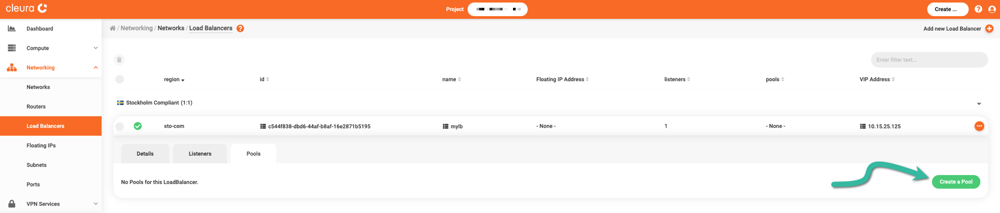

    A new pane named _Create a Pool_ slides over.
    First, type in a name for the new pool.
    For the _Algorithm_, make sure to select *ROUND_ROBIN*.
    Since you are configuring a TCP load balancer, set the _Protocol_ to _TCP_.

    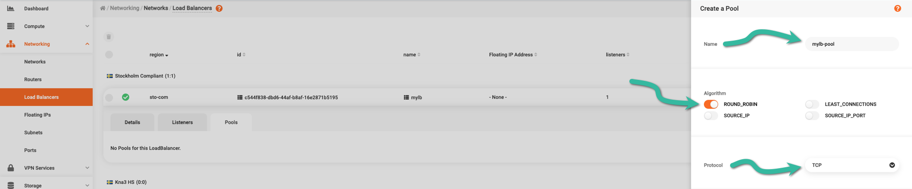

    A little bit further down the pane, there is the _Listener_ dropdown menu; select the one you created in the previous step.
    Leave the _Session persistence_ parameter as it is, and create your pool with a click on the green _Create_ button.

    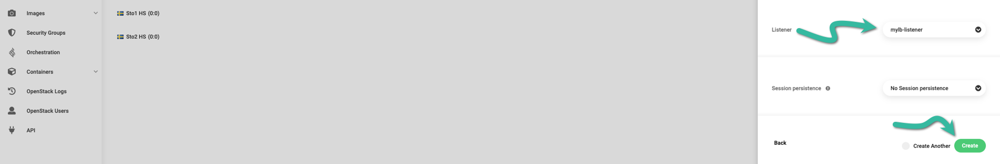

    The pool is instantaneously available; as you can see, it has zero members and one listener (the one you created in the previous step).

    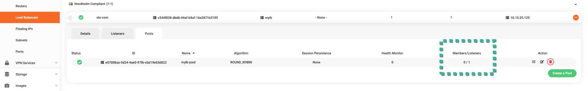

    Notice that the listener already knows about the new pool, even though you did not explicitly mention it.

    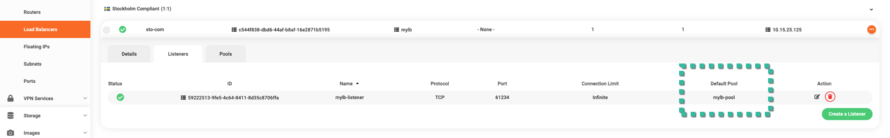
=== "OpenStack CLI"
    To create a pool named `mylb-pool` that distributes incoming TCP connections to its members in a round-robin fashion from the listener named `mylb-listener`, type this command:

    ```bash
    openstack loadbalancer pool create \
        --name mylb-pool --lb-algorithm ROUND_ROBIN \
        --listener mylb-listener --protocol TCP
    ```

    ```text
    +----------------------+--------------------------------------+
    | Field                | Value                                |
    +----------------------+--------------------------------------+
    | admin_state_up       | True                                 |
    | created_at           | 2025-03-07T11:41:51                  |
    | description          |                                      |
    | healthmonitor_id     |                                      |
    | id                   | 71ce0713-3bf4-4373-bc93-ea4a04f01754 |
    | lb_algorithm         | ROUND_ROBIN                          |
    | listeners            | 0322a0a7-1b5a-4aac-8174-cb7cbb6d13e1 |
    | loadbalancers        | 1ab11475-4700-4047-858c-34bbf2fe1f3e |
    | members              |                                      |
    | name                 | mylb-pool                            |
    | operating_status     | OFFLINE                              |
    | project_id           | d42230ea21674515ab9197af89fa5192     |
    | protocol             | TCP                                  |
    | provisioning_status  | PENDING_CREATE                       |
    | session_persistence  | None                                 |
    | updated_at           | None                                 |
    | tls_container_ref    | None                                 |
    | ca_tls_container_ref | None                                 |
    | crl_container_ref    | None                                 |
    | tls_enabled          | False                                |
    | tls_ciphers          | None                                 |
    | tls_versions         | None                                 |
    | tags                 |                                      |
    | alpn_protocols       | None                                 |
    +----------------------+--------------------------------------+
    ```

    Once more, you may check the `provisioning_status` by typing the following:

    ```bash
    openstack loadbalancer pool show mylb-pool -c provisioning_status
    ```

    ```text
    +---------------------+--------+
    | Field               | Value  |
    +---------------------+--------+
    | provisioning_status | ACTIVE |
    +---------------------+--------+
    ```

## Adding members to the pool

The pool you created has no members, so it is time to populate it.

=== "{{gui}}"
    In the detailed view of your load balancer, go to the _Pools_ tab and click the bulleted-list icon.

    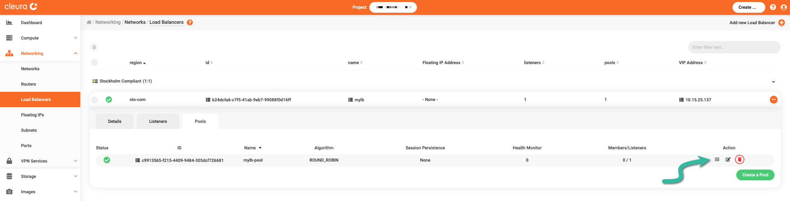

    A new pane titled _Modify Pool Members_ appears, listing all the servers that share the same region with the load balancer.
    In our example, there are three servers.
    We created `srv-lbaas-1` and `srv-lbaas-2` to test the load balancer, so now we click on the corresponding plus-sign icons to add those to the pool.

    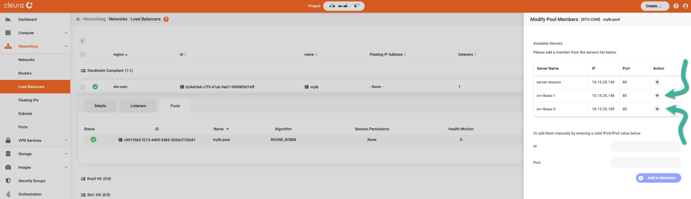

    You may have noticed that the listening port of each server we added is by default 80, but we want port 61234.
    To change the listening port of a server, just click the corresponding notepad-and-pen icon.

    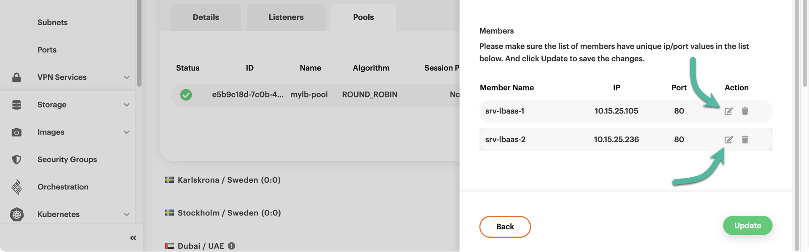

    To confirm the changes, click the green _Update_ button.

    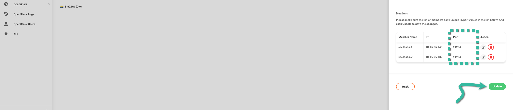

    At this point, the load balancer should have its listener plus a pool with two members.

    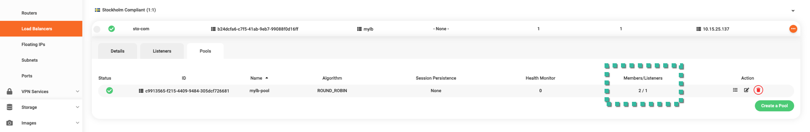
=== "OpenStack CLI"
    Both our test servers are in the `subnet-{{api_region|lower}}` subnet, one of them has IP `10.15.25.105`, and the other one has IP `10.15.25.236`.
    To add those two servers in pool `mylb-pool`, type:

    ```bash
    openstack loadbalancer member create \
        --subnet-id subnet-{{api_region|lower}} --address 10.15.25.105 \
        --protocol-port 61234 mylb-pool
    ```

    ```text
    +---------------------+--------------------------------------+
    | Field               | Value                                |
    +---------------------+--------------------------------------+
    | address             | 10.15.25.149                         |
    | admin_state_up      | True                                 |
    | created_at          | 2025-03-07T11:44:14                  |
    | id                  | 0d6b1284-67af-4b3b-91c1-0e46bc3cc4c1 |
    | name                |                                      |
    | operating_status    | NO_MONITOR                           |
    | project_id          | d42230ea21674515ab9197af89fa5192     |
    | protocol_port       | 61234                                |
    | provisioning_status | PENDING_CREATE                       |
    | subnet_id           | f3437683-88a3-40a3-89c4-021bed3a2ccf |
    | updated_at          | None                                 |
    | weight              | 1                                    |
    | monitor_port        | None                                 |
    | monitor_address     | None                                 |
    | backup              | False                                |
    | tags                |                                      |
    | vnic_type           | normal                               |
    +---------------------+--------------------------------------+
    ```

    ```bash
    openstack loadbalancer member create \
        --subnet-id subnet-{{api_region|lower}} --address 10.15.25.236 \
        --protocol-port 61234 mylb-pool
    ```

    ```text
    +---------------------+--------------------------------------+
    | Field               | Value                                |
    +---------------------+--------------------------------------+
    | address             | 10.15.25.155                         |
    | admin_state_up      | True                                 |
    | created_at          | 2025-03-07T11:45:40                  |
    | id                  | 1d43123f-cb7a-48f3-982b-52d39f4616d0 |
    | name                |                                      |
    | operating_status    | NO_MONITOR                           |
    | project_id          | d42230ea21674515ab9197af89fa5192     |
    | protocol_port       | 61234                                |
    | provisioning_status | PENDING_CREATE                       |
    | subnet_id           | f3437683-88a3-40a3-89c4-021bed3a2ccf |
    | updated_at          | None                                 |
    | weight              | 1                                    |
    | monitor_port        | None                                 |
    | monitor_address     | None                                 |
    | backup              | False                                |
    | tags                |                                      |
    | vnic_type           | normal                               |
    +---------------------+--------------------------------------+
    ```

    You may at any time list all members of a particular pool:

    ```bash
    openstack loadbalancer member list mylb-pool
    ```

    ```text
    +----------------+------+----------------+---------------------+--------------+---------------+------------------+--------+
    | id             | name | project_id     | provisioning_status | address      | protocol_port | operating_status | weight |
    +----------------+------+----------------+---------------------+--------------+---------------+------------------+--------+
    | 0d6b1284-67af- |      | d42230ea216745 | ACTIVE              | 10.15.25.149 |         61234 | NO_MONITOR       |      1 |
    | 4b3b-91c1-     |      | 15ab9197af89fa |                     |              |               |                  |        |
    | 0e46bc3cc4c1   |      | 5192           |                     |              |               |                  |        |
    | 1d43123f-cb7a- |      | d42230ea216745 | ACTIVE              | 10.15.25.155 |         61234 | NO_MONITOR       |      1 |
    | 48f3-982b-     |      | 15ab9197af89fa |                     |              |               |                  |        |
    | 52d39f4616d0   |      | 5192           |                     |              |               |                  |        |
    +----------------+------+----------------+---------------------+--------------+---------------+------------------+--------+
    ```

## Assigning a floating IP

Your load balancer has an internal IP chosen from the subnet you indicated earlier.
This makes it reachable from other servers in the same subnet but not from the Internet.
You probably want the load balancer to be reachable from anywhere, meaning you have to equip it with a floating IP.

=== "{{gui}}"
    While viewing your load balancer, click the three-dot icon on the right.
    From the pop-up menu that appears, select _Modify Load Balancer_.

    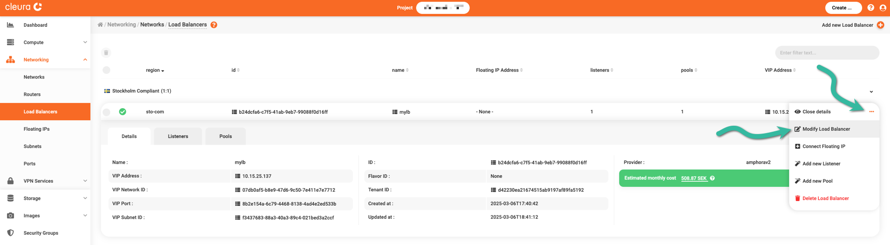

    The _Modify Load Balancer_ pane appears.
    For the _Floating IP_ option, select _Create and attach IP_.

    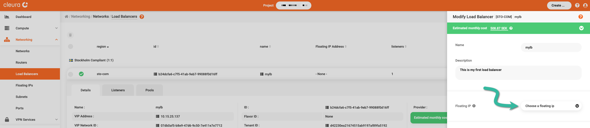

    A new pane slides over, named _Create a Floating IP_.
    For the _Region_ parameter, select the one the load balancer resides in.
    Select an external network for the _External Network_ parameter.
    For the _Assign to_ parameter, make sure you choose _Load Balancer_.
    In our example, there's only one load balancer in the region we are working in, so the parameter _LoadBalancer_ below is automaticlally set for us.
    To finalize the assignment, click the green _Create and Assign_ button.

    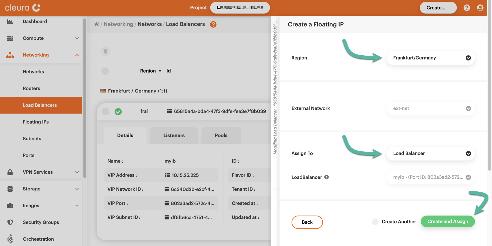

    As you may see, your load balancer now has a floating IP.
    You can now use that to test the balancer and make sure it works as expected.

    
=== "OpenStack CLI"
    First, create a new floating IP:

    ```bash
    openstack floating ip create ext-net
    ```

    ```text
    +---------------------+--------------------------------------+
    | Field               | Value                                |
    +---------------------+--------------------------------------+
    | created_at          | 2025-03-07T11:48:38Z                 |
    | description         |                                      |
    | dns_domain          |                                      |
    | dns_name            |                                      |
    | fixed_ip_address    | None                                 |
    | floating_ip_address | 198.51.100.129                       |
    | floating_network_id | efb30531-a65a-4890-8b3c-56a503b51637 |
    | id                  | 7bd382d0-dfb1-4eaa-b235-a13ba4cecd12 |
    | name                | 185.16.85.55                         |
    | port_details        | None                                 |
    | port_id             | None                                 |
    | project_id          | d42230ea21674515ab9197af89fa5192     |
    | qos_policy_id       | None                                 |
    | revision_number     | 0                                    |
    | router_id           | None                                 |
    | status              | DOWN                                 |
    | subnet_id           | None                                 |
    | tags                | []                                   |
    | updated_at          | 2025-03-07T11:48:38Z                 |
    +---------------------+--------------------------------------+
    ```

    Then, load the ID of the new floating IP to a variable:

    ```bash
    FLOAT_IP_ID=$(openstack floating ip list \
        --floating-ip-address 198.51.100.129 -c ID -f value)
    ```

    Do the same for the VIP port ID of your load balancer:

    ```bash
    VIP_PORT_ID=$(openstack loadbalancer show mylb \
        -c vip_port_id -f value)
    ```

    Finally, assign the floating IP to your load balancer like so:

    ```bash
    openstack floating ip set --port $VIP_PORT_ID $FLOAT_IP_ID
    ```

## Testing the load balancer

Each of the two test servers runs `ncat` to continuously listen on port 61234/TCP and respond to clients with a simple message, revealing its hostname:

```bash
ncat -kv -l 61234 -c 'echo Yello from $(hostname)!'
```

Since the load balancer has a floating IP (`198.51.100.129`, in our example), and we know the port it listens to, we can try connecting to it via `wget` and see what happens:

```console
$ wget -q 198.51.100.129:61234 -O -

Yello from srv-lbaas-1!
```

It looks like we talked to the first test server.
If we run the exact same `wget` command for a second time, since the load balancer distributes client connection requests in a round-robin fashion, we expect to talk to the second server:

```console
$ wget -q 198.51.100.129:61234 -O -

Yello from srv-lbaas-2!
```

During our testing, executing the `wget` command repeatedly, we were getting those two hostnames one after the other --- and that was proof our TCP load balancer was working as expected.
But there is one more expectation of any load balancer: the ability to skip backend hosts when they are inaccessible.

To test our load balancer in this new scenario, let us first use `wget` to connect to port 61234 and jot down the backend server that will respond:

```console
$ wget -q 198.51.100.129:61234 -O -

Yello from srv-lbaas-2!
```

We see that `srv-lbaas-2` responded. That means the next time we try to connect, `srv-lbaas-1` will respond.
But if we SSH into `srv-lbaas-1` and terminate `ncat`, then after connecting with `wget` we will get a response from `srv-lbaas-2` --- again.
This, at least, is our expectation.
So without further ado, we SSH into `srv-lbaas-1`, we terminate `ncat`, we log out, and from our local terminal, we type:

```console
$ wget -q 198.51.100.129:61234 -O -

Yello from srv-lbaas-2!
```

Exactly as we expected, `srv-lbaas-2` has responded again, proving our load balancer behaves correctly.
As an exercise, you might want to shutdown your `srv-lbaas-1` and/or re-enable `ncat`, and check the behavior of the load balancer.
There should be no surprises.

## Adding a health monitor

You can add a health monitor to the pool of your load balancer, so whenever ---and for whatever reason--- one or more of the pool member services are inaccessible, the load balancer will know and won't even bother trying to redirect client requests to them.
Of course, whenever an inaccessible service gets accessible again, the load balancer will take notice and start treating the corresponding pool member as a fully functional server.

=== "{{gui}}"
    In the detailed view of your load balancer, pull up the _Pools_ tab.
    In the _Health Monitor_ column there is a "0", for the pool has no health monitor yet.

    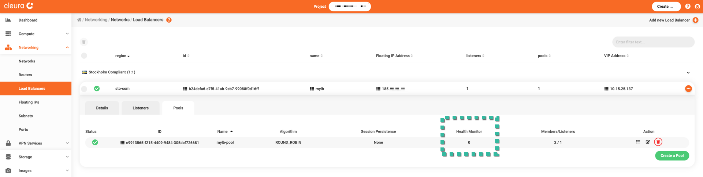

    To add a health monitor, click the notepad-and-pen icon.
    A pane titled _Modify Pool_ slides over.
    Scroll down if you have to, and stop when the _Health Monitor_ section is fully visible.
    You will see a message saying, "No health monitor created", so click the green _Create a Healthmonitor_ button to create one.

    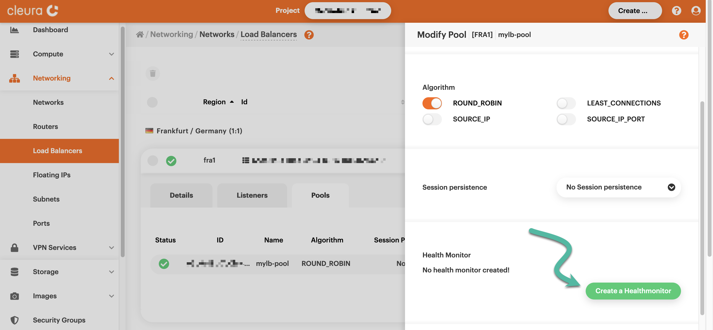

    Pick a name for the new health monitor, and set its type to TCP.
    That is the connection protocol that will be used to determine whether pool member services are accessible.
    Finalize your choices with a click on the green _Create_ button.

    

    You will then see that in the _Health Monitor_ column there is a "1" --- and that means the monitor is active.
    To see real-time information regarding pool members operating status, click over "1".

    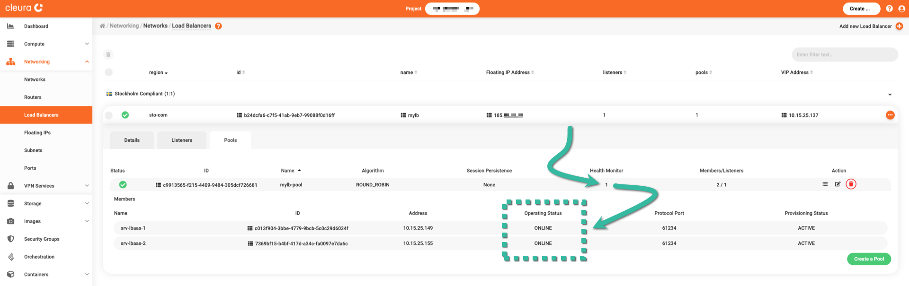
=== "OpenStack CLI"
    To create a health monitor for pool `mylb-pool` of load balancer `mylb`, type something like the following:

    ```console
    $ openstack loadbalancer healthmonitor create \
        --name=mylb-pool-healthmon --type=TCP \
        --delay=10 --timeout=5 --max-retries=1 \
        mylb-pool

    +---------------------+--------------------------------------+
    | Field               | Value                                |
    +---------------------+--------------------------------------+
    | project_id          | d42230ea21674515ab9197af89fa5192     |
    | name                | mylb-pool-healthmon                  |
    | admin_state_up      | True                                 |
    | pools               | 71ce0713-3bf4-4373-bc93-ea4a04f01754 |
    | created_at          | 2025-03-07T11:54:10                  |
    | provisioning_status | PENDING_CREATE                       |
    | updated_at          | None                                 |
    | delay               | 10                                   |
    | expected_codes      | None                                 |
    | max_retries         | 1                                    |
    | http_method         | None                                 |
    | timeout             | 5                                    |
    | max_retries_down    | 3                                    |
    | url_path            | None                                 |
    | type                | TCP                                  |
    | id                  | df9aeb33-6ff7-4610-b3ce-8ce925c611f7 |
    | operating_status    | OFFLINE                              |
    | http_version        | None                                 |
    | domain_name         | None                                 |
    | tags                |                                      |
    +---------------------+--------------------------------------+
    ```

    The name of the new health monitor is `mylb-pool-healthmon`, and the TCP protocol will be used to check whether members of pool `mylb-pool` are online or offline.
    To check the provisioning status of the health monitor, type:

    ```console
    $ openstack loadbalancer healthmonitor show \
        mylb-pool-healthmon -c provisioning_status

    +---------------------+--------+
    | Field               | Value  |
    +---------------------+--------+
    | provisioning_status | ACTIVE |
    +---------------------+--------+
    ```

    Once the health monitor is provisioned, you may at any time check the pool members status like so:

    ```console
    $ openstack loadbalancer member list mylb-pool

    ```plain
    +----------------+------+----------------+---------------------+--------------+---------------+------------------+--------+
    | id             | name | project_id     | provisioning_status | address      | protocol_port | operating_status | weight |
    +----------------+------+----------------+---------------------+--------------+---------------+------------------+--------+
    | 0d6b1284-67af- |      | d42230ea216745 | ACTIVE              | 10.15.25.149 |         61234 | ONLINE           |      1 |
    | 4b3b-91c1-     |      | 15ab9197af89fa |                     |              |               |                  |        |
    | 0e46bc3cc4c1   |      | 5192           |                     |              |               |                  |        |
    | 1d43123f-cb7a- |      | d42230ea216745 | ACTIVE              | 10.15.25.155 |         61234 | ONLINE           |      1 |
    | 48f3-982b-     |      | 15ab9197af89fa |                     |              |               |                  |        |
    | 52d39f4616d0   |      | 5192           |                     |              |               |                  |        |
    +----------------+------+----------------+---------------------+--------------+---------------+------------------+--------+
    ```

## Observing and testing the monitor

Having a health monitor for your load balancer's pool up and running, whenever the service of interest in any of the pool members gets inaccessible, the monitor notices and immediately considers the corresponding member as offline.
From then on, and until the same service gets accessible again, the load balancer does not even try to redirect client connections to the affected member.
During our testing, we killed `ncat` running on `srv-lbaas-1`, and then took a look at the health monitor from the {{gui}} --- and also from a local terminal.

=== "{{gui}}"
    In the detailed view of your load balancer, pull up the _Pools_ tab and click anywhere on its line.
    After a second or two, you will see information regarding all pool members.
    Pay attention to the _Operating Status_ column, where you can see the status of any of the pool members.

    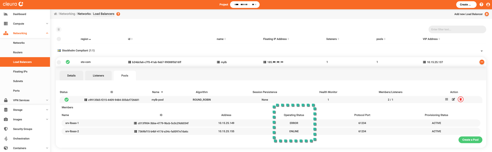

=== "OpenStack CLI"
    To check the operating status of any of the pool members of your load balancer, type something like this:

    ```console
    # openstack loadbalancer member list mylb-pool

    ```plain
    +----------------+------+----------------+---------------------+--------------+---------------+------------------+--------+
    | id             | name | project_id     | provisioning_status | address      | protocol_port | operating_status | weight |
    +----------------+------+----------------+---------------------+--------------+---------------+------------------+--------+
    | 0d6b1284-67af- |      | d42230ea216745 | ACTIVE              | 10.15.25.149 |         61234 | ERROR            |      1 |
    | 4b3b-91c1-     |      | 15ab9197af89fa |                     |              |               |                  |        |
    | 0e46bc3cc4c1   |      | 5192           |                     |              |               |                  |        |
    | 1d43123f-cb7a- |      | d42230ea216745 | ACTIVE              | 10.15.25.155 |         61234 | ONLINE           |      1 |
    | 48f3-982b-     |      | 15ab9197af89fa |                     |              |               |                  |        |
    | 52d39f4616d0   |      | 5192           |                     |              |               |                  |        |
    +----------------+------+----------------+---------------------+--------------+---------------+------------------+--------+
    ```

    In the example above, see the `operating_status` column, specifically the status of server with the IP of `10.15.25.149` (that's `srv-lbaas-1`).
    Regarding the operating status of all pool members, you can always limit the scope of your query like so:

    ```bash
    openstack loadbalancer member list mylb-pool \
        -c id -c address -c operating_status
    ```

    ```plain
    +--------------------------------------+--------------+------------------+
    | id                                   | address      | operating_status |
    +--------------------------------------+--------------+------------------+
    | 0d6b1284-67af-4b3b-91c1-0e46bc3cc4c1 | 10.15.25.149 | ERROR            |
    | 1d43123f-cb7a-48f3-982b-52d39f4616d0 | 10.15.25.155 | ONLINE           |
    +--------------------------------------+--------------+------------------+
    ```

Finally, let us see what happens when we repeatedly try to access the remote service via the load balancer:

```console
$ wget -q 198.51.100.129:61234 -O -
Yello from srv-lbaas-2!

$ wget -q 198.51.100.129:61234 -O -
Yello from srv-lbaas-2!

$ wget -q 198.51.100.129:61234 -O -
Yello from srv-lbaas-2!
```

Since pool member `srv-lbaas-1` is offline to the health monitor, we keep getting an answer from `srv-lbaas-2`.
Actually, while the service of interest in `srv-lbaas-1` is inaccessible, then no matter how many times we run the command above we will keep getting a response from `srv-lbaas-2` only.
