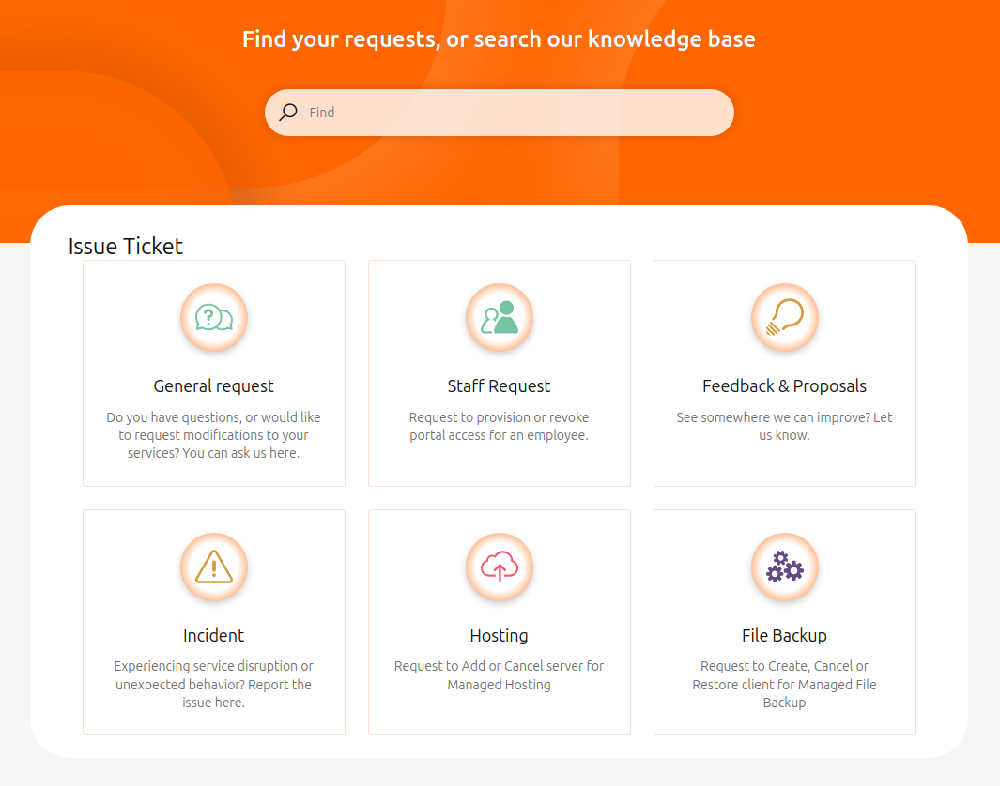

# Raising support issues

The **{{support}} portal** is designed for customers with a paid support package tier, typically organizations.
Using this portal, you can create, manage, and track issue tickets.

If you are not subscribed to a paid support package plan, you can still reach out to us via email to raise tickets.

## Issue properties

### Issue type

Depending on your selections while filling out a request type, additional fields may be dynamically displayed to gather relevant information.

#### Requests

Requests are used for general inquiries, access management, or feedback.
Available options include:

##### General Requests

- Request for information
- General
- Invoice
- {{gui}} (CCMP)
- Quota
- Prior Incident
- Data Center (DC) Access
- Status Page
- Sales
- Problem

##### Staff Requests

- **Onboarding:**
    - Status Page (for {{brand_compliant}} customers)
    - {{support}} portal

- **Offboarding:**
    - Status Page (for {{brand_compliant}} customers)
    - {{support}} portal

##### Feedback & Proposals
- Feedback
- Improvement Proposals

#### Issues

Issues are used to report ongoing problems. Available option:

- **Incident**:
    - Report ongoing incidents that disrupt normal operations.

#### Managed Services

Managed Services tickets relate to hosted services or backup operations.
Available options:

- **Hosting**:
    - Canceling

- **File Backup**:
    - Restoring
    - Canceling

### Priority matrix

We use a **Priority matrix** to prioritize tickets effectively.
This allows us to evaluate **Urgency** and **Impact**, ensuring issues are resolved efficiently and fairly.

When creating a ticket, you will be asked to assign a **Priority** based on the following matrix:

|                | **High Impact** | **Medium Impact** | **Low Impact** |
|----------------|------------------|-------------------|----------------|
| **High Urgency** | P1               | P2                | P3             |
| **Medium Urgency** | P2               | P2                | P3             |
| **Low Urgency**    | P3               | P3                | P4             |

## Raising tickets via the {{support}} portal

The **{{support}} portal** organizes requests into a single menu where all request types are available.
The interface dynamically displays fields depending on the selections you make.

### Steps to create a ticket

1. Visit the [{{support}} portal](https://{{support_domain}}/servicedesk).
2. Log in if prompted.  
3. Navigate to the relevant service project.
     - A user can have access to several service projects. You should select the project that relates to your request.
4. Select the **Issue type** that best matches your request.
5. Fill in the required fields and any additional fields that appear dynamically based on your selections.
6. If you're part of an organization and want the ticket visible to others, select **Share with [organization name]** at the bottom of the form. Otherwise, choose **Private request**.  
7. Click **Create** to submit your ticket.

> **Tip**: Use the **search bar** at the top of the portal page to quickly find your tickets or search our knowledge base for helpful articles.

## Raising tickets via email

If you choose to raise a ticket by email, please follow these guidelines:

1. **Email address**: Send your email to [{{support_email}}](mailto:{{support_email}}) from an account [matching your profile information](../account-billing/change-account-data.md).
2. **Language**: Use English for quicker responses. While some staff speak other languages, using languages other than English may delay responses.
3. **Subject**: Provide a clear and descriptive subject line, e.g., "Request to increase project quota" or "Unable to log in to {{gui}}."
4. **Details**: Include as much information as possible, especially:
     - Steps you’ve taken to resolve the issue.
     - The UUID (Universally Unique Identifier) of affected resources, if applicable.

> **Note:** Customers with a paid support package must use the **{{support}} portal** for raising tickets.

## Ticket communication

Once your ticket is created, here’s what to expect:

1. **Confirmation email**: You will receive an email confirming your ticket submission. To add more details, reply directly to this email.
2. **Support engineer assignment**: A Technical Support Engineer will review your case, confirm the details, and take the necessary steps to resolve or fulfill your request.  
3. **Additional information requests**: Be prepared to provide additional details if requested by the Support Engineer.

Regardless of your support plan, you will receive email notifications for updates to your ticket. You can always reply to these notifications to provide additional information or updates.

> For customers with a paid support package, you can only use the **{{support}} portal** for all communication.
